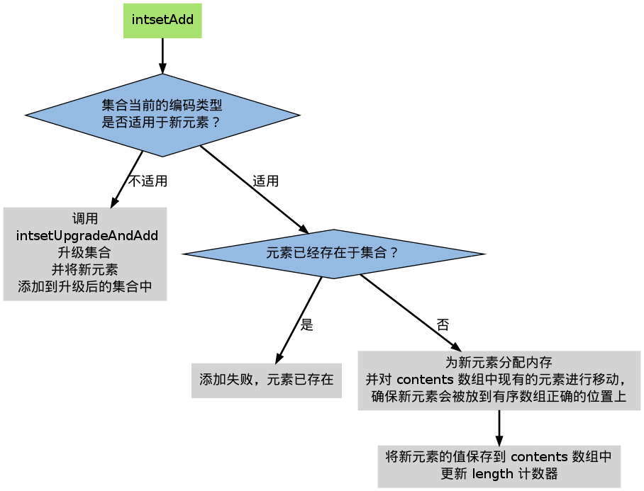

整数集合 —— intset
========================

Intset 用于有序、无重复地保存多个整数值：
它会根据元素的值，自动选择该用什么长度的整数类型来保存元素。

举个例子，如果在一个 intset 里面，最长的元素可以用 ``int16_t`` 类型来保存，那么这个 intset 的所有元素都以 ``int16_t`` 类型来保存。

另一方面，如果有一个新元素要加入到这个 intset ，并且这个元素不能用 ``int16_t`` 类型来保存 —— 比如说，新元素的长度为 ``int32_t`` ，那么这个 intset 就会自动进行『升级』：先将集合中的所有元素从 ``int16_t``  类型转换为 ``int32_t`` 类型，接着再将新元素加入到集合中。

只要有需要， intset 可以自动从 ``int16_t`` 升级到 ``int32_t`` / ``int64_t`` ，或者从 ``int32_t`` 升级到 ``int64_t`` 。

数据结构和主要操作
------------------------

以下是 ``intset.h/intset`` 类型的定义：

::

    typedef struct intset {
        uint32_t encoding;
        uint32_t length;
        int8_t contents[];
    } intset;

``encoding`` 属性记录集合元素所使用的类型的长度，它的值可以是以下三个常量的其中一个（定义位于 ``intset.c`` ）：

::

    #define INTSET_ENC_INT16 (sizeof(int16_t))
    #define INTSET_ENC_INT32 (sizeof(int32_t))
    #define INTSET_ENC_INT64 (sizeof(int64_t))

``length`` 属性记录集合元素的个数。

``contents`` 数组是实际保存元素的地方。元素之间没有重复，并且按值从小到大排序。

``contents`` 数组的 ``int8_t`` 类型声明比较容易让人误解，实际上， ``intset`` 并不使用 ``int8_t`` 类型来保存任何元素，结构中的这个类型声明只是作为一个占位符使用：在对 ``contents`` 中的元素进行读取或者写入时，程序并不是直接使用 ``contents`` 来对元素进行索引，而是根据 ``encoding`` 的值，对 ``contents`` 进行类型转换和指针运算，计算出元素在内存中的正确位置。在添加新元素，进行内存分配时，分配的容量也是由 ``encoding`` 的值决定。

下表列出了处理 ``intset`` 的一些主要操作，以及这些操作的算法复杂度：

====================== =========================== ========================
操作                    函数                        复杂度
====================== =========================== ========================
创建 intset             ``intsetNew``               :math:`\theta(1)`
删除 intset             无                          无
添加新元素（不升级）    ``intsetAdd``               :math:`O(n)`
添加新元素（升级）      ``intsetUpgradeAndAdd``     :math:`O(n)`
按索引获取元素          ``_intsetGet``              :math:`\theta(1)`               
按索引设置元素          ``_intsetSet``              :math:`\theta(1)`
查找元素，返回索引      ``intsetSearch``            :math:`O(\lg n)`
删除元素                ``intsetRemove``            :math:`O(n)`
====================== =========================== ========================

intset 运行实例
--------------------------

让我们跟踪一个 ``intset`` 的创建和添加过程，籍此了解 ``intset`` 的运作方式。

**创建新 intset**

``intset.c/intsetNew`` 函数创建一个新的 ``intset`` ，并为它设置初始化值：

::

    intset *is = intsetNew();
    
    // intset->encoding = INTSET_ENC_INT16;  
    // intset->contents = [];
    // intset->length 0;

注意 ``encoding`` 使用 ``INTSET_ENC_INT16`` 作为初始值。

**添加新元素到 intset**

创建 ``intset`` 之后，就可以对它添加新元素了。

添加新元素到 ``intset`` 的工作由 ``intset.c/intsetAdd`` 函数完成，它需要处理以下三种情况：

1. 元素已存在于集合，添加失败

2. 元素不存在于集合，并且添加新元素并不需要升级

3. 元素不存在于集合，但是要在升级之后，才能添加新元素

并且， ``intsetAdd`` 还保证 ``intset->contents`` 具有以下性质：

1. 数组中没有重复元素

2. 数组中的元素按从小到大排序

整个 ``intsetAdd`` 的执行流程可以表示为下图：

**添加新元素到 intset （不需要升级）**

以下代码演示了将三个 ``int16_t`` 类型的整数添加到集合的过程，
以及在添加过程中，集合的状态：

::

    intset *is = intsetNew();

    intsetAdd(is, 10, NULL);

    // is->encoding = INTSET_ENC_INT16;
    // is->length = 1;
    // is->contents = [10];

    intsetAdd(is, 5, NULL);

    // is->encoding = INTSET_ENC_INT16;
    // is->length = 2;
    // is->contents = [5, 10];

    intsetAdd(is, 12, NULL);

    // is->encoding = INTSET_ENC_INT16;
    // is->length = 3;
    // is->contents = [5, 10, 12]

因为添加的三个元素都可以表示为 ``int16_t`` ，
因此 ``is->encoding`` 一直都是 ``INTSET_ENC_INT16`` 。

另一方面， ``is->length`` 和 ``is->contents`` 的值则随着新元素的加入而被修改。

**添加新元素到 intset （需要升级）**

当要添加新元素到集合，并且集合当前的编码并不适用于新元素的编码时，就需要对集合进行升级。

以下代码演示了带升级的添加操作的执行过程：

::

    intset *is = intsetNew();

    intsetAdd(is, 1, NULL);

    // is->encoding = INTSET_ENC_INT16;
    // is->length = 1;
    // is->contents = [1];                  // 所有值使用 int16_t 保存

    intsetAdd(is, 65535, NULL);

    // is->encoding = INTSET_ENC_INT32;     // 升级
    // is->length = 2;
    // is->contents = [1, 65535];           // 所有值使用 int32_t 保存

    intsetAdd(is, 70000, NULL);

    // is->encoding = INTSET_ENC_INT32;
    // is->length = 3;
    // is->contents = [1, 65535, 70000];

    intsetAdd(is, 4294967295, NULL);

    // is->encoding = INTSET_ENC_INT64;                 // 升级
    // is->length = 4;
    // is->contents = [1, 65535, 70000, 4294967295];    // 所有值使用 int64_t 保存

在添加 ``65535`` 和 ``4294967295`` 之后，
``encoding`` 属性的值，以及 ``contents`` 数组保存值的方式，都被改变了。

升级
--------

在添加新元素时，如果 ``intsetAdd`` 发现新元素不能用现有的编码方式来保存，它就会将升级集合和添加新元素的任务转交给 ``intsetUpgradeAndAdd`` 来完成。

``intsetUpgradeAndAdd`` 需要完成以下几个任务：

1. 对新元素进行检测，看保存这个新元素所需的编码类型。
2. 将集合 ``encoding`` 属性的值设置为新编码类型，并根据新编码类型，对整个 ``contents`` 数组进行内存重分配。
3. 调整 ``contents`` 数组内原有的元素在内存中的排列方式，让它们从旧编码调整为新编码。
4. 将新元素添加到集合中。

整个过程中，最复杂的就是第三步，让我们用一个例子来理解这个步骤。

假设有一个 ``intset`` ，里面包含三个用 ``int16_t`` 方式保存的数值，分别是 ``1`` 、 ``2`` 和 ``3`` ，它的结构如下：

::

    intset->encoding = INTSET_ENC_INT16;
    intset->length = 3;
    intset->contents = [1, 2, 3];

其中， ``intset->contents`` 在内存中的排列如下：

::

    bit     0    15    31    47
    value   |  1  |  2  |  3  |

现在，我们要要将一个长度为 ``int32_t`` 的值 ``65535`` 加入到集合中， ``intset`` 需要执行以下步骤：

**1\) 将 intset->encoding 设置为 INTSET_ENC_INT32 。**

**2\) 根据 intset->encoding ，对 contents 数组进行内存重分配。**

重分配完成之后， ``contents`` 在内存中的排列如下：

::

    bit     0    15    31    47     63        95       127
    value   |  1  |  2  |  3  |  ?  |    ?    |    ?    |

``contents`` 数组现在共有可容纳 4 个 ``int32_t`` 值的空间。

**3\) 因为原来的 3 个 int16_t 值还『挤在』 contents 前面的 48 个位里，
所以程序需要对它们进行移动和类型转换，
从而让它们适应集合的新编码方式。**

首先是移动 ``3`` ：

::

    bit     0    15    31    47     63        95       127
    value   |  1  |  2  |  3  |  ?  |    3    |    ?    |
                           |             ^
                           |             |
                           +-------------+
                         int16_t -> int32_t

接着移动 ``2`` ：

::

    bit     0    15    31   47     63        95       127
    value   |  1  |  2  |    2     |    3    |    ?    |
                     |       ^
                     |       |
                     +-------+
                int16_t -> int32_t

最后，移动 ``1`` ：

::
 
    bit     0   15    31   47     63        95       127
    value   |    1     |    2     |    3    |    ?    |
                | ^
                V |
        int16_t -> int32_t

**4\) 最后，将新值 65535 添加到数组：**

::
  
    bit     0   15    31   47     63        95       127
    value   |    1     |    2     |    3    |  65535  |
                                                 ^
                                                 |
                                                add

将 ``intset->length`` 设置为 ``4`` 。 

至此，集合的升级和添加操作完成，现在的 ``intset`` 结构如下：

::

    intset->encoding = INTSET_ENC_INT32;
    intset->length = 4;
    intset->contents = [1, 2, 3, 65535];

关于升级
-----------

关于升级操作，还有两点需要提醒一下：

**第一，从较短整数到较长整数的转换，并不会更改元素里面的值。**

在 C 语言中，从长度较短的带符号整数到长度较长的带符号整数之间的转换（比如从 ``int16_t`` 转换为 ``int32_t`` ）总是可行的（不会溢出）、无损的。

另一方面，从较长整数到较短整数之间的转换可能是有损的（比如从 ``int32_t`` 转换为 ``int16_t`` ）。

因为 intset 只进行从较短整数到较长整数的转换（也即是，只『升级』，不『降级』），因此，『升级』操作并不会修改元素原有的值。

**第二，集合编码元素的方式，由元素中长度最大的那个值来决定。**

就像前面演示的例子一样，
当要将一个 ``int32_t`` 编码的新元素添加到集合时，
集合原有的所有 ``int16_t`` 编码的元素，
都必须转换为 ``int32_t`` 。

尽管这个集合真正需要用 ``int32_t`` 长度来保存的元素只有一个，但整个集合的所有元素都必须转换为这种类型。

关于元素移动
---------------

在进行升级的过程中，需要对数组内的元素进行『类型转换』和『移动』的操作。

其中，移动不仅出现在升级（\ ``intsetUpgradeAndAdd``\ ）操作中，
还出现其他对 ``contents`` 数组内容进行增删的操作上，
比如 ``intsetAdd`` 和 ``intsetRemove`` ，
因为这种移动操作需要处理的元素数量等于集合中个数的长度，
所以这些函数的复杂度都不低于 :math:`O(n)` 。

其他操作
--------------------

**读取**

有两种方式读取 ``intset`` 的元素，一种是 ``_intsetSet`` ，另一种是 ``intsetSearch`` ：

``_intsetSet`` 接受一个给定的索引 ``pos`` ，并根据 ``intset->encoding`` 的值进行指针运算，计算出给定索引在 ``intset->contents`` 数组上的值。

``intsetSearch`` 则使用\ `二分查找 <http://en.wikipedia.org/wiki/Binary_search_algorithm>`_\ 算法，判断一个给定元素在 ``contents`` 数组上的索引。

**写入**

除了前面介绍过的 ``intsetAdd`` 和 ``intsetUpgradeAndAdd`` 之外， ``_intsetSet`` 也对集合进行写入操作：
它接受一个索引 ``pos`` ，以及一个 ``new_value`` ，将 ``contents`` 数组 ``pos`` 位置的值设为 ``new_value`` 。

**删除**

删除单个元素的工作由 ``intsetRemove`` 操作，
它先调用 ``intsetSearch`` 找到需要被删除的元素在 ``contents`` 数组中的索引，
然后使用内存移位操作，将目标元素从内存中抹去，
最后，通过内存重分配，对 ``contents`` 数组的长度进行调整。

TBD 小结
--------------

缺点？

- 没有降级

Intset 定位为一种受限的中间表示，决定了它被保存的时间不会太长，而且它还只能保存整数值，而且元素的个数也不能超过 ``redis.h/REDIS_SET_MAX_INTSET_ENTRIES`` （目前版本值为 ``512`` ），因此对它进行太复杂的操作，没有必要。

- 元素的长度由最长的元素决定

像 ziplist 那样进行前缀编码，对 ``intset`` 是可行的，只是，进行编码也需要使用额外的空间，而这种空间使用不一定能节约多少空间（有时甚至浪费了额外的空间），但是绝对增加了操作的复杂度，所以 intset 也没有进行非常复杂的编码。
