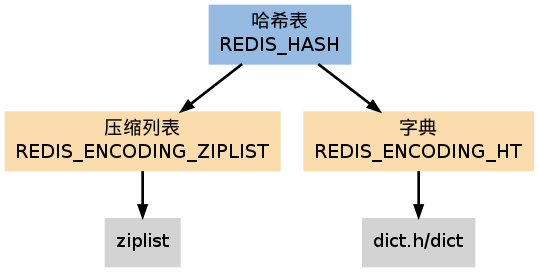
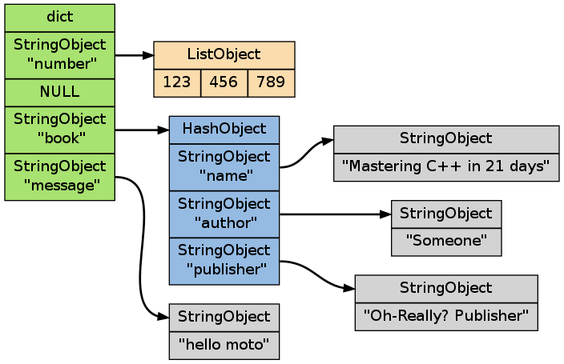

.. _hash_chapter:

哈希表
=================

``REDIS_HASH`` （哈希表）是 :ref:`HSET` 、 :ref:`HLEN` 等命令的操作对象，
它使用 ``REDIS_ENCODING_ZIPLIST`` 和 ``REDIS_ENCODING_HT`` 两种编码方式：

字典编码的哈希表
---------------------

当哈希表使用字典编码时，
程序将哈希表的键（key）保存为字典的键，
将哈希表的值（value）保存为字典的值。

哈希表的键总是字符串，
而值则可以是任意键类型：包括字符串、列表、哈希表、集合和有序集。

下图展示了一个使用字典编码的哈希表，
表中保存了三对类型不同的键值对：

压缩列表编码的哈希表
---------------------------

当使用 ``REDIS_ENCODING_ZIPLIST`` 编码哈希表时，
程序通过将键和值一同推入压缩列表，
从而形成保存哈希表所需的键-值对结构：

::

    +--------------------+------+------+------+------+------+------+------+------+-------------------+
    | ZIPLIST_ENTRY_HEAD | key1 | val1 | key2 | val2 | ...  | ...  | keyN | valN | ZIPLIST_ENTRY_END |
    +--------------------+------+------+------+------+------+------+------+------+-------------------+

新添加的 key-value 对会被添加到压缩列表的表尾。

当进行查找/删除或更新操作时，程序先定位到键的位置，然后再通过对键的位置来定位值的位置。

编码的选择
------------------

创建空白哈希表时，
程序默认使用 ``REDIS_ENCODING_ZIPLIST`` 编码，
当以下任何一个条件被满足时，
程序将编码从切换为 ``REDIS_ENCODING_HT`` ：

- 哈希表中某个键或某个值的长度大于 ``server.hash_max_ziplist_value`` （默认值为 ``64`` ）。

- 压缩列表中的节点数量大于 ``server.hash_max_ziplist_entries`` （默认值为 ``512`` ）。

哈希命令的实现
------------------

哈希类型命令的实现全都是对字典和压缩列表操作函数的包装，
以及几个在两种编码之间进行转换的函数，
没有特别要讲解的地方。
