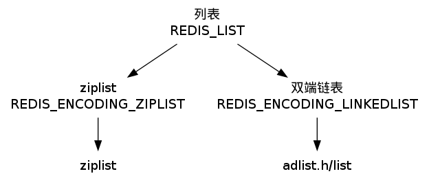
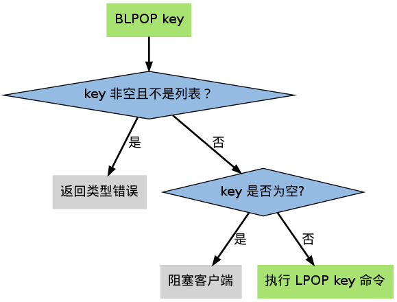
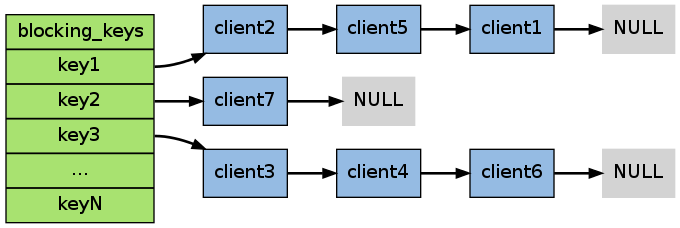
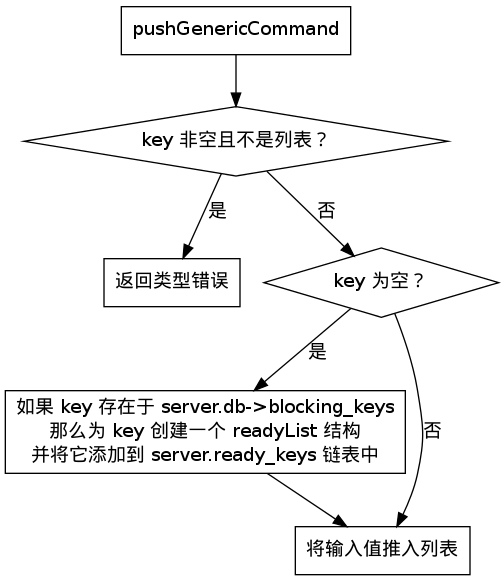
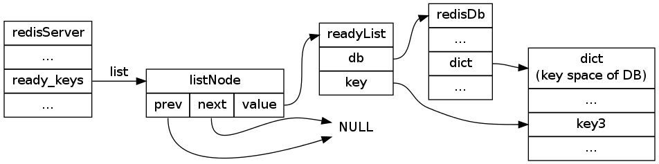

.. _list_chapter:

列表 —— List
=================

``REDIS_LIST`` （列表）是 ``LPUSH`` 、 ``LRANGE`` 等命令的操作对象，
它使用 ``REDIS_ENCODING_ZIPLIST`` 和 ``REDIS_ENCODING_LINKEDLIST`` 这两种方式编码：

创建新列表时默认使用 ``REDIS_ENCODING_ZIPLIST`` 编码，
当以下任一个条件被满足时，
列表会被转换成 ``REDIS_ENCODING_LINKEDLIST`` 编码：

- 试图往列表新添加一个字符串值，且这个字符串的长度超过 ``server.list_max_ziplist_value`` （默认值为 ``64`` ）。

- ``ziplist`` 本身的长度超过 ``server.list_max_ziplist_entries`` （默认值为 ``512`` ）。

Redis 列表类型命令的实现，
主要是对 ``adlist.c/list`` 和 ``ziplist`` 两种数据结构的操作函数的包装，
以及一些在两种编码之间进行转换的函数，
没有太多需要介绍的地方。

唯一需要谈一下的是
``BLPOP`` 、 ``BRPOP`` 和 ``BRPOPLPUSH`` 这个几个阻塞命令的实现，
以下内容就来讨论这个主题。

阻塞的条件
-------------

``BLPOP`` 、 ``BRPOP`` 和 ``BRPOPLPUSH`` 三个命令都可能造成客户端被阻塞，
以下将这些命令统称为列表的阻塞原语。

阻塞原语并不是一定会造成客户端阻塞，
只有当这些命令被用于空列表时，
它们才会阻塞客户端。
如果被处理的列表不为空的话，
它们就执行无阻塞版本的 ``LPOP`` 、 ``RPOP`` 和 ``RPOPLPUSH`` 命令。

作为例子，以下流程图展示了 ``BLPOP`` 决定是否对客户端进行阻塞过程：

阻塞
-----------

当阻塞原语被用于处理空元素时，就需要对执行该命令的客户端进行阻塞。

阻塞客户端的步骤包括：

1. 将客户端的状态设为“被阻塞”，并记录阻塞这个客户端的各个 key ，以及阻塞的最长时限（timeout）等数据。

2. 将客户端记录到 ``server.db[i]->blocking_keys`` 中（其中 ``i`` 为客户端所使用的数据库号码）。

3. 继续维持客户端和服务器之间的 socket 连接，但不再向客户端传送任何信息，造成客户端阻塞。

第 2 步是将来解除阻塞的关键，
``server.db[i]->blocking_keys`` 是一个字典，
字典的键是那些造成客户端阻塞的 key ，
而字典的值是一个个链表，
链表里保存了所有因 key 所阻塞的客户端
（被同一个 key 所阻塞的客户端可能不止一个）：

在上图展示的 ``blocking_keys`` 例子中， ``client2`` 、 ``client5`` 和 ``client1`` 三个客户端就正被 ``key1`` 阻塞，
而其他几个客户端也正在被别的两个 key 阻塞。

当客户端被阻塞之后，脱离阻塞状态有以下三种方法：

- 有其他客户端为造成阻塞的 key 推入了新元素

- 到达执行阻塞原语时设定的最大阻塞时间

- 客户端强制终止和服务器的连接

以下内容分别介绍前两种脱离阻塞状态方式的运作原理。

阻塞因 LPUSH 、 RPUSH 、 LINSERT 等添加命令而被取消
-------------------------------------------------------

通过将新元素推入造成客户端阻塞的某个 key 中，
可以让相应的客户端从阻塞状态中脱离出来
（取消阻塞的客户端数量取决于推入元素的数量）。

``LPUSH`` 、 ``RPUSH`` 和 ``LINSERT`` 这三个添加元素到列表的命令，
在底层都由一个 ``pushGenericCommand`` 的函数实现，
这个函数的运作流程如下图：

当向一个空 key 中推入新元素时，
``pushGenericCommand`` 函数会检查这个 key 是否存在于前面提到的 ``server.db->blocking_keys`` 字典里，
如果是的话，
那么说明有至少一个客户端因为这个 key 而被阻塞，
然后程序就会为这个 key 创建一个 ``readyList`` 结构，
并将它添加到 ``server.ready_keys`` 链表中。

``readyList`` 结构的定义如下：

::

    typedef struct readyList {
        redisDb *db;
        robj *key;
    } readyList;

``readyList`` 结构的 ``key`` 属性指向造成阻塞的 key ，而 ``db`` 则指向该 key 所在的数据库。

举个例子，
假设某个非阻塞客户端正在使用 0 号数据库，
而该数据库的 ``blocking_keys`` 属性的值如下：

如果这时客户端对该数据库执行 ``PUSH key3 value`` ，
那么 ``pushGenericCommand`` 将创建一个 ``db`` 属性指向 0 号数据库、
``key`` 属性指向 ``key3`` 键对象的 ``readyList`` 结构 ，
并将它添加到服务器 ``server.ready_keys`` 属性的链表中：

在我们这个例子中，
到目前为止，
``pushGenericCommand`` 函数完成了以下两件事：

1. 将 ``readyList`` 添加到服务器 

2. 将新元素 ``value`` 添加到键 ``key3``

虽然 ``key3`` 已经不再是空 key ，
但因为它而阻塞的客户端还没有任何一个被解除阻塞状态。

为了做到这一点，
Redis 的主进程在执行完 ``pushGenericCommand`` 函数之后，
会继续调用 ``handleClientsBlockedOnLists`` 函数，
这个函数执行以下操作：

1. 如果 ``server.ready_keys`` 不为空，那么弹出该链表的表头元素，并取出元素中的 ``readyList`` 值

2. 根据 ``readyList`` 值所保存的 ``key`` 和 ``db`` ，在 ``server.blocking_keys`` 中查找所有因为 ``key`` 而被阻塞的客户端（以链表的形式保存）

3. 如果 ``key`` 不为空，那么从 ``key`` 中弹出一个元素，并弹出客户端链表的第一个客户端，然后将被弹出元素返回给被弹出客户端作为阻塞原语的返回值

4. 根据 ``readyList`` 结构的属性，删除 ``server.blocking_keys`` 中相应的客户端数据，取消客户端的阻塞状态

5. 继续执行步骤 3 和 4 ，直到 ``key`` 没有元素可弹出，或者所有因为 ``key`` 而阻塞的客户端都取消阻塞为止

6. 继续执行步骤 1 ，直到 ``ready_keys`` 链表里的所有 ``readyList`` 结构都被处理完为止

用一段伪代码描述以上操作可能会更直观一些：

::

    while server.ready_keys != NULL
        弹出链表的第一个 readyList
        根据 readyList 保存的 key 和 db ，
        在 server.blocking_keys 中查找所有因为 key 而被阻塞的客户端
        while 客户端链表 != NULL
            if key 中仍然有元素可以弹出
                弹出客户端链表中第一个被阻塞的客户端
                从 key 中弹出元素，并返回给客户端
                从 server.blocking_keys 中删除被弹出客户端的资料，
                并取消这个客户端的阻塞状态
            else
                // 推入 key 的元素数量少于因 key 而被阻塞的客户端数量
                // 仍有客户端被 key 阻塞
                break   

先阻塞先服务（FBFS）策略
--------------------------

值得一提的是，
当程序添加一个新的被阻塞客户端到 ``server.blocking_keys`` 字典的链表中时，
它将该客户端放在链表的最后，
而当 ``handleClientsBlockedOnLists`` 取消客户端的阻塞时，
它从链表的最前面开始取消阻塞：
这个链表形成了一个 FIFO 队列，
最先被阻塞的客户端总值最先被取消，
Redis 文档称这种模式为先阻塞先服务（FBFS，first-block-first-serve）。

举个例子，在下图所示的阻塞状况中，
如果客户端对数据库执行 ``PUSH key3 value`` ，
那么只有 ``client3`` 会被取消阻塞，
``client6`` 和 ``client4`` 仍然阻塞；
如果客户端对数据库执行 ``PUSH key3 value1 value2`` ，
那么 ``client3`` 和 ``client4`` 的阻塞都会被取消，
而客户端 ``client6`` 依然处于阻塞状态：

阻塞因超过最大等待时间而被取消
--------------------------------

前面提到过，
当客户端被阻塞时，
所有造成它阻塞的 key ，
以及阻塞的最长时限会被记录在客户端里面，
并且该客户端的状态会被设置为“正在阻塞”。

Redis 主进程每次执行计时中断器（timer interrupt）时，
中断器都会检查所有连接到服务器的客户端，
查看那些处于“被阻塞”状态的客户端的最大阻塞时限是否已经过期，
如果是的话，
就给客户端返回一个空白回复，
然后撤销对客户端的阻塞。

可以用一段伪代码来描述这个过程：

::

    while 时间中断器正在执行
      for 客户端 in 所有连接到服务器的客户端
        if 客户端正处于阻塞状态 && 阻塞的最大期限已过期
          向客户端发送空回复
          清除客户端的阻塞状态
