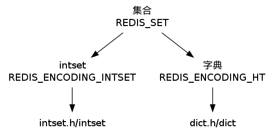
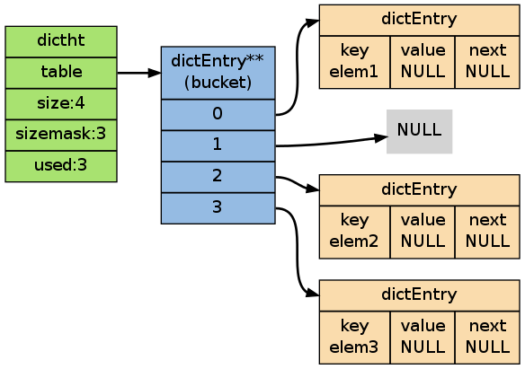

.. _set_chapter:

集合 —— Set
=================

``REDIS_SET`` （集合）是 ``SADD`` 、 ``SRANDMEMBER`` 等命令的操作对象，
它使用 ``REDIS_ENCODING_INTSET`` 和 ``REDIS_ENCODING_HT`` 两种方式编码：

第一个添加到集合的元素，决定了创建集合时所使用的编码，
如果该元素可以表示为 ``long long`` 类型值（也即是，它是一个整数），
那么元素的编码为 ``REDIS_ENCODING_INTSET`` ，
否则为 ``REDIS_ENCODING_HT`` 。

如果一个集合使用 ``REDIS_ENCODING_INTSET`` 编码，
那么当以下任何一个条件被满足时，
这个集合会被转换成 ``REDIS_ENCODING_HT`` 编码：

- ``intset`` 保存的整数值个数超过 ``server.set_max_intset_entries`` （默认值为 ``512`` ）

- 试图往集合里添加一个新元素，并且这个元素不能被表示为 ``long long`` 类型（也即是，它不是一个整数）

当使用 ``REDIS_ENCODING_HT`` 编码时，
集合将元素保存到字典的键里面，
而字典的值则统一设为 ``NULL`` 。

作为例子，
以下图片展示了一个以 ``REDIS_ENCODING_HT`` 编码表示的集合，
集合的成员为 ``elem1`` 、 ``elem2`` 和 ``elem3`` ：

Redis 集合类型命令的实现，
主要是对 ``intset`` 和 ``dict`` 两个数据结构的操作函数的包装，
以及一些在两种编码之间进行转换的函数，
大部分都没有什么需要解释的地方，
唯一比较有趣的是 ``SINTER`` 、 ``SUNION`` 等命令之下的算法实现，
以下三个小节就分别讨论它们所使用的算法。

求交集算法
------------------------

``SINTER`` 和 ``SINTERSTORE`` 两个命令所使用的求并交集算法可以用 Python 表示如下：

.. highlight:: python

.. literalinclude:: sinter.py

算法的复杂度为 :math:`O(N^2)` ，
执行步数为 :math:`S * T` ，
其中 :math:`S` 为输入集合中基数最小的集合，
而 :math:`T` 则为输入集合的数量。

求并集算法
------------------------

``SUNION`` 和 ``SUNIONSTORE`` 两个命令所使用的求并集算法可以用 Python 表示如下：

.. literalinclude:: sunion.py

算法的复杂度为 :math:`O(N)` 。

求差集算法
------------------------

Redis 为 ``SDIFF`` 和 ``SDIFFSTORE`` 两个命令准备了两种求集合差的算法。

以 Python 代码表示的算法一定义如下：

.. literalinclude:: sdiff_1.py

这个算法的复杂度为 :math:`O(N^2)` ，
执行步数为 :math:`S*T` ，
其中 :math:`S` 为输入集合中基数最小的集合，
而 :math:`T` 则为除第一个集合之外，
其他集合的数量。

以 Python 代码表示的算法二定于如下：

.. literalinclude:: sdiff_2.py

这个算法的复杂度同样为 :math:`O(N^2)` ，
执行步数为 :math:`S` ，
其中 :math:`S` 为所有集合的基数总和。

Redis 使用一个程序决定该使用那个求差集算法，
程序用 Python 表示如下：

.. literalinclude:: sdiff.py
