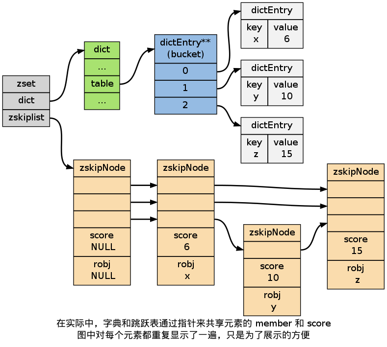

.. _sorted_set_chapter:

有序集
========================

``REDIS_ZSET`` （有序集）是 :ref:`ZADD` 、 :ref:`ZCOUNT` 等命令的操作对象，
它使用 ``REDIS_ENCODING_ZIPLIST`` 和 ``REDIS_ENCODING_SKIPLIST`` 两种方式编码：

.. image:: image/redis_zset.png

编码的选择
---------------

在通过 :ref:`ZADD` 命令添加第一个元素到空 ``key`` 时，
程序通过检查输入的第一个元素来决定该创建什么编码的有序集。

如果第一个元素符合以下条件的话，
就创建一个 ``REDIS_ENCODING_ZIPLIST`` 编码的有序集：

- 服务器属性 ``server.zset_max_ziplist_entries`` 的值大于 ``0`` （默认为 ``128`` ）。

- 元素的 ``member`` 长度小于服务器属性 ``server.zset_max_ziplist_value`` 的值（默认为 ``64`` ）。

否则，程序就创建一个 ``REDIS_ENCODING_SKIPLIST`` 编码的有序集。

编码的转换
-------------

对于一个 ``REDIS_ENCODING_ZIPLIST`` 编码的有序集，
只要满足以下任一条件，
就将它转换为 ``REDIS_ENCODING_SKIPLIST`` 编码：

- ``ziplist`` 所保存的元素数量超过服务器属性 ``server.zset_max_ziplist_entries`` 的值（默认值为 ``128`` ）

- 新添加元素的 ``member`` 的长度大于服务器属性 ``server.zset_max_ziplist_value`` 的值（默认值为 ``64`` ）

ZIPLIST 编码的有序集
--------------------------

当使用 ``REDIS_ENCODING_ZIPLIST`` 编码时，
有序集将元素保存到 ``ziplist`` 数据结构里面。

其中，每个有序集元素以两个相邻的 ``ziplist`` 节点表示，
第一个节点保存元素的 ``member`` 域，
第二个元素保存元素的 ``score`` 域。

多个元素之间按 ``score`` 值从小到大排序，
如果两个元素的 ``score`` 相同，
那么按字典序对 ``member`` 进行对比，
决定那个元素排在前面，
那个元素排在后面。

::

              |<--  element 1 -->|<--  element 2 -->|<--   .......   -->|<--  element N -->|

    +---------+---------+--------+---------+--------+---------+---------+---------+--------+---------+
    | ZIPLIST |         |        |         |        |         |         |         |        | ZIPLIST |
    | ENTRY   | member1 | score1 | member2 | score2 |   ...   |   ...   | memberN | scoreN | ENTRY   |
    | HEAD    |         |        |         |        |         |         |         |        | END     |
    +---------+---------+--------+---------+--------+---------+---------+---------+--------+---------+

    score1 <= score2 <= ... <= scoreN

虽然元素是按 ``score`` 域有序排序的，
但对 ``ziplist`` 的节点指针只能线性地移动，
所以在 ``REDIS_ENCODING_ZIPLIST`` 编码的有序集中，
查找某个给定元素的复杂度为 :math:`O(N)` 。

每次执行添加/删除/更新操作都需要执行一次查找元素的操作，
因此这些函数的复杂度都不低于 :math:`O(N)` ，
至于这些操作的实际复杂度，
取决于它们底层所执行的 ``ziplist`` 操作。

SKIPLIST 编码的有序集
-------------------------

当使用 ``REDIS_ENCODING_SKIPLIST`` 编码时，
有序集元素由 ``redis.h/zset`` 结构来保存：

::

    /*
     * 有序集
     */
    typedef struct zset {

        // 字典
        dict *dict;

        // 跳跃表
        zskiplist *zsl;

    } zset;

``zset`` 同时使用字典和跳跃表两个数据结构来保存有序集元素。

其中，
元素的成员由一个 ``redisObject`` 结构表示，
而元素的 ``score`` 则是一个 ``double`` 类型的浮点数，
字典和跳跃表两个结构通过将指针共同指向这两个值来节约空间
（不用每个元素都复制两份）。

下图展示了一个 ``REDIS_ENCODING_SKIPLIST`` 编码的有序集：

通过使用字典结构，
并将 ``member`` 作为键，
``score`` 作为值，
有序集可以在 :math:`O(1)` 复杂度内：

- 检查给定 ``member`` 是否存在于有序集（被很多底层函数使用）；
- 取出 ``member`` 对应的 ``score`` 值（实现 :ref:`ZSCORE` 命令）。

另一方面，
通过使用跳跃表，
可以让有序集支持以下两种操作：

- 在 :math:`O(\log N)` 期望时间、 :math:`O(N)` 最坏时间内根据 ``score`` 对 ``member`` 进行定位（被很多底层函数使用）；

- 范围性查找和处理操作，这是（高效地）实现 :ref:`ZRANGE` 、 :ref:`ZRANK` 和 :ref:`ZINTERSTORE` 等命令的关键。

通过同时使用字典和跳跃表，
有序集可以高效地实现按成员查找和按顺序查找两种操作。
