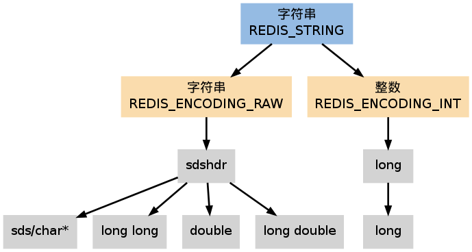

字符串 —— String
====================

``REDIS_STRING`` （字符串）是 Redis 使用得最广泛的数据类型，
它除了是 ``SET`` 、 ``GET`` 等命令的操作对象之外，
数据库中的所有键，以及执行命令时提供的参数，都是用这种类型保存的。

字符串类型分别使用 ``REDIS_ENCODING_INT`` 和 ``REDIS_ENCODING_RAW`` 两种编码：
前者用 ``long`` 类型来保存 ``long`` 类型值，
而后者则使用 ``sdshdr`` 结构保存 ``sds`` （\ ``char*``\ ） 、 ``long long`` 、 ``double`` 和 ``long double`` 类型值。

创建新字符串时默认使用 ``REDIS_ENCODING_RAW`` 编码，
在将字符串保存进数据库时，
Redis 会尝试将字符串转为 ``REDIS_ENCODING_INT`` 编码。

Redis 字符串类型命令的实现，
基本上就是对 ``sds`` 数据结构操作的包装，
以及一些在两种编码之间进行转换的函数，
没有特别需要说明的地方，
具体细节可以参考 ``t_string.c`` 模块。

-----

字符串的操作都是对 sds 数据结构操作的包装，没有什么需要讲的。

两种编码方式：

- ``REDIS_ENCODING_RAW`` ，将 ``sds`` （\ ``char*``\ ）、 ``long long`` 和 ``long double`` （Redis 字符串输入的浮点数都以这种类型表示）类型的值全部以 ``sds`` 类型保存。

- ``REDIS_ENCODING_INT`` ，将 ``long`` 类型的值以 ``long`` 类型来保存。
