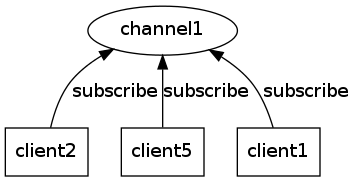
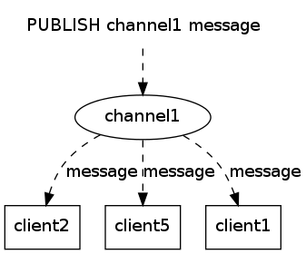
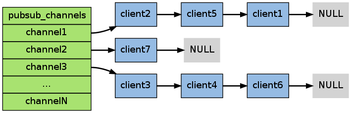
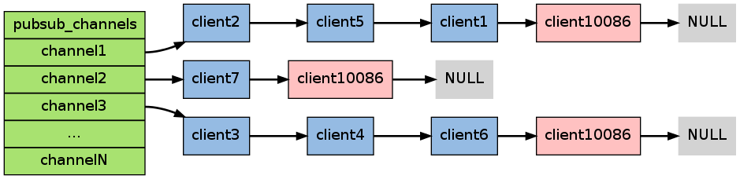
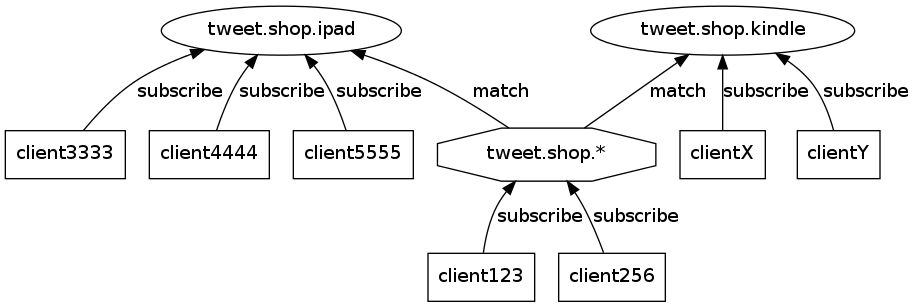
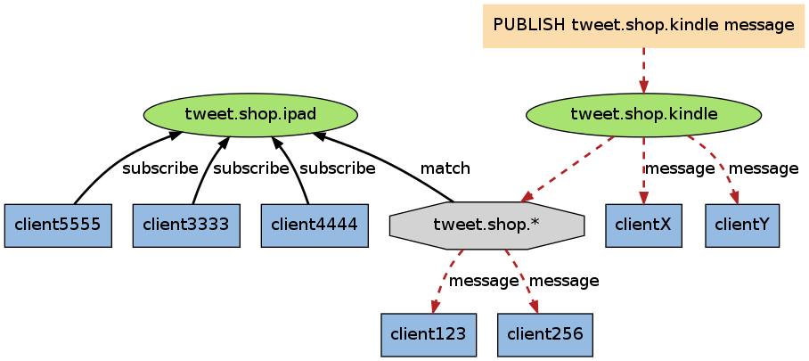
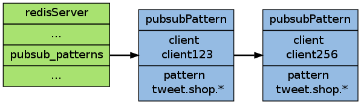
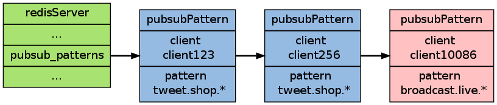

订阅与发布
==========================

Redis 通过 ``PUBLISH`` 、 ``SUBSCRIBE`` 等命令实现了订阅与发布模式，
这个功能提供两种信息机制，
分别是订阅/发布到频道和订阅/发布到模式，
下文先讨论订阅/发布到频道的实现，
再讨论订阅/发布到模式的实现。

频道的订阅与信息发送
------------------------

Redis 的 ``SUBSCRIBE`` 命令可以让客户端订阅任意数量的频道，
每当有新信息发送到被订阅的频道时，
信息就会被发送给所有订阅指定频道的客户端。

作为例子，
下图展示了频道 ``channel1`` ，
以及订阅这个频道的三个客户端 —— ``client2`` 、 ``client5`` 和 ``client1`` 之间的关系：

当有新消息通过 ``PUBLISH`` 命令发送给频道 ``channel1`` 时，
这个消息就会被发送给订阅它的三个客户端：

在后面的内容中，我们将来探讨 ``SUBSCRIBE`` 和 ``PUBLISH`` 命令的实现，
以及这套订阅与发布机制的运作原理。

订阅频道
----------------------

每个 Redis 服务器进程都维持着一个 ``redis.h/redisServer`` 结构，
这个结构的 ``pubsub_channels`` 属性是一个字典，
用于保存订阅频道的信息：

::

    struct redisServer {
        // ...
        dict *pubsub_channels;
        // ...
    };

其中，字典的键为正在被订阅的频道，
而字典的值则是一个链表，
链表中保存了所有订阅这个频道的客户端。

比如说，在下图展示的这个 ``pubsub_channels`` 示例中， ``client2`` 、 ``client5`` 和 ``client1`` 就订阅了 ``channel1`` ，
而其他频道也分别被别的客户端所订阅：

当客户端调用 ``SUBSCRIBE`` 命令时，
程序就将客户端和要订阅的频道在 ``pubsub_channels`` 字典中关联起来。

举个例子，如果客户端 ``client10086`` 执行命令 ``SUBSCRIBE channel1 channel2 channel3`` ，那么前面展示的 ``pubsub_channels`` 将变成下面这个样子：

``SUBSCRIBE`` 命令的行为可以用伪代码表示如下：

.. code-block:: python

    def SUBSCRIBE(client, subscribe_channels):

        client = get_current_client()                               # 获取当前客户端

        for channel in subscribe_channels:                          # 遍历所有输入频道
            redisServer.pubsub_channels[channel].append(client)     # 将客户端添加到链表的末尾

通过 ``pubsub_channels`` 字典，
程序只要检查某个频道是否字典的键，
就可以知道该频道是否正在被客户端订阅；
只要取出某个键的值，
就可以得到所有订阅该频道的客户端的信息。

发送信息到频道
---------------------

了解了 ``pubsub_channels`` 字典的结构，
解释 ``PUBLISH`` 命令的实现就非常简单了 —— 
当调用 ``PUBLISH channel message`` 命令，
程序首先根据 ``channel`` 定位到字典的键，
然后将信息发送给字典值链表中的所有客户端。

比如说，对于以下这个 ``pubsub_channels`` 实例，
如果某个客户端执行命令 ``PUBLISH channel1 "hello moto"`` ，那么 ``client2`` 、 ``client5`` 和 ``client1`` 三个客户端都将接收到 ``"hello moto"`` 信息：

``PUBLISH`` 命令的实现可以用以下伪代码来描述：

.. code-block:: python

    def PUBLISH(channel, message):
        
        for client in server.pubsub_channels[channel]:      # 遍历所有订阅频道 channel 的客户端
            send_message(client, message)                   # 将信息发送给它们

退订频道
----------

使用 ``UNSUBSCRIBE`` 命令可以退订指定的频道，
这个命令执行的是订阅的反操作：
它从 ``pubsub_channels`` 字典的给定频道（键）中，
删除关于当前客户端的信息。

模式的订阅与信息发送
----------------------------

当使用 ``PUBLISH`` 命令发送信息到某个频道时，
不仅所有订阅该频道的客户端会收到信息，
如果有某个/某些模式和这个频道匹配的话，
那么所有订阅这个/这些频道的客户端也同样会收到信息。

以下是一个同时展示了频道和模式的例子，
其中 ``tweet.shop.*`` 模式匹配了 ``tweet.shop.kindle`` 频道和 ``tweet.shop.ipad`` 频道，
并且有不同的客户端分别订阅它们三个：

当有信息发送到 ``tweet.shop.kindle`` 频道时，
信息除了发送给 ``clientX`` 和 ``clientY`` 之外，
还会发送给订阅 ``tweet.shop.*`` 模式的 ``client123`` 和 ``client256`` ：

因为模式只保存订阅者（客户端）的信息，
它本身并不接受 ``PUBLISH`` 命令发送过来的信息、也不对信息进行任何转发，
``PUBLISH`` 命令的信息是直接发给订阅模式的客户端，而不是模式本身，
所以图中从 ``tweet.shop.kindle`` 频道到 ``tweet.shop.*`` 模式之间的连接线并没有使用 ``message`` 标签。

订阅模式
-----------

``redisServer.pubsub_patterns`` 属性是一个链表，链表中保存着所有和模式相关的信息：

::

    struct redisServer {
        // ...
        list *pubsub_patterns;
        // ...
    };

链表中的每个节点都包含一个 ``redis.h/pubsubPattern`` 结构：

::

    typedef struct pubsubPattern {                                         
        redisClient *client;                                               
        robj *pattern;                                                     
    } pubsubPattern;  

``client`` 属性保存着订阅模式的客户端，而 ``pattern`` 属性则保存着被订阅的模式。

每当调用 ``PSUBSCRIBE`` 命令订阅一个模式时，
程序就创建一个包含客户端信息和模式的 ``pubsubPattern`` 结构，
并将该结构添加到 ``redisServer.pubsub_patterns`` 链表中。

作为例子，下图展示了一个包含两个模式的 ``pubsub_patterns`` 链表，
其中 ``client123`` 和 ``client256`` 都正在订阅 ``tweet.shop.*`` 模式：

如果这时客户端 ``client10086`` 执行 ``PSUBSCRIBE broadcast.list.*`` ，
那么 ``pubsub_patterns`` 链表将被更新成这样：

通过遍历整个 ``pubsub_patterns`` 链表，程序可以检查所有正在被订阅的模式，以及订阅这些模式的链表。

发送信息到模式
-----------------

发送信息到模式的工作也是由 ``PUBLISH`` 命令进行的，
在前面讲解频道的时候，
我们给出了这样一段伪代码，
说它定义了 ``PUBLISH`` 命令的行为：

.. code-block:: python

    def PUBLISH(channel, message):
        
        for client in server.pubsub_channels[channel]:      # 取出所有订阅频道 channel 的客户端
            send_message(client, message)                   # 将信息发送给它们

但是，这段伪代码并没有完整描述 ``PUBLISH`` 命令的行为，
因为 ``PUBLISH`` 除了将 ``message`` 发送到所有订阅 ``channel`` 的客户端之外，
它还会将 ``channel`` 和 ``pubsub_patterns`` 中的模式进行对比，
如果 ``channel`` 和某个模式匹配的话，
那么也将 ``message`` 发送到订阅那个模式的客户端。

完整描述 ``PUBLISH`` 功能的伪代码定于如下：

.. code-block:: python

    def PUBLISH(channel, message):
        
        for client in server.pubsub_channels[channel]:      # 取出所有订阅频道 channel 的客户端
            send_message(client, message)                   # 将信息发送给它们

        for pattern, client in server.pubsub_patterns:      # 取出所有模式，以及订阅模式的客户端
            if match(channel, pattern):                     # 如果 channel 和模式匹配
                send_message(client, message)               # 那么将信息也发给订阅该模式的客户端

举个例子，如果 Redis 服务器的 ``pubsub_patterns`` 状态如下：

那么当某个客户端发送信息 ``"Amazon Kindle, $69."`` 到 ``tweet.shop.kindle`` 频道时，
除了所有订阅了 ``tweet.shop.kindle`` 频道的客户端会收到信息之外，
客户端 ``client123`` 和 ``client256`` 也同样会收到信息，
因为这两个客户端订阅的 ``tweet.shop.*`` 模式和 ``tweet.shop.kindle`` 频道匹配。

退订模式
----------

使用 ``PUNSUBSCRIBE`` 命令可以退订指定的模式，
这个命令执行的是订阅模式的反操作：
程序会删除 ``redisServer.pubsub_patterns`` 链表中，
所有和被退订模式相关联的 ``pubsubPattern`` 结构。

小结
------------

- 订阅信息由服务器进程维持的 ``redisServer.pubsub_channels`` 字典保存，字典的键为被订阅的频道，字典的值为订阅频道的所有客户端。

- 当有新消息发送到频道时，程序遍历频道（键）所对应的（值）所有客户端，然后将消息发送到所有订阅频道的客户端上。

- 订阅模式的信息由服务器进程维持的 ``redisServer.pubsub_patterns`` 链表保存，链表的每个节点都保存着一个 ``pubsubPattern`` 结构，结构中保存着被订阅的模式，以及订阅该模式的客户端。程序通过遍历链表来查找某个频道是否和某个模式匹配。

- 当有新消息发送到频道时，除了订阅频道的客户端会收到消息之外，所有订阅了匹配频道的模式的客户端，也同样会收到消息。

- 退订频道和退订模式分别是订阅频道和订阅模式的反操作。
