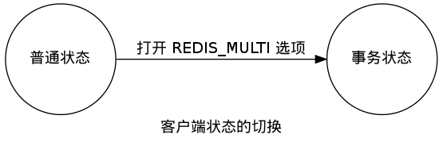
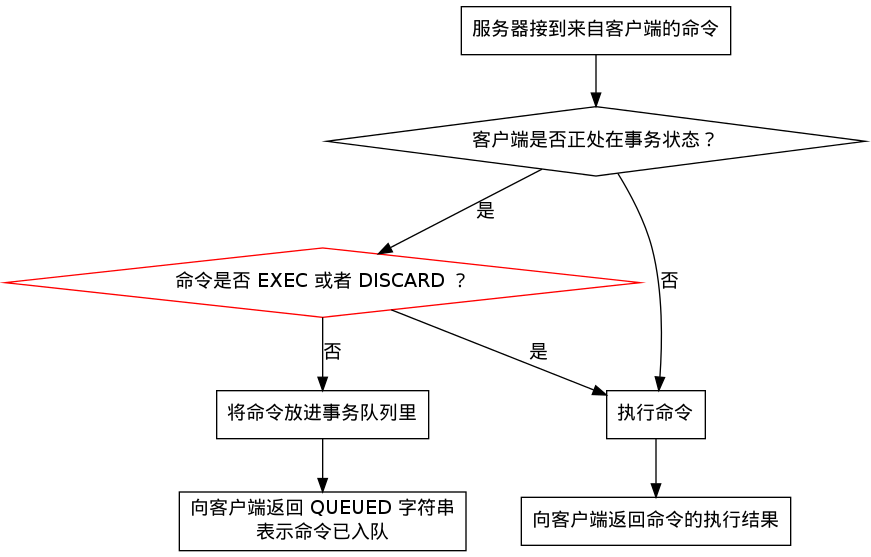
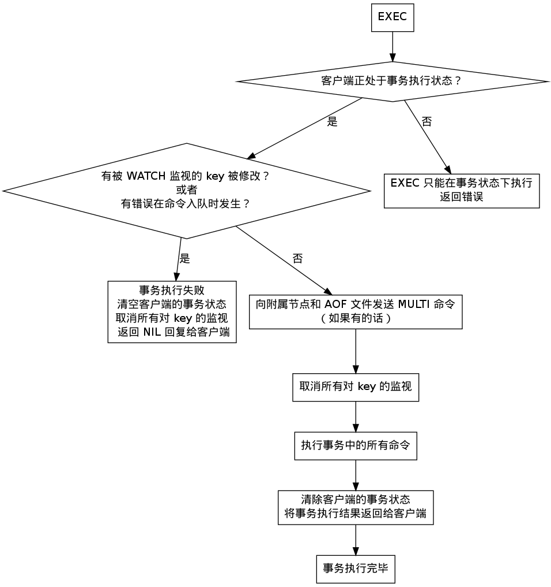

事务 —— multi
===============

事务的执行可以分为 1) 开始事务 2) 命令入队 和 3) 执行事务三个阶段。

开始事务
-----------

``MULTI`` 命令的执行标记着事务的开始，
这个命令唯一做的就是，
将客户端的 ``REDIS_MULTI`` 选项打开，
让客户端从一般状态进入到事务状态。

命令入队
-----------

当客户端处在一般状态下时，
所有发送给服务器端的命令都会立即被服务器执行。

但是，
当客户端进入事务状态之后，
服务器在收到来自客户端的命令时，
不会立即执行命令，
而是将这些命令全部放进一个事务队列里。

以下流程图展示了这一行为：

.. image:: image/enqueue.png

事务队列是一个数组，
每个数组项是都包含三个属性：
要执行的命令（cmd）、传给命令的参数（argv）、以及参数的个数（argc）。

举个例子，
如果客户端执行以下命令：

::

    redis> MULTI
    OK

    redis> SET number 123
    QUEUED

    redis> SADD animal panda
    QUEUED

    redis> LPUSH book-list Mastering C++ in 21 days
    QUEUED

    redis> LLEN book-list
    QUEUED

那么程序将创建以下事务数组：

========= ==========  ============= ================================= ===============
数组索引    cmd         argv[0]         argv[1]                         argc
========= ==========  ============= ================================= ===============
0           SET         number          123                             2
1           SADD        animal          panda                           2
2           LPUSH       book-list       Mastering C++ in 21 days        2
3           LLEN        book-list                                       1
========= ==========  ============= ================================= ===============

执行事务
----------

前面说到，
当客户端进入事务状态之后，
客户端发送的命令就会被放进事务队列里。

但其实并不是所有的命令都会被放进事务队列 ——
其中的例外就是 ``EXEC`` 和 ``DISCARD`` 两个命令，
当这两个命令从客户端发送到服务器时，
它们会像客户端处在一般状态一样，
直接被服务器执行：

当 ``EXEC`` 命令执行时，
服务器根据客户端所保存的事务队列，
以“先入队的命令先执行”的方式，
按顺序执行事务中的命令。

比如说，对于以下事务数组：

========= ==========  ============= ================================= ===============
数组索引    cmd         argv[0]         argv[1]                         argc
========= ==========  ============= ================================= ===============
0           SET         number          123                             2
1           SADD        animal          panda                           2
2           LPUSH       book-list       Mastering C++ in 21 days        2
3           LLEN        book-list                                       1
========= ==========  ============= ================================= ===============

服务器首先执行 ``SET`` 命令，然后执行 ``SADD`` 命令，再然后执行 ``LPUSH`` 命令，最后执行 ``LLEN`` 命令。

每个命令执行所得的结果值会被保存到一个回复队列里，
当事务队列里的所有命令被执行完之后，
``EXEC`` 命令会将回复队列作为自己的执行结果返回给客户端，
客户端从事务状态返回到一般状态，
至此，
事务执行完毕。

事务执行的整个过程可以用以下伪代码表示：

.. code-block:: python
  
    reply_queue = []                                    # 回复队列

    for cmd, argv, argc in transaction_queue:           # 取出事务队列里的所有命令、参数和参数数量
        reply = server_exec_command(cmd, argv, argc)    # 在服务器中执行命令，并取得命令的返回值
        reply_queue.append(reply)                       # 将回复加入到回复队列（的末尾）

    set_client_to_normal_state(client)                  # 取消客户端的事务状态

    send_reply_to_client(client, reply_queue)           # 将事务的执行结果返回给客户端

放弃事务
-----------

除了 ``EXEC`` 之外，
服务器在客户端处于事务状态时，
不加入到事务队列而直接执行的另一个命令是 ``DISCARD`` 。

``DISCARD`` 命令用于取消一个事务，
它清空客户端的整个事务队列，
然后将客户端从事务状态调整回一般状态，
最后返回字符串 ``OK`` 给客户端，
说明事务已被取消。

带 WATCH 的事务
-----------------

所有被监视的 key 都会以链表的方式保存到客户端中。

另一方面，数据库保存这一个字典，
字典的键是这个数据库被监视的 key ，
字典的值是一个链表，
它保存着所有正在监视某个 key 的所有客户端。

当 Redis 每次修改数据库中的某个 key 的时候，
它都会检查是否有客户端正在监视这个 key ，
如果有的话，
它就将所有监视这个 key 的客户端的状态设置为“被污染”，
这样客户端执行 ``EXEC`` 执行事务时，
事务就会失败。

