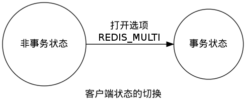
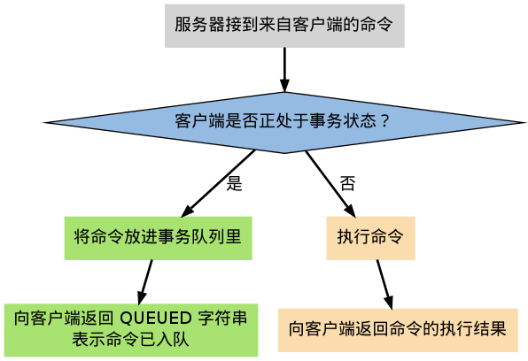
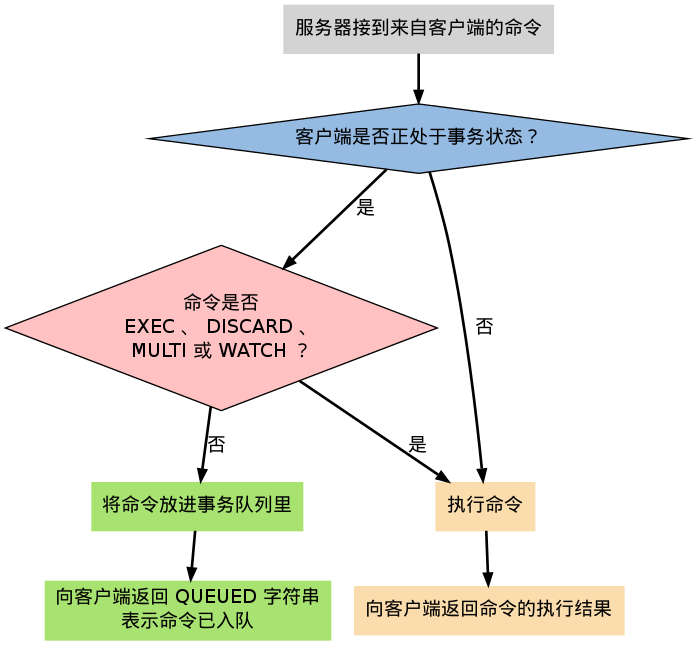
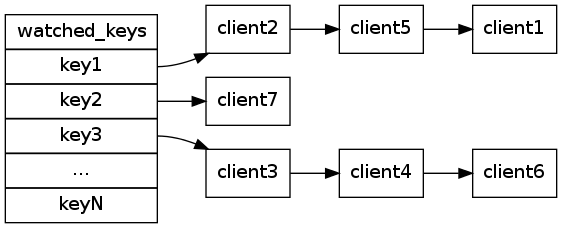
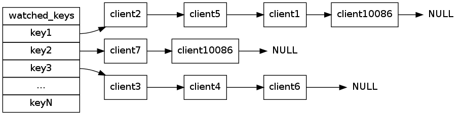
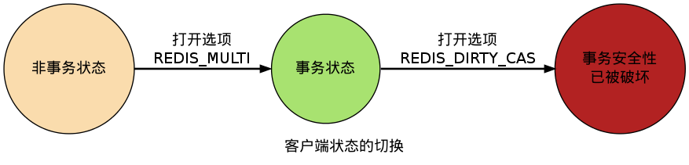

事务
===============

介绍两种事务： TBD

事务
---------------------------

事务提供了一种“有序地执行多个命令”的机制，
并且事务的执行不会被中断，服务器在执行完事务中的所有命令之后，才会继续处理其他客户端的其他命令。

以下是一个事务的例子，它将多个命令入队到事务中，然后由 ``EXEC`` 命令启动事务，一并执行事务中的所有命令：

::

    redis 127.0.0.1:6379> MULTI
    OK

    redis 127.0.0.1:6379> SET book-name "The Design and Implementation of Redis"
    QUEUED

    redis 127.0.0.1:6379> GET book-name
    QUEUED

    redis 127.0.0.1:6379> SADD animal panda
    QUEUED

    redis 127.0.0.1:6379> SADD animal bear
    QUEUED

    redis 127.0.0.1:6379> SMEMBERS animal
    QUEUED

    redis 127.0.0.1:6379> EXEC
    1) OK
    2) "The Design and Implementation of Redis"
    3) (integer) 1
    4) (integer) 1
    5) 1) "bear"
       2) "panda"

一个事务从开始到执行会经历“开始事务”、“命令入队”和“执行事务”三个阶段，
下文就分别来介绍这三个阶段，以此了解 Redis 事务功能的工作机制。

开始事务
-----------

``MULTI`` 命令的执行标记着事务的开始：

::

    redis 127.0.0.1:6379> MULTI
    OK

这个命令唯一做的就是，
将客户端的 ``REDIS_MULTI`` 选项打开，
让客户端从非事务状态切换到事务状态。

命令入队
-----------

当客户端处于非事务状态下时，
所有发送给服务器端的命令都会立即被服务器执行：

::

    redis 127.0.0.1:6379> SET msg "hello moto"
    OK

    redis 127.0.0.1:6379> GET msg
    "hello moto"

但是，
当客户端进入事务状态之后，
服务器在收到来自客户端的命令时，
不会立即执行命令，
而是将这些命令全部放进一个事务队列里：

::

    redis 127.0.0.1:6379> MULTI
    OK

    redis 127.0.0.1:6379> SET msg "hello moto"
    QUEUED

    redis 127.0.0.1:6379> GET msg
    QUEUED

以下流程图展示了这一行为：

事务队列是一个数组，
每个数组项是都包含三个属性：
要执行的命令（cmd）、传给命令的参数（argv）、以及参数的个数（argc）。

举个例子，
如果客户端执行以下命令：

::

    redis> MULTI
    OK

    redis> SET number 123
    QUEUED

    redis> SADD animal panda
    QUEUED

    redis> LPUSH book-list Mastering C++ in 21 days
    QUEUED

    redis> LLEN book-list
    QUEUED

那么程序将创建以下事务数组：

.. include:: _example_of_transaction_queue

执行事务
----------

前面说到，
当客户端进入事务状态之后，
客户端发送的命令就会被放进事务队列里。

但其实并不是所有的命令都会被放进事务队列 ——
其中的例外就是 ``EXEC`` 、 ``DISCARD`` 、 ``MULTI`` 和 ``WATCH`` 这四个命令，
当这四个命令从客户端发送到服务器时，
它们会像客户端处于非事务状态一样，
直接被服务器执行：

如果客户端正处于事务状态，
那么当 ``EXEC`` 命令执行时，
服务器根据客户端所保存的事务队列，
以“先入队的命令先执行”的方式执行事务队列中的命令。

比如说，对于以下事务数组：

.. include:: _example_of_transaction_queue

服务器首先执行 ``SET`` 命令，然后执行 ``SADD`` 命令，再然后执行 ``LPUSH`` 命令，最后执行 ``LLEN`` 命令。

每个命令执行所得的结果值会被保存到一个回复队列里，
当事务队列里的所有命令被执行完之后，
``EXEC`` 命令会将回复队列作为自己的执行结果返回给客户端，
客户端从事务状态返回到非事务状态，
至此，事务执行完毕。

事务执行的整个过程可以用以下伪代码表示：

.. code-block:: python
  
    reply_queue = []                                    # 回复队列

    for cmd, argv, argc in transaction_queue:           # 取出事务队列里的所有命令、参数和参数数量
        reply = exec_command(cmd, argv, argc)           # 执行命令，并取得命令的返回值
        reply_queue.append(reply)                       # 将返回值追加到回复队列末尾

    set_client_to_non_transaction_state(client)         # 取消客户端的事务状态

    send_reply_to_client(client, reply_queue)           # 将事务的执行结果返回给客户端

在事务和非事务状态下执行命令
--------------------------------------

无论在事务状态下，还是在非事务状态下，Redis 命令都由同一个函数执行，
所以它们共享很多服务器的一般设置，
比如 AOF 的配置、RDB 的配置，以及内存限制，等等。

不过事务中的命令和普通命令在执行上还是有一点区别的，其他最重要的两点是：

1. 非事务状态下的命令以单个命令为单位执行，前一个命令和后一个命令的客户端不一定是同一个；
   
   而事务状态则是以一个事务为单位，执行事务队列中的所有命令：除非当前事务执行完毕，否则服务器不会中断事务，也不会执行其他客户端的其他命令。

2. 在非事务状态下，执行命令所得的结果会立即被返回给客户端。

   而事务则是将所有命令的结果集合到回复队列，再作为 ``EXEC`` 命令的结果返回给客户端。

事务状态下的 DISCARD 、 MULTI 和 WATCH 命令
------------------------------------------------------

除了 ``EXEC`` 之外，
服务器在客户端处于事务状态时，
不加入到事务队列而直接执行的另外三个命令是 ``DISCARD`` 、 ``MULTI`` 和 ``WATCH`` 。

``DISCARD`` 命令用于取消一个事务，
它清空客户端的整个事务队列，
然后将客户端从事务状态调整回非事务状态，
最后返回字符串 ``OK`` 给客户端，
说明事务已被取消。

Redis 的事务是不可嵌套的，
当客户端已经处于事务状态，
而客户端又再向服务器发送 ``MULTI`` 时，
服务器只是简单地向客户端发送一个错误，
然后继续等待其他命令的入队。
``MULTI`` 命令的发送不会造成整个事务失败，
也不会修改事务队列中已有的数据。

``WATCH`` 只能在客户端进入事务状态之前执行，
在事务状态下发送 ``WATCH`` 命令会引发一个错误，
但它不会造成整个事务失败，
也不会修改事务队列中已有的数据（和前面处理 ``MULTI`` 的情况一样）。

带 WATCH 的事务
-----------------------

``WATCH`` 命令用于在事务开始之前监视任意数量的键，
当调用 ``EXEC`` 命令执行事务时，
如果任意一个被监视的键已经被其他客户端修改了，
那么整个事务不再执行，直接返回失败。

以下示例展示了一个执行失败的事务例子：

::

    redis 127.0.0.1:6379> WATCH name
    OK

    redis 127.0.0.1:6379> MULTI
    OK

    redis 127.0.0.1:6379> SET name peter
    QUEUED

    redis 127.0.0.1:6379> EXEC
    (nil)

以下执行序列展示了上面的例子是如何失败的：

========   ==================================   ==================================
时间        客户端 A                               客户端 B
========   ==================================   ==================================
T1              ``WATCH name``                     

T2              ``MULTI``

T3              ``SET name peter``

T4                                                 ``SET name john``

T5              ``EXEC``
========   ==================================   ==================================

在时间 T4 ，客户端 B 修改了 ``name`` 键的值，
当客户端 A 在 T5 执行 ``EXEC`` 时，Redis 会发现 ``name`` 这个被监视的键已经被修改，
因此客户端 A 的事务不会被执行，而是直接返回失败。

下文就来介绍 ``WATCH`` 的实现机制，并且看看事务系统是如何检查某个被监视的键是否被修改，从而保证事务的安全性的。

WATCH 命令的实现
---------------------

在每个代表数据库的 ``redis.h/redisDb`` 结构类型中，
都保存了一个 ``watched_keys`` 字典，
字典的键是这个数据库被监视的键，
而字典的值则是一个链表，
链表中保存了所有监视这个键的客户端。

比如说，以下字典就展示了一个 ``watched_keys`` 字典的例子：

其中， 键 ``key1`` 正在被 ``client2`` 、 ``client5`` 和 ``client1`` 三个客户端监视，
其他一些键也分别被其他别的客户端监视着。

``WATCH`` 命令的作用，就是将当前客户端和要监视的键在 ``watched_keys`` 中进行关联。
比如说，如果当前客户端为 ``client10086`` ，
并且客户端执行 ``WATCH key1 key2`` ，
那么上图所示的 ``watched_keys`` 将被修改成这个样子：

通过 ``watched_keys`` 字典，如果程序想检查某个键是否被监视，那么它只要检查哈希表中是否存在这个键即可；
如果程序要获取监视某个键的所有客户端，那么只要取出键的值（一个链表），然后对链表进行遍历即可。

WATCH 的触发
--------------

在任何对数据库的键进行修改的命令执行之后，
``multi.c/touchWatchKey`` 函数都会被调用：
它检查数据库的 ``watched_keys`` 字典，
看是否有客户端正在监视命令所处理的键，
如果有的话，
程序将所有监视这个/这些被修改键的客户端的 ``REDIS_DIRTY_CAS`` 状态打开：

当客户端发送 ``EXEC`` 命令、触发事务执行时，
服务器会对客户端的状态进行检查：

- 如果客户端的 ``REDIS_DIRTY_CAS`` 选项已经被打开， 那么说明客户端监视的至少一个键已经被修改，事务的安全性已经被破坏。服务器会放弃执行这个事务，直接向客户端返回空回复，表示事务执行失败。

- 如果 ``REDIS_DIRTY_CAS`` 选项没有被打开，那么说明所有监视键都安全，执行事务。

可以用一段伪代码来表示这个检查：

::

    if client_state && REDIS_DIRTY_CAS
        return nil_bulk_reply
    else
        execute_transaction()

举个例子，假设数据库的 ``watched_keys`` 字典如下图所示：

如果某个客户端对 ``key1`` 进行了修改（比如执行 ``DEL key1`` ），
那么所有监视 ``key1`` 的客户端，
包括 ``client2`` 、 ``client5`` 和 ``client1`` 的 ``REDIS_DIRTY_CAS`` 选项都会被打开，
当客户端 ``client2`` 、 ``client5`` 和 ``client1`` 执行 ``EXEC`` 的时候，它们的事务都会以失败告终。

以上就是带 ``WATCH`` 的事务在执行失败时的工作原理。

另一方面，如果在 ``EXEC`` 触发事务执行的时候，
客户端的 ``REDIS_DIRTY_CAS`` 未打开，
那么表示监视的所有键都没有被修改，
服务器可以放心地执行事务。
事务的执行方式，和前面介绍的不带 ``WATCH`` 命令的事务的执行方式一样。

事务的 ACID 性质
--------------------

在传统的关系式数据库中，常常用 `ACID 性质 <http://en.wikipedia.org/wiki/ACID>`_\ 来检验事务功能的安全性。

Redis 事务保证了其中的一致性（C）和隔离性（I），但并不保证原子性（A）和持久性（D）。

以下四小节是关于这四个性质的详细讨论。

原子性（Atomicity）
^^^^^^^^^^^^^^^^^^^^^^^

单个 Redis 命令的执行是原子性的，但 Redis 没有在事务上增加任何维持原子性的机制，所以 Redis 事务的执行并不是原子性的。

如果一个事务队列中的所有命令都被成功地执行，那么称这个事务执行成功。
另一方面，如果 Redis 服务器进程在执行事务的过程中被停止 —— 比如接到 KILL 信号、宿主机器停机，等等，那么事务执行失败。

当事务失败时，Redis 也不会进行任何的重试或者回滚操作。

一致性（Consistency）
^^^^^^^^^^^^^^^^^^^^^^^^^^^

Redis 的一致性问题可以分为三部分来讨论：入队错误、执行错误、Redis 进程被终结。

入队错误
"""""""""""""

在命令入队的过程中，如果客户端向服务器发送错误的命令，那么客户端只会将错误直接返回客户端，
错误的命令不会被入队，它也不会影响已入队的命令，所以它不会影响事务的一致性。

执行错误
""""""""""""""

如果命令在事务执行的过程中发生错误，比如说，对一个不同类型的 key 执行了错误的操作，
那么 Redis 只会将错误包含在事务的结果中，
这不会引起事务中断或整个失败，不会影响已执行事务命令的结果，也不会影响后面要执行的事务命令，
所以它对事务的一致性也没有影响。

Redis 进程被终结
"""""""""""""""""""

如果 Redis 服务器进程在执行事务的过程中被其他进程终结，或者被管理员强制杀死，那么根据 Redis 所使用的持久化模式，可能有以下情况出现：

- 内存模式：如果 Redis 没有采取任何持久化机制，那么重启之后的数据库总是空白的，所以数据总是一致的。

- RDB 模式：在执行事务时，Redis 不会中断事务去执行保存 RDB 的工作，只有在事务执行之后，保存 RDB 的工作才有可能开始。所以当 RDB 模式下的 Redis 服务器进程在事务中途被杀死时，事务内执行的命令，不管成功了多少，都不会被保存到 RDB 文件里。恢复数据库需要使用现有的 RDB 文件，而这个 RDB 文件的数据保存的是最近一次的数据库快照（snapshot），所以它的数据可能不是最新的，但只要 RDB 文件本身没有因为其他问题而出错，那么还原后的数据库就是一致的。

- AOF 模式：因为保存 AOF 文件的工作在后台线程进行，所以即使是在事务执行的中途，保存 AOF 文件的工作也可以继续进行，因此，根据事务语句是否被写入并保存到 AOF 文件，有以下两种情况发生：

  1）如果事务语句未写入到 AOF 文件，或 AOF 未被 SYNC 调用保存到磁盘，那么当进程被杀死之后，Redis 可以根据最近一次成功保存到磁盘的 AOF 文件来还原数据库，只要 AOF 文件本身没有因为其他问题而出错，那么还原后的数据库总是一致的，但其中的数据不一定是最新的。

  2）如果事务的部分语句被写入到 AOF 文件，并且 AOF 文件被成功保存，那么不完整的事务执行信息就会遗留在 AOF 文件里，当重启 Redis 时，程序会检测到 AOF 文件并不完整，Redis 会退出，并报告错误。需要使用 redis-check-aof 工具将部分成功的事务命令移除之后，才能再次启动服务器。还原之后的数据总是一致的，而且数据也是最新的（直到事务执行之前为止）。

隔离性（Isolation）
^^^^^^^^^^^^^^^^^^^^^^^^

Redis 是单进程程序，并且它保证在执行事务时，不会对事务进行中断，事务可以运行直到执行完所有事务队列中的命令为止。因此，Redis 的事务是总是带有隔离性的。 

持久性（Durability）
^^^^^^^^^^^^^^^^^^^^^^^^

因为事务不过是用队列包裹起了一组 Redis 命令，并没有提供任何额外的持久性功能，所以事务的持久性由 Redis 所使用的持久化模式决定。

在单纯的内存模式下，事务肯定是不持久的。

在 RDB 模式下，服务器可能在事务执行之后、RDB 文件更新之前的这段时间失败，所以 RDB 模式下的 Redis 事务也是不持久的。

在 AOF 的“总是 SYNC ”模式下，事务在执行成功之后，会立即调用 ``fsync`` 或 ``fdatasync`` 将事务数据写入到 AOF 文件，但是这里也有一段非常小的间隔，所以这种模式下的事务也是不持久的。

其他 AOF 模式也和“总是 SYNC ”模式类似，所以它们都是不持久的。
