字典 —— Dict
================

.. note::

    Redis 哈希类型，被 ``HSET`` 等命令操纵的 key 对象。
    字典 ： ``dict.c/dict`` 类型
    哈希表: ``dict.c/dictht`` 类型
    哈希表数组： ``dictht.table`` 属性

TBD 应用
------------

- Hash 类型的实现（ ``HSET`` 、 ``HGET`` 、 ``HKEYS`` etc）

- Redis 的数据库空间本身也是一个 dict

TBD（算法复杂度） 字典数据结构及其操作
-----------------------------------------------

『字典』这一抽象数据类型由 ``dict.h/dict`` 类型定义：

::

    /*
     * 字典
     *
     * 每个字典使用两个哈希表，用于实现渐进式 rehash
     */
    typedef struct dict {
        dictType *type;     // 特定于类型的处理函数
        void *privdata;
        dictht ht[2];       // 哈希表（2个）
        int rehashidx;      // 记录 rehash 进度的标志，-1 表示未进行 rehash
        int iterators;      // 当前正在运作的安全迭代器数量
    } dict;

以下是处理 ``dict`` 类型的函数：

.. todo: 带分栏的表格

+-----------+---------------------------------+------------------------------+----------+
| 操作类型  | 操作                            | 函数                         | 复杂度   |
+===========+=================================+==============================+==========+
| 创建      | 创建一个新字典                  |    ``dictCreate``            |          |
+-----------+---------------------------------+------------------------------+----------+
|           | 添加新键值对到字典              |     ``dictAdd``              |          |
| 添加/更新 +---------------------------------+------------------------------+----------+
|           | 添加或更新给定键的值            |   ``dictReplace``            |          |
+-----------+---------------------------------+------------------------------+----------+
|           | 在字典中查找给定键所在的节点    |   ``dictFind``               |          |
| 获取      +---------------------------------+------------------------------+----------+
|           | 在字典中查找给定键的值          |   ``dictFetchValue``         |          |
|           +---------------------------------+------------------------------+----------+
|           | 从字典中随机返回一个节点        |   ``dictGetRandomKey``       |          |
+-----------+---------------------------------+------------------------------+----------+
|           | 根据给定键，删除字典中的键值对  |    ``dictDelete``            |          |
|           +---------------------------------+------------------------------+----------+
| 删除      | 清空并释放字典                  |   ``dictRelease``            |          |
|           +---------------------------------+------------------------------+----------+
|           | 清空并重置（但不释放）字典      |   ``dictEmpty``              |          |
+-----------+---------------------------------+------------------------------+----------+
| 空间占用  | 缩小字典                        |    ``dictResize``            |          |
|           +---------------------------------+------------------------------+----------+
|           | 扩大字典                        |    ``dictExpand``            |          |
|           +---------------------------------+------------------------------+----------+
|           | 对字典进行给定步数的 rehash     |      ``dictRehash``          |          |
|           +---------------------------------+------------------------------+----------+
|           | 在给定毫秒内，对字典进行rehash  |   ``dictRehashMilliseconds`` |          |
+-----------+---------------------------------+------------------------------+----------+

字典的实现
-----------------

实现字典的方法有很多种，最简单的就是使用链表，但是这种方式只适用于元素个数不多的情况下；
要兼顾高效和简单性，可以使用哈希表；
如果追求更为稳定的性能特征的话，则可以使用更为复杂的平衡树。

在 ``dict`` 模块中，
字典由哈希表 ``dictht`` 类型实现，
它的定义如下：

::

    /*
     * 哈希表
     */
    typedef struct dictht {
        dictEntry **table;      // 哈希表数组，数组元素为指向哈希表节点的指针
        unsigned long size;     // table 数组的长度
        unsigned long sizemask; // 数组长度掩码，用于计算索引值
        unsigned long used;     // 已有节点数量
    } dictht;

``table`` 属性是一个数组，数组的每个元素都是一个指向 ``dictEntry`` 节点的指针，每个 ``dictEntry`` 用于保存一个键值对。

``dictEntry`` 的定义如下：

::

    /*
     * 哈希表节点
     */
    typedef struct dictEntry {
        void *key;              // 键
        union {                 // 值
            void *val;
            uint64_t u64;
            int64_t s64;
        } v;
        struct dictEntry *next; // 链往后继节点
    } dictEntry;

``dictEntry`` 的 ``next`` 属性指向另一个 ``dictEntry`` 结构，从而形成链表，
从这里可以看出， ``dictht`` 使用\ `链地址法 <http://en.wikipedia.org/wiki/Hash_table#Separate_chaining>`_\ 来处理键碰撞：
当多个不同的键拥有相同的哈希值时，哈希表用一个链表将这些键连接起来。

下图展示了一个由 ``dictht`` 和数个 ``dictEntry`` 组成的哈希表例子：

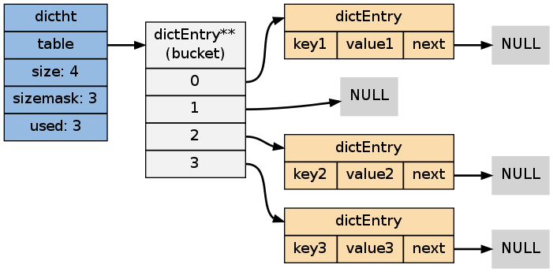

如果再加上之前列出的 ``dict`` 类型，那么整个字典结构可以表示如下：

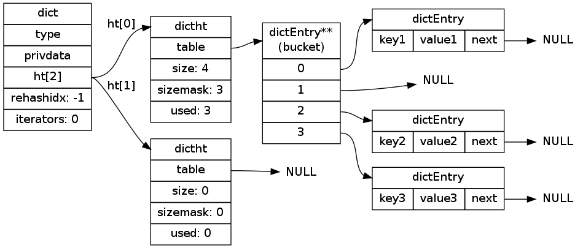

注意，这里只展示了 ``dict`` 使用单个哈希表的情况 —— 
虽然字典拥有两个指向 ``dictht`` 的指针，
但是在多数情况下，
字典只使用 ``ht[0]`` ，
只有在 ``ht[0]`` 进行 rehash 时，
字典才会同时使用 ``ht[0]`` 和 ``ht[1]`` 。

创建新字典
------------

``dictCreate`` 函数创建并返回一个新字典：

::

    dict *d = dictCreate(&hash_type, NULL);

``d`` 的值表示如下：

::

    d->type = hash_type;
    d->privdata = NULL;
    d->ht[2] = [ 
                 struct dictht {    // ht[0]
                    table = NULL;
                    size = 0;
                    sizemask = 0;
                    used = 0;
                 },
                 struct dictht {    // ht[1]
                    table = NULL;
                    size = 0;
                    sizemask = 0;
                    used = 0;
                 }
                ]
    d->rehashidx = -1;
    d->iterators = 0;

新创建的两个哈希表都没有为 ``table`` 分配任何空间：
对 ``ht[0]`` 的空间分配将留到第一次往字典添加键值对时进行，
而对 ``ht[1]`` 的空间分配将留到 rehash 开始时进行。

添加键值对到字典
--------------------------------

``dictAdd`` 函数负责将给定的键值对添加到字典，它执行以下操作：

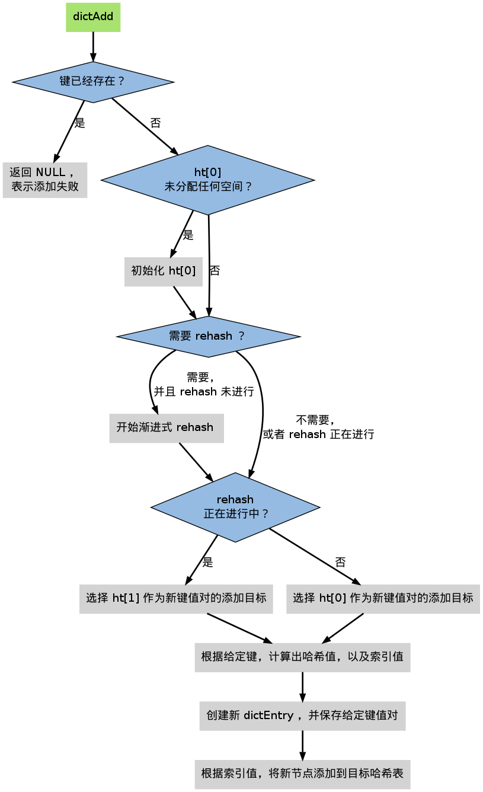

当第一次往空字典里添加键值对时，
程序会根据 ``dict.h/DICT_HT_INITIAL_SIZE`` 里指定的大小为
``d->ht[0]->table`` 分配空间
（在目前的版本中， ``DICT_HT_INITIAL_SIZE`` 的值为 ``4`` ）。

以下是字典空白时的样子：

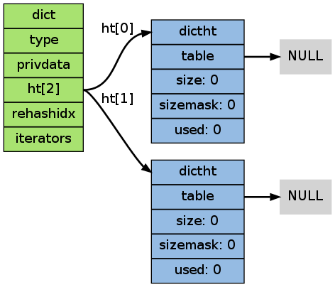

以下是往空白字典添加了第一个键值对之后的样子：

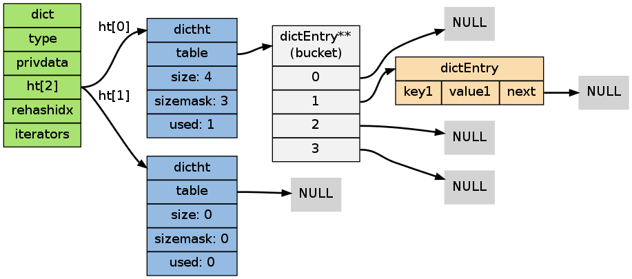

碰撞处理
--------------------------------

在哈希表实现中，当两个不同的键的哈希值相同时，我们称这两个键发生碰撞（collision），而哈希表实现必须想办法对碰撞进行处理。

``dictht`` 将多个碰撞的键放到哈希表同一个索引位置上，
将多个 ``dictEntry`` 以链表的方式连接起来，
这种解决碰撞的方法称为\ `链地址法 <http://en.wikipedia.org/wiki/Hash_table#Separate_chaining>`_\ 。

假设现在有一个带有三个节点的哈希表，如下图：

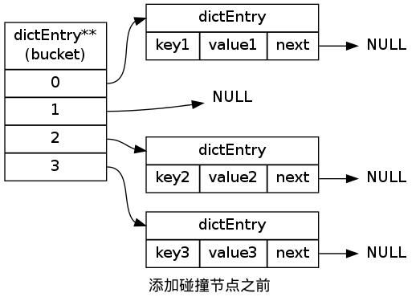

对于一个新的键值对 ``key4`` 和 ``value4`` ，
如果 ``key4`` 的哈希值和 ``key1`` 的哈希值相同，
那么它们将在哈希表的 ``0`` 号索引上发生碰撞。

通过将 ``key4-value4`` 和 ``key1-value1`` 两个键值对用链表连接起来，
就可以解决碰撞的问题：

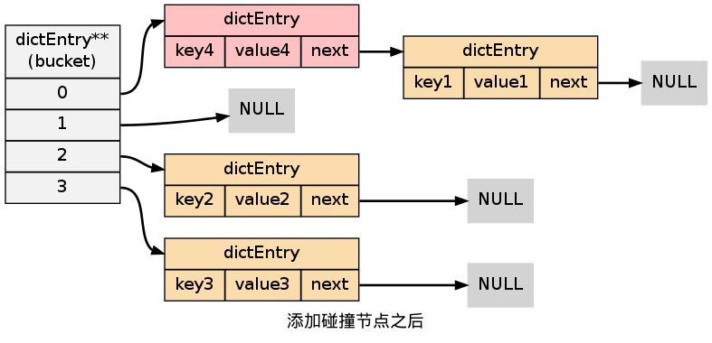

TBD（图）Rehash
-------------------

对于使用链地址法来解决碰撞问题的哈希表 ``dictht`` 来说，
哈希表的性能依赖于它的大小（\ ``size``\ 属性）和它所保存的节点的数量（\ ``used``\ 属性）之间的比率，
比率在 1:1 时，哈希表的性能最好，
如果节点数比哈希表的大小要大很多的话，哈希表的性能就会非常差。

！！！两个图，一个好性能的哈希表，另一个坏性能的哈希表！！！

为了在字典的键值对不断增多的情况下保持良好的性能，
字典需要对所使用的哈希表（\ ``ht[0]``\ ）进行 rehash 操作：
在不修改任何键值对的情况下，对哈希表进行扩容。

``dictAdd`` 在每次向字典添加新键值对之前， 都会对哈希表 ``ht[0]`` 进行检查，
对于 ``ht[0]`` 的 ``size`` 和 ``used`` 属性，
如果它们之间的比率 ``ratio = used / size`` 满足以下任何一个条件的话，rehash 过程就会被激活：

1. ``ratio >= 1`` ，且变量 ``dict_can_resize`` 为真。

2. ``ratio`` 大于变量 ``dict_force_resize_ratio`` （目前版本中， ``dict_force_resize_ratio`` 的值为 ``5`` ）。

整个 Rehash 过程可以分为以下几个阶段：

**1\)开始 rehash**

这个阶段有两个事情要做：

1. 设置字典的 ``rehashidx`` 为 ``0`` ，标识着 rehash 的开始。

2. 为 ``ht[1]`` 分配空间，大小至少为 ``ht[0].used`` 的两倍。

这时的字典是这个样子：

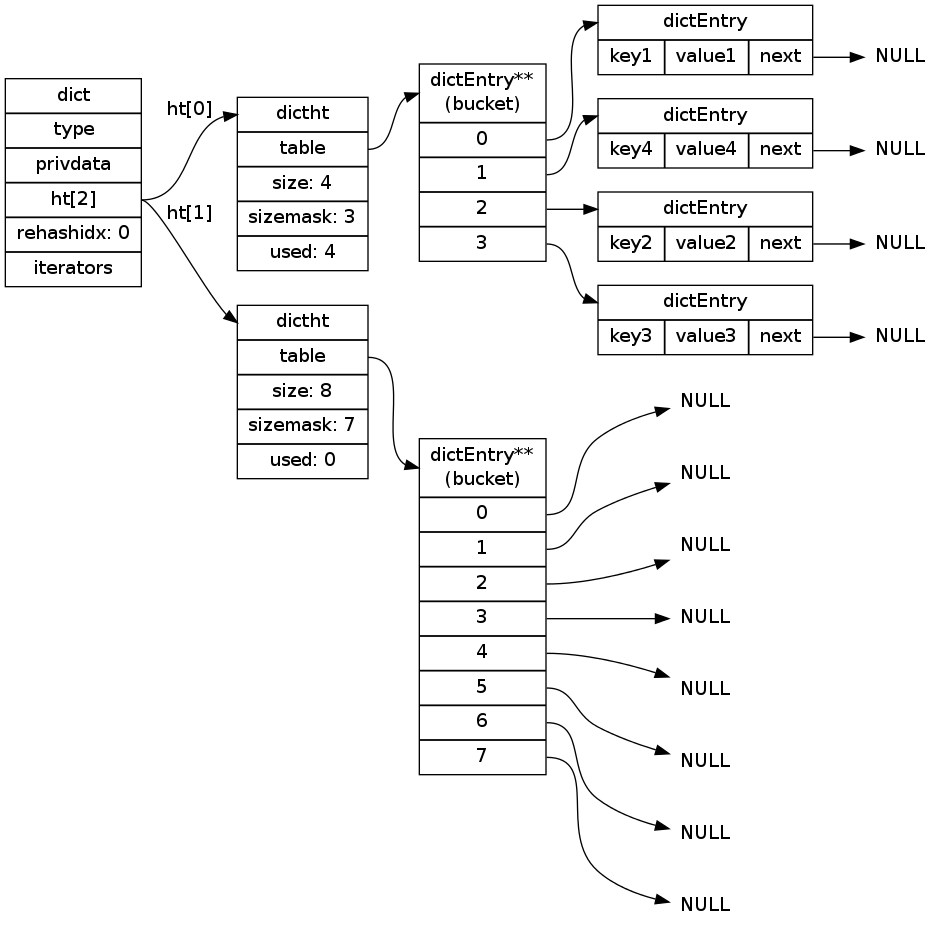

**2\)Rehash 进行中**

在这个阶段， ``ht[0]`` 的节点会被逐渐迁移到 ``ht[1]`` ，
因为 rehash 是分多次进行的（细节在下一节解释），
字典的 ``rehashidx`` 变量会记录 rehash 进行到 ``ht[0]`` 的哪个索引位置上。

以下是 ``rehashidx`` 值为 ``2`` 时，字典的样子：

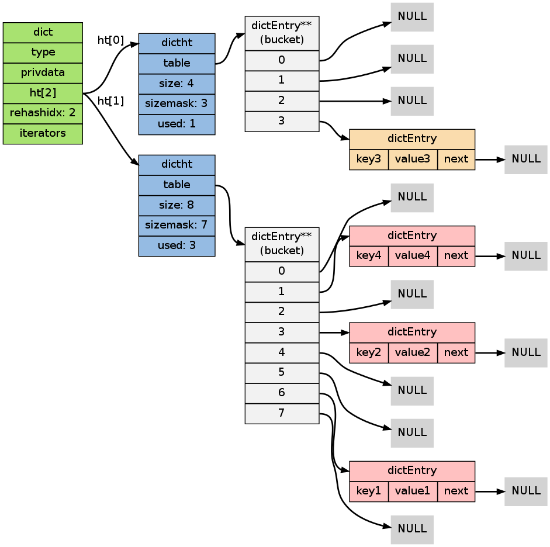

注意除了节点的移动外，
字典的 ``rehashidx`` 、 ``ht[0].used`` 和 ``ht[1].used`` 三个属性也产生了变化。

**3\)节点迁移完毕**

到了这个阶段，所有的节点都已经从 ``ht[0]`` 迁移到 ``ht[1]`` 了：

.. image:: image/rehash_step_three.png

**4\)Rehash 完毕**

在 rehash 的最后阶段，程序会执行以下工作：

1. 释放 ``ht[0]`` 的空间。

2. 用 ``ht[1]`` 来代替 ``ht[0]`` ，使原来的 ``ht[1]`` 成为新的 ``ht[0]`` 。

3. 创建一个新的空哈希表，并将它设置为 ``ht[1]`` 。

4. 将字典的 ``rehashidx`` 属性设置为 ``-1`` ，标识 rehash 已停止。

以下是字典 rehash 完毕之后的样子：

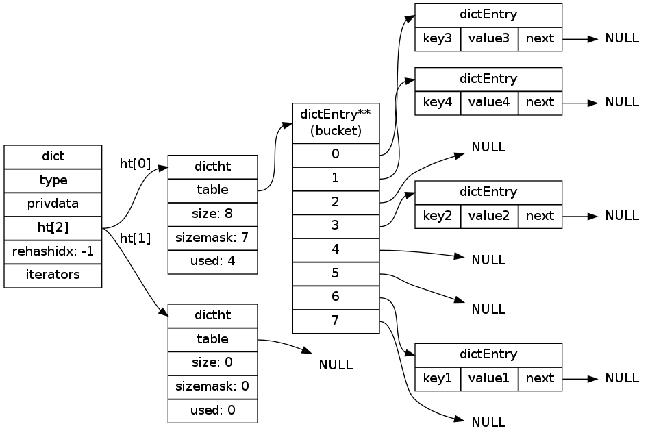

对比字典 rehash 之前和 rehash 之后，
新的 ``ht[0]`` 空间更大，
并且字典原有的节点也没有被修改或者删除。

渐进式 rehash 
-------------------

在上一节，我们了解了字典的 rehash 过程，
需要特别指出的是， rehash 程序并不是在激活之后就马上执行直到完成的，
而是分多次、渐进式地完成的。

假设这样一个场景：在一个有很多键值对的字典里，
某个用户在添加新键值对时触发了 rehash 过程，
如果这个 rehash 过程必须将所有键值对迁移完毕之后才将结果返回给用户，
这样的处理方式将是非常不友好的。

.. todo: 用个 meme 来表示？

为了解决这个问题，
Redis 使用了渐进式（incremental）的rehash 方式：
通过将 rehash 分散到多个步骤中进行，从而避免了集中式的计算。

渐进式 rehash 主要由 ``_dictRehashStep`` 和 ``dictRehashMilliseconds`` 两个函数进行。

**_dictRehashStep**

每次执行 ``_dictRehashStep`` ，
``ht[0]`` 哈希表第一个不为空的索引上的所有节点就会全部迁移到 ``ht[1]`` 。

在 rehash 开始进行之后（\ ``d->rehashidx`` 不为 ``-1``\ ），
每次执行一次添加、查找、删除操作，
``_dictRehashStep`` 都会被执行一次：

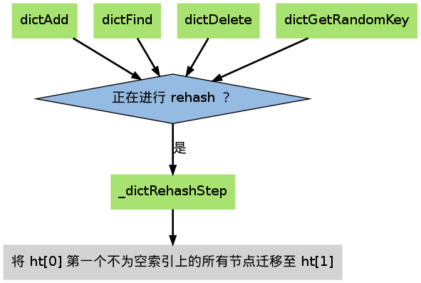

因为字典会保持哈希表大小和节点数的比率在一个很小的范围内，
所以每个索引上的节点数量不会很多（目前版本的 rehash 条件来看，平均只有一个，最多只有五个），
所以在执行操作的同时，对单个索引上的节点进行迁移，
几乎不会对响应时间造成影响。

**dictRehashMilliseconds**

除了使用 ``_dictRehashStep`` 对单个索引上的节点进行迁移外，
``dictRehashMilliseconds`` 还可以在指定的毫秒数内，
对字典进行 rehash 。

``dictRehashMilliseconds`` 的一个使用例子就是在 Redis 的主进程内，
对各个数据库所使用的字典进行渐进式 rehash 。

**其他措施**

除了 ``_dictRehashStep`` 和 ``dictRehashMilliseconds`` 之外，
在哈希表进行 rehash 时，
字典还会采取一些特别的措施，
确保 rehash 顺利、正确地进行：

- 因为在 rehash 时，字典会同时使用两个哈希表，所以在这期间的所有查找、删除等操作，除了在 ``ht[0]`` 上进行，还需要在 ``ht[1]`` 上进行。

- 在执行添加操作时，新的节点会直接添加到 ``ht[1]`` 而不是 ``ht[0]`` ，这样保证 ``ht[0]`` 的节点数量在整个 rehash 过程中都只减不增。

TBD 其他操作
----------------

**按 key 进行查找**

**按 key 进行删除**

TBD 哈希表迭代器
--------------------

Redis 为字典实现了两种迭代器：

- 安全迭代器 —— 在迭代进行时，可以对字典进行修改。

- 不安全迭代器 —— 在迭代进行时，只能调用 ``dictNext`` 。

**数据结构**

迭代器由以下数据结构实现：

::

    typedef struct dictIterator {
        dict *d;
        int table,
            index,
            safe;
        dictEntry *entry,
                  *nextEntry;
    } dictIterator;

属性 ``d`` 指向正在被迭代的字典。

属性 ``table`` 标示正在被迭代的哈希表。

属性 ``index`` 标示正在迭代的哈希表数组的索引。

属性 ``safe`` 表示该迭代器是否安全。

属性 ``entry`` 指向当前被迭代到的节点。

属性 ``nextEntry`` 用于保存 ``entry`` 节点的后继节点，因为在使用安全迭代器时， ``entry`` 本身有可能被调用者所修改，所以需要在返回 ``entry`` 之前，保存它的后继节点。

**操作**

迭代器定义了以下操作函数：

``dictIterator *dictGetIterator(dict *d)`` ：创建一个不安全迭代器。

``dictIterator *dictGetSafeIterator(dict *d)`` ：创建一个安全迭代器。

``dictEntry *dictNext(dictIterator *iter)`` ：返回迭代器指向的当前节点，如果迭代完毕，返回 ``NULL`` 。

``void dictReleaseIterator(dictIterator *iter)`` ：释放迭代器。
