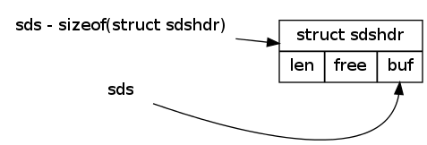

动态字符串 —— Simple Dynamic String (sds)
===========================================

Sds 是 Redis 底层所使用的字符串表示，它被使用在几乎所有的 Redis 模块中，其中最关键的几个用途是：

* 保存 Redis 对象的键
* 实现 Redis 的字符串类型
* 表示 Redis 命令的回复

以下是这三个用途的介绍和用例。

**保存 Redis 对象的键**

在 Redis 中，所有对象的键都以 sds 格式保存。举个例子，对于以下代码：

::

    SET project-name "Redis"

    LPUSH nosql "Redis" "MongoDB" "Neo4j"

    HSET author "Redis" "antirez"

``project-name`` 、 ``nosql`` 、 ``author`` 这些键全都是以 sds 的形式保存在 Redis 中。

**实现 Redis 的字符串类型**

Redis 的字符串类型也是通过 sds 实现的：所有操作字符串值的命令，比如 ``set`` 、 ``getset`` 、 ``append`` 等等，在底层操作的都是 sds ，而字符串的实际内容则保存在 sds 的 buffer 当中。

::

    redis 127.0.0.1:6379> set msg "hello world"     // 创建新 sds ，并保存值 "hello world\0"
    OK

    redis 127.0.0.1:6379> append msg "!"            // 适当扩展 sds 的 buffer 长度，并将 "!" 字符串追加到末尾
    (integer) 12

    redis 127.0.0.1:6379> get msg                   // 取出 sds 的值
    "hello world!"

**表示 Redis 命令的回复**

在 Redis 中，所有命令的回复(reply)都以 sds 格式表示(represent)，通过打印 sds 所保存的字符串内容，可以将命令的回复显示给客户端。

其中，单个回复以单个 sds 表示，而多个回复则以 sds 的链表表示。

::

    redis 127.0.0.1:6379> set msg "hello world!"            // 单个回复
    OK

    redis 127.0.0.1:6379> set book "learn c++ in 21 days"
    OK

    redis 127.0.0.1:6379> set language "c++"
    OK

    redis 127.0.0.1:6379> get book                          // 单个回复
    "learn c++ in 21 days"

    redis 127.0.0.1:6379> mget msg book language            // 多个回复
    1) "hello world!"
    2) "learn c++ in 21 days"
    3) "c++"

Redis 中的字符串
----------------------

在 C 语言中，字符串可以用一个 ``\0`` 结尾的 ``char`` 数组来表示。

比如说， ``hello world`` 在 C 语言中就可以表示为 ``"hello world\0"`` 。

这种简单的字符串表示在大多数情况下都能满足要求，但是，它并不能高效地支持长度计算和追加(append)这两种操作：

* 对于字符串的每次长度计算(``strlen(s)``)，算法复杂度为 :math:`\theta(n)` 。

* 对字符串的 N 次追加，必定需要对字符串进行 N 次内存重分配(``realloc``)。

在 Redis 内部，字符串的追加和长度计算并不少见，而 ``APPEND`` 和 ``STRLEN`` 更是这两种操作在 Redis 命令中的直接映射，因此，为了高效地支持这两种操作， Redis 使用 sds 而不是 ``char`` 数组，作为 Redis 的默认字符串表示。

sds 的实现
-----------------------

在前面的内容中，我们一直将 sds 作为一种抽象数据结构来说明，实际上，它的实现由以下两部分组成(从现在开始，文章将明确区分 ``sds`` 类型和 ``sdshdr`` 结构)：

::

    // sds 类型                                                            
    typedef char *sds;                                                     

    // sdshdr 结构                                                         
    struct sdshdr {                                                        
        int len;        // buf 已占用长度                                  
        int free;       // buf 可用长度                                    
        char buf[];     // 实际保存字符串的地方
    };    

其中，类型 ``sds`` 是 ``char *`` 的别名(alias)，而结构 ``sdshdr`` 则保存了 ``len`` 、 ``free`` 和 ``buf`` 三个属性。

作为例子，以下是新创建的，同样保存 ``hello world`` 字符串的 ``sdshdr`` 结构：

::

    struct sdshdr {
        len = 11;
        free = 0;
        buf = "hello world\0";  // buf 的实际长度为 len + 1 
    };

通过 ``len`` 属性， ``sdshdr`` 可以实现复杂度为 :math:`\theta(1)` 的长度计算操作。

另一方面，通过对 ``buf`` 分配一些额外的空间，并使用 ``free`` 记录未使用空间的大小， ``sdshdr`` 可以减少执行追加操作所需的内存重分配次数：最坏情况下，进行 N 次追加仍然需要 N 次内存重分配；但是，在最好情况下， N 次追加只需要 1 次内存重分配。比起原始 C 字符串 N 次追加必定需要 N 次重分配来说， ``sdshdr`` 的处理方式要高效很多。

当然，这种字符串实现也对操作的正确实现提出了要求 —— 所有处理 ``sdshdr`` 的函数，都必须正确地更新 ``len`` 和 ``free`` 属性，否则就会造成 bug 。

通过 sds 来持有 sdshdr 结构
---------------------------------

在 Redis 的 ``sds.c`` 模块中，大部分函数处理的都是 ``sds`` 类型，也即是 ``sdshdr`` 的 ``buf`` 部分，而处理 ``sdshdr`` 结构的函数则只占一小部分。

为了节省一些打字时间， ``sds.c`` 模块在源码中使用了一个指针技巧：通过指针运算，程序使用 ``sds`` 来持有 ``sdshdr`` 结构，而不是直接持有 ``sdshdr`` 结构。

举个例子， ``sdsnewlen`` 函数创建一个包含指定 ``buf`` 长度的 ``sdshdr`` 结构，但是这个函数的返回值却是 ``sdshdr`` 的 ``buf`` 部分，而不是 ``sdshdr`` 结构：

::

    /*
     * 创建一个指定长度的 sds 
     * 如果给定了初始化值 init 的话，那么将 init 复制到 sds 的 buf 当中
     */
    sds sdsnewlen(const void *init, size_t initlen) {

        struct sdshdr *sh;

        // 为 sh 分配内存，设置值，等等 ...

        return (char*)sh->buf;  // 返回 buf 而不是整个 sdshdr
    }   

这样一来，Redis 源码的使用者就可以像操纵普通的 ``char`` 数组一样操纵 ``sds`` :

::

    sds s = sdsnewlen("hello world", 11);   // s = "hello world\0";

这个 ``sds`` 可以直接用在那些接受 ``sds`` 或者 ``char *`` 的函数上。

``sdstoupper`` 函数就是一个这样的例子，它接受一个 ``sds`` 值，并将它的所有字符转换为大写，这个过程中不需要用到 ``sdshdr`` 结构：

::

    /*
     * 将给定 sds 中的字符全部转为大写
     *
     * 用例：
     *
     *   sds s = sdsnewlen("hello world", 11);
     *   // s = "hello world\0";
     *
     *   sdstoupper(s);
     *   // s = "HELLO WORLD\0";
     */
    void sdstoupper(sds s) {
        int len = sdslen(s), j;

        for (j = 0; j < len; j++) s[j] = toupper(s[j]);
    }

另一方面，对于那些需要 ``sdshdr`` 结构的函数，程序可以通过指针运算，通过 ``sds`` 获取与之相对应的 ``sdshdr`` 结构。

``sdsclear`` 函数就是这样一个例子，它接受一个 ``sds`` ，根据 ``sds`` 计算出 ``sdshdr`` 结构，并将这个结构的 ``free`` 、 ``len`` 和 ``buf`` 三个属性清空：

::

    /*
     * 清除给定 sds buf 中的内容，让它只包含一个 \0 终结符
     *
     * 用例：
     *
     *   sds s = sdsnewlen("hello world", 11);
     *   // sdshdr->len = 11;
     *   // sdshdr->free = 0;
     *   // sdshdr->buf = "hello world\0";
     *
     *   sdsclear(s);
     *   // sdshdr->len = 0;
     *   // sdshdr->free = 11;
     *   // sdshdr->buf = "\0           ";  // 空白为未使用空间
     */
    void sdsclear(sds s) {

        // 根据 sds ，计算出相应的 sdshdr 结构
        struct sdshdr *sh = (void*) (s-(sizeof(struct sdshdr)));

        sh->free += sh->len;
        sh->len = 0;
        sh->buf[0] = '\0';
    }

语句 ``s-(sizeof(struct sdshdr))`` 将指针从 ``buf`` 属性回退到 ``sdshdr`` 结构本身，从而返回一个 ``sdshdr`` 结构：

明白了这个技巧之后，阅读 ``sds.c`` 模块的源码基本上就不会遇到问题了。

优化追加操作
-------------------------

在前面说到过，利用 ``sdshdr`` 结构，除了可以用 :math:`\theta(1)` 复杂度获取字符串的长度之外，还可以减少追加(append)操作所需的内存重分配次数，以下就来详细解释这个优化的原理。

为了易于理解，我们用一个 Redis 执行实例作为例子，解释一下，当执行以下代码时， Reids 内部发生了什么：

::

    redis 127.0.0.1:6379> SET msg "hello world"
    OK

    redis 127.0.0.1:6379> APPEND msg " again!"
    (integer) 18

首先， ``SET`` 命令创建并保存 ``hello world`` 到一个 ``sdshdr`` 中，这个 ``sdshdr`` 的值如下：

::

    struct sdshdr {
        len = 11;
        free = 0;
        buf = "hello world\0";
    }

当执行 ``APPEND`` 命令时，相应的 ``sdshdr`` 被更新，字符串 ``" again!"`` 被追加到原来的 ``"hello world"`` 之后：

::

    struct sdshdr {
        len = 18;
        free = 18;
        buf = "hello world again!\0                  ";     // 空白的地方为预分配空间
    }

注意，当第一次创建 ``sdshdr`` 时，它的 ``free`` 属性为 ``0`` ，Redis 也没有为 ``buf`` 创建额外的空间。而在执行 ``APPEND`` 之后，Redis 为 ``buf`` 创建了多于所需空间一倍的大小。

在这个例子中，保存 ``"hello world again!"`` 共需要 ``18 + 1`` 个 ``char`` 空间，但 Redis 却为我们分配了 ``18 + 18 + 1 = 37`` 个 ``char`` 空间，这样一来，如果将来再次对同一个 ``sdshdr`` 进行追加操作，只要追加内容的长度不超过 ``free`` 属性的值， ``buf`` 就不需要进行重非配。

另一方面，当 Redis 需要更多内存时，它会按照规定的算法，收缩 ``sdshdr->buf`` 中多余的空间，因此，从理论上来说，这种预分配策略在不浪费内存的情况下，大大减少了执行追加操作时所需的内存重分配次数。

``sds.c`` 模块中的 ``sdsMakeRoomFor`` 函数描述了 ``sdshdr`` 的内存分配策略：

::

    /* 
     * 对 sds 的 buf 进行扩展，扩展的长度不少于 addlen 。
     */
    sds sdsMakeRoomFor(
        sds s,
        size_t addlen   // 需要增加的空间长度
    ) 
    {
        struct sdshdr *sh, *newsh;
        size_t free = sdsavail(s);  // 剩余空间
        size_t len, newlen;

        // 剩余空间可以满足需求，无须扩展
        if (free >= addlen) return s;

        // 获取 sdshdr 结构
        sh = (void*) (s-(sizeof(struct sdshdr)));

        // 目前 buf 长度
        len = sdslen(s);
        // 新 buf 长度
        newlen = (len+addlen);
        // 如果新 buf 长度小于 SDS_MAX_PREALLOC 长度
        // 那么将 buf 的长度设为新 buf 长度的两倍
        if (newlen < SDS_MAX_PREALLOC)
            newlen *= 2;
        else
            newlen += SDS_MAX_PREALLOC;

        // 扩展长度
        newsh = zrealloc(sh, sizeof(struct sdshdr)+newlen+1);
        if (newsh == NULL) return NULL;

        newsh->free = newlen - len;

        return newsh->buf;
    }

在目前版本的 Redis 中， ``SDS_MAX_PREALLOC`` 的值为 ``1024 * 1024`` ，也就是说，对大小小于 ``1MB`` 的字符串来说， ``sdsMakeRoomFor`` 都为它们预分配多于现有长度一倍的空间。如果字符串的大小大于 ``1MB`` ，那么 ``sdsMakeRoomFor`` 就为它们多分配 ``1MB`` 的空间。

sds.c 模块的其他函数
-----------------------

TODO: 列举 API
