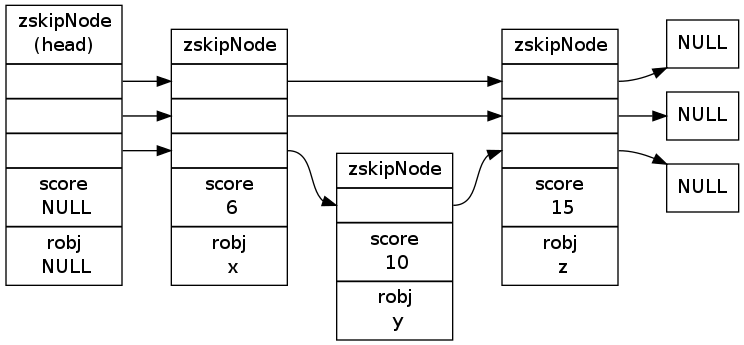

跳跃表
====================

跳跃表（\ `skiplist <http://en.wikipedia.org/wiki/Skip_list>`_\ ）是一种随机化的数据，
由 William Pugh 在论文《Skip lists: a probabilistic alternative to balanced trees》中提出，
这种数据结构以有序的方式在层次化的链表中保存元素，
它的效率可以和平衡树媲美 ——
查找、删除、添加等操作都可以在对数期望时间下完成，
并且比起平衡树来说，
跳跃表的实现要简单直观得多。

以下是一个典型的跳跃表例子（图片来自\ `维基百科 <http://en.wikipedia.org/wiki/File:Skip_list.svg>`_\ ）：

.. image:: image/skiplist.png
   :height: 234px
   :width: 1000px
   :scale: 80%

从图中可以看到，
跳跃表主要由以下部分构成：

- 表头（head）：负责维护跳跃表的节点指针。

- 跳跃表节点：保存着元素值，以及多个层。

- 层：保存着指向其他元素的指针。高层的指针越过的元素数量大于等于低层的指针，为了提高查找的效率，程序总是从高层先开始访问，然后随着元素值范围的缩小，慢慢降低层次。

- 表尾：全部由 ``NULL`` 组成，表示跳跃表的末尾。

因为跳跃表的定义可以在任何一本算法或数据结构的书中找到，
所以本章不介绍跳跃表的具体实现方式或者具体的算法，
而只介绍跳跃表在 Redis 的应用、核心数据结构和 API 。

跳跃表的实现
---------------

为了适应自身的功能需要，
Redis 基于 William Pugh 论文中描述的跳跃表进行了以下修改：

1. 允许重复的 ``score`` 值：多个不同的 ``member`` 的 ``score`` 值可以相同。

2. 进行对比操作时，不仅要检查 ``score`` 值，还要检查 ``member`` ：当 ``score`` 值可以重复时，单靠 ``score`` 值无法判断一个元素的身份，所遇需要连 ``member`` 域都一并检查才行。

3. 每个节点都带有一个高度为 1 层的后退指针，用于从表尾方向向表头方向迭代：当执行 :ref:`zrevrange` 或 :ref:`zrevrangebyscore` 这类以逆序处理有序集的命令时，就会用到这个属性。

这个修改版的跳跃表由 ``redis.h/zskiplist`` 结构定义：

::

    typedef struct zskiplist {

        // 头节点，尾节点
        struct zskiplistNode *header, *tail;

        // 节点数量
        unsigned long length;

        // 目前表内节点的最大层数
        int level;

    } zskiplist;

跳跃表的节点由 ``redis.h/zskiplistNode`` 定义：

::

    typedef struct zskiplistNode {

        // member 对象
        robj *obj;

        // 分值
        double score;

        // 后退指针
        struct zskiplistNode *backward;

        // 层
        struct zskiplistLevel {

            // 前进指针
            struct zskiplistNode *forward;

            // 这个层跨越的节点数量
            unsigned int span;

        } level[];

    } zskiplistNode;

以下是操作这两个数据结构的 API ，它们的作用以及相应的算法复杂度：

========================== ============================================================== ===================================================
函数                        作用                                                            复杂度
========================== ============================================================== ===================================================
``zslCreateNode``           创建并返回一个新的跳跃表节点                                    最坏 :math:`O(1)`

``zslFreeNode``             释放给定的跳跃表节点                                            最坏 :math:`O(1)`

``zslCreate``               创建并初始化一个新的跳跃表                                      最坏 :math:`O(N)`

``zslFree``                 释放给定的跳跃表                                                最坏 :math:`O(N)`

``zslInsert``               将一个包含给定 ``score`` 和 ``member`` 的新节点添加到跳跃表中   最坏 :math:`O(N)` 平均 :math:`O(\log N)`

``zslDeleteNode``           删除给定的跳跃表节点                                            最坏 :math:`O(N)`

``zslDelete``               删除匹配给定 ``member`` 和 ``score`` 的元素                     最坏 :math:`O(N)` 平均 :math:`O(\log N)`

``zslFirstInRange``         找到跳跃表中第一个符合给定范围的元素                            最坏 :math:`O(N)` 平均 :math:`O(\log N)`

``zslLastInRange``          找到跳跃表中最后一个符合给定范围的元素                          最坏 :math:`O(N)` 平均 :math:`O(\log N)`

``zslDeleteRangeByScore``   删除 ``score`` 值在给定范围内的所有节点                         最坏 :math:`O(N^2)` 

``zslDeleteRangeByRank``    删除给定排序范围内的所有节点                                    最坏 :math:`O(N^2)`

``zslGetRank``              返回目标元素在有序集中的排位                                    最坏 :math:`O(N)` 平均 :math:`O(\log N)`

``zslGetElementByRank``     根据给定排位，返回该排位上的元素节点                            最坏 :math:`O(N)` 平均 :math:`O(\log N)`
========================== ============================================================== ===================================================

跳跃表的应用
---------------

和字典、链表或者字符串这几种在 Redis 中大量使用的数据结构不同，
跳跃表在 Redis 的唯一作用，
就是实现有序集数据类型。

跳跃表将指向有序集的 ``score`` 值和 ``member`` 域的指针作为元素，
并以 ``score`` 值为索引，
对有序集元素进行排序。

举个例子，
以下代码就创建了一个带有 3 个元素的有序集：

::

    redis> ZADD s 6 x 10 y 15 z
    (integer) 3

    redis> ZRANGE s 0 -1 WITHSCORES
    1) "x"
    2) "6"
    3) "y"
    4) "10"
    5) "z"
    6) "15"

在底层实现中，
Redis 为 ``x`` 、 ``y`` 和 ``z`` 三个 ``member`` 分别创建了三个字符串，
并为 ``6`` 、 ``10`` 和 ``15`` 分别创建三个 ``double`` 类型的值，
然后用一个跳跃表将这些指针有序地保存起来，
形成这样一个跳跃表：

为了展示的方便，
在图片中我们直接将 ``member`` 和 ``score`` 值包含在表节点中，
但是在实际的定义中，
因为跳跃表要和另一个实现有序集的结构（字典）分享 ``member`` 和 ``score`` 值，
所以跳跃表只保存指向 ``member`` 和 ``score`` 的指针。
更详细的信息，请参考《\ :ref:`sorted_set_chapter`\ 》章节。

小结
------

- 跳跃表是一种随机化数据结构，它的查找、添加、删除操作都可以在对数期望时间下完成。

- 跳跃表目前在 Redis 的唯一作用就是作为有序集类型的底层数据结构（之一，另一个构成有序集的结构是字典）。

- 为了适应自身的需求，Redis 基于 William Pugh 论文中描述的跳跃表进行了修改，包括：

  1. ``score`` 值可重复。
  2. 对比一个元素需要同时检查它的 ``score`` 和 ``memeber`` 。
  3. 每个节点带有高度为 1 层的后退指针，用于从表尾方向向表头方向迭代。
