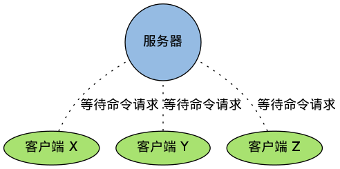
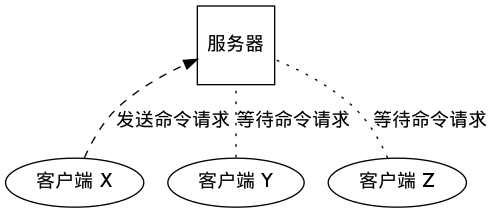
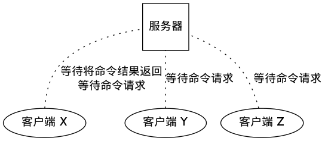
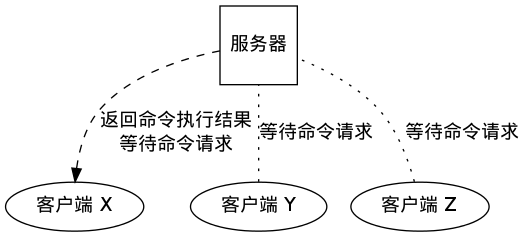
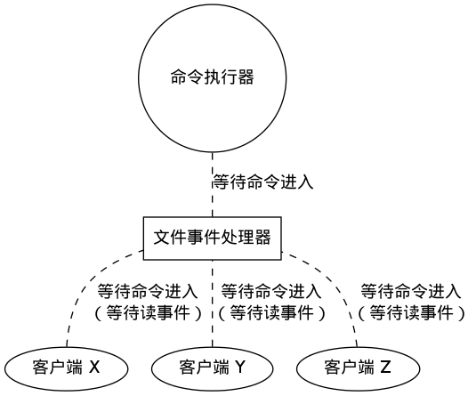
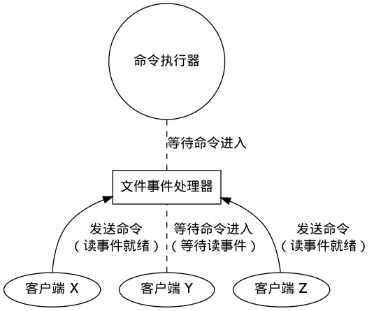
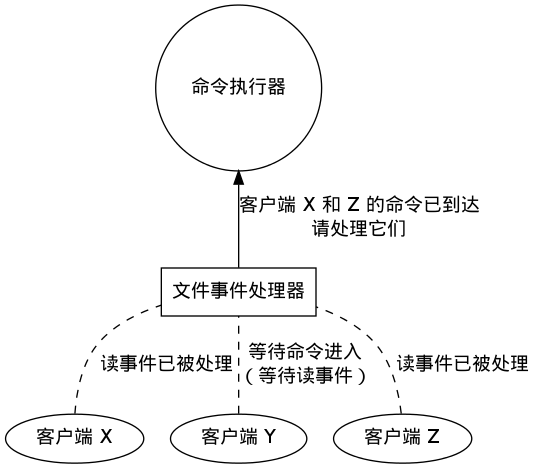
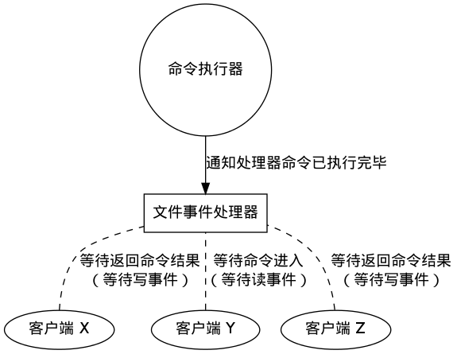
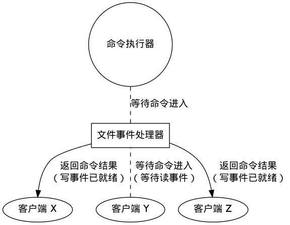

事件处理器
===========================

事件处理器是 Redis 服务器的核心，
它处理两项重要的任务：

1. 在多个客户端中实现多路复用，接受它们发来的命令请求，并将命令的执行结果返回给客户端。

2. 实现服务器中断器。

本章就来介绍事件处理器的实现，
以及它的详细工作行为。

文件事件
------------

Redis 服务器通过在多个客户端之间进行多路复用，
从而实现高效的命令请求处理：
多个客户端通过套接字连接到 Redis 服务器中，
但只有在套接字可以无阻塞地进行读或者写时，
服务器才会和这些客户端进行交互。

Redis 将这类因为对套接字进行多路复用而产生的事件称为文件事件（file event），
文件事件可以分为读事件和写事件两类。

读事件
^^^^^^^^^

读事件标志着客户端命令请求的发送状态。

当一个新的客户端连接到服务器时，
服务器会给为该客户端绑定读事件，
直到客户端断开连接之后，
这个读事件才会被移除。

读事件在整个网络连接的生命期内，
都会在等待和就绪两种状态之间切换：

- 当客户端只是连接到服务器，但并没有向服务器发送命令时，该客户端的读事件就处于等待状态。

- 当客户端给服务器发送命令请求，并且请求已到达时（相应的套接字可以无阻塞地执行读操作），该客户端的读事件处于就绪状态。

作为例子，
下图展示了三个已连接到服务器、但并没有发送命令的客户端：

这三个客户端的状态如下表：

=============  ==========================    ===============================
客户端              读事件状态                  命令发送状态
客户端 X            等待                        未发送
客户端 Y            等待                        未发送
客户端 Z            等待                        未发送
=============  ==========================    ===============================

之后，
当客户端 X 向服务器发送命令请求，
并且命令请求已到达时，
客户端 X 的读事件状态变为就绪：

这时，
三个客户端的状态如下表（只有客户端 X 的状态被更新了）：

=============  ==========================    ===============================
客户端              读事件状态                  命令发送状态
客户端 X            **就绪**                    **已发送，并且已到达**
客户端 Y            等待                        未发送
客户端 Z            等待                        未发送
=============  ==========================    ===============================

当事件处理器被执行时，
就绪的文件事件会被识别到，
相应的命令请求会被发送到命令执行器，
并对命令进行求值。

写事件
^^^^^^^^^

写事件标志着客户端对命令结果的接收状态。

和客户端自始至终都关联着读事件不同，
服务器只会在有命令结果要传回给客户端时，
才会为客户端关联写事件，
并且在命令结果传送完毕之后，
客户端和写事件的关联就会被移除。

一个读事件会在两种状态之间切换：

- 当服务器有命令结果需要返回给客户端，但客户端还未能执行无阻塞写，那么写事件处于等待状态。

- 当服务器有命令结果需要返回给客户端，并且客户端可以进行无阻塞写，那么写事件处于就绪状态。

当客户端向服务器发送命令请求，
并且请求被接受并执行之后，
服务器就需要将保存在缓存内的命令执行结果返回给客户端，
这时服务器就会为客户端关联写事件。

作为例子，
下图展示了三个连接到服务器的客户端，
其中服务器正等待客户端 X 变得可写，
从而将命令的执行结果返回给它：

此时三个客户端的事件状态分别如下表：

=============  ==========================   =================================
客户端              读事件状态                  写事件状态
客户端 X            等待                        等待
客户端 Y            等待                        无
客户端 Z            等待                        无
=============  ==========================   =================================

当客户端 X 的套接字可以进行无阻塞写操作时，
写事件就绪，
服务器将保存在缓存内的命令执行结果返回给客户端：

此时三个客户端的事件状态分别如下表（只有客户端 X 的状态被更新了）：

=============  ==========================   =================================
客户端              读事件状态                  写事件状态
客户端 X            等待                        **已就绪**
客户端 Y            等待                        无
客户端 Z            等待                        无
=============  ==========================   =================================

当命令执行结果被传送回客户端之后，
客户端和写事件之间的关联会被解除（只剩下读事件），
至此，
返回命令执行结果的动作执行完毕：

.. note:: 同时关联写事件和读事件

    前面提到过，读事件只有在客户端断开和服务器的连接时，才会被移除。

    这也就是说，当客户端关联写事件的时候，实际上它在同时关联读/写两种事件。

    因为在同一次文件事件处理器的调用中，
    单个客户端只能执行其中一种事件（要么读，要么写，但不能又读又写），
    当出现读事件和写事件同时就绪的情况时，
    事件处理器优先处理读事件。

事件处理器状态
------------------

和其他很多的事件处理器一样，
Redis 的事件处理器也是由一个循环（loop）驱动的：
通过在一个循环里不断对事件状态进行修改，
从而实现事件的处理、添加、修改和删除操作：

.. image:: image/event-loop.png

Redis 事件处理器的状态由 ``ae.h/aeEventLoop`` 结构表示：

::

    typedef struct aeEventLoop {
        // 目前已注册的最大描述符
        int maxfd;   /* highest file descriptor currently registered */
        // 目前已追踪的最大描述符
        int setsize; /* max number of file descriptors tracked */
        // 用于生成时间事件 id
        long long timeEventNextId;
        // 最后一次执行时间事件的时间
        time_t lastTime;     /* Used to detect system clock skew */

        // 已注册的文件事件
        aeFileEvent *events; /* Registered events */

        // 已就绪的文件事件
        aeFiredEvent *fired; /* Fired events */

        // 时间事件
        aeTimeEvent *timeEventHead;

        // 事件处理器的开关
        int stop;
        // 多路复用库的私有数据
        void *apidata; /* This is used for polling API specific data */
        // 在处理事件前要执行的函数
        aeBeforeSleepProc *beforesleep;
    } aeEventLoop;

在这个结构中，
最重要的是 ``events`` 、 ``fired`` 和 ``timeEventHead`` 三个属性：

- ``events`` 属性：保存所有正在等待的文件事件。

- ``fired`` 属性：记录所有已就绪文件事件的信息。“已就绪”指的是，事件无须再等待，已经可以被执行了。

- ``timeEventHead`` 属性：保存所有正在等待的时间事件。因为所有时间事件都串连在一个链表里，所以这个属性被称为 ``Head`` 。

在本章接下来的内容中，
我们将详细地分析这三个属性，
以及它们所对应的事件。

文件事件
------------------------

Redis 服务器通过在多个客户端之间进行多路复用，
从而实现高效的命令请求处理：
多个客户端通过套接字连接到 Redis 服务器中，
但只有在套接字可以无阻塞地进行读或者写时，
服务器才会和这些客户端进行交互。

Redis 将这类因为对套接字进行多路复用而产生的事件称为文件事件（file event），
这种事件的信息分别由 ``aeEventLoop`` 结构中的 ``events`` 属性和 ``fired`` 属性保存。

以下两个小节将对这两个属性进行介绍。

events 属性
^^^^^^^^^^^^^^^^

``events`` 属性是一个 ``aeFileEvent`` 类型的数组，
每个 ``aeFileEvent`` 结构都记录了一个和文件描述符相关联的事件的信息，
其中 ``events[i]`` 记录的就是文件描述符 ``i`` 的事件信息。

``aeFileEvent`` 类型的定义如下：

::

    typedef struct aeFileEvent {
        // 事件类型掩码
        int mask; 
        // 写事件函数
        aeFileProc *rfileProc;
        // 读事件函数
        aeFileProc *wfileProc;
        // 多路复用库的私有数据
        void *clientData;
    } aeFileEvent;

``aeFileEvent`` 最重要的是 ``mask`` 、 ``rfileProc`` 和 ``wfileProc`` 三个属性，
它们的作用分别如下：

- ``mask`` ：记录了描述符正在等待的文件事件，它的值可以是 ``AE_READABLE`` 或者 ``AE_WRITABLE`` ，或者两者的或。

- ``rfileProc`` ：指向读事件处理函数的指针。

- ``wfileProc`` ：指向写事件处理函数的指针。

注意，
虽然文件描述符可以同时关联两种事件的处理函数，
但同一时间内，
只有一种事件会被处理，
这也就是说，
连接要么写，
要么读，
但不能又读又写。

如果文件描述符同时关联了两种事件，
并且两种事件都已就绪，
那么程序优先执行读事件。

fired 属性
^^^^^^^^^^^^^^

除了记录了所有事件信息的 ``events`` 数组之外，
多路复用程序还使用 ``fired`` 数组记录所有已就绪文件的事件信息。

``fired`` 属性是一个 ``aeFiredEvent`` 类型的数组，
每个 ``aeFiredEvent`` 结构都记录了一个已就绪的文件事件。

``aeFiredEvent`` 类型的定义如下：

::

    typedef struct aeFiredEvent {
        // 已就绪文件描述符
        int fd;
        // 事件类型掩码，可以是 AE_READABLE 或 AE_WRITABLE
        int mask;
    } aeFiredEvent;

``fd`` 记录了已就绪文件的描述符。

``mask`` 则记录了已就绪的事件类型，它的值可以是 ``AE_READABLE`` 、 ``AE_WRITABLE`` 或这两者的或：

- ``AE_READABLE`` 表示文件可以无阻塞地读。

- ``AE_WRITABLE`` 表示文件可以无阻塞地写。

执行文件事件
^^^^^^^^^^^^^^^^^^

文件事件使用 ``aeApiPoll`` 函数等待文件事件发生，
这个函数是底层多路复用库的类 ``poll`` 函数的一个包装，
它返回已就绪事件的数量，
然后程序处理所有已就绪事件。

整个过程可以描述为以下伪代码：

.. code-block:: python

    def process_file_events():

        # 在最多 timeout 秒的阻塞之内，获取已就绪事件
        # 并返回已就绪事件的数量
        numevents = aeApiPoll(eventLoop, timeout)

        # 遍历所有已就绪事件
        for i in numevents:
       
            # 已就绪事件的文件描述符
            fd = eventLoop.fired[i].fd

            # 已就绪事件的类型掩码
            mask = eventLoop.fired[i].mask
        
            # 该文件所关联的事件信息
            event = eventLoop.events[ready_fd]

            # 执行已就绪事件
            # 如果两种事件都已就绪，那么优先执行读事件
            if (event.mask & mask & AE_READABLE):
                # 执行读事件
                fe->rfileProc(eventLoop, fd, fd->clientData, mask)
            elif (event.mask & mask & AE_WRITABLE):
                # 执行写事件
                fe->wfileProc(eventLoop, fd, fd->clientData, mask)

Redis 处理事件的方式是典型的 `reactor 模式 <http://en.wikipedia.org/wiki/Reactor_pattern>`_ ：
事件处理器和事件源（套接字描述符）相关联，
当事件就绪时，
将套接字描述符、事件状态等数据作为参数，
调用相应的事件处理器。

文件事件的应用：接收命令请求和返回命令结果
-----------------------------------------------

文件事件实现了 Redis 的命令请求和结果返回机制。

每个连接到服务器的客户端，
服务器都会为其绑定读事件，
当客户端向服务器发送命令请求时，
相应的读事件就会就绪。

另一方面，
当命令执行完之后，
服务器会将命令的执行结果保存到缓存中，
并为之前发送命令的客户端绑定写事件，
当写事件就绪时，
就可以将命令的返回值传回给客户端。

作为例子，
下图展示了三个连接到服务器的客户端。
图片显示，
事件处理器正在等待客户端套接字的读事件就绪，
这就是说，
服务器正在等待客户端发来命令请求：

当客户端向服务器发来命令请求时，
相应客户端套接字的读事件会变为就绪状态。

在下图展示的例子中，
客户端 X 和 Z 都给服务器送来命令请求：

当事件处理器发现读事件就绪之后，
它会调用相关的读入程序，
读取客户端送来的命令的详细内容，
并通知命令执行器，
让它执行客户端送入的命令。

在下图展示的例子中，
程序读取客户端 X 和 Z 发送的命令，
并让命令执行器执行它们：

            
命令执行器在执行完命令之后，
会将结果保存在服务器缓存，
并通知文件事件处理器，
命令已经处理完毕，
请等待相关客户端的写事件。

在下图展示的例子中，
命令执行完毕之后，
事件处理器会等待客户端 X 和 Z 的写事件就绪：

当相应客户端的写事件就绪时，
就可以将命令的执行结果传回客户端。

在下图展示的例子中，
服务器将命令分别传回给客户端 X 和 Z ：

以上就是 Redis 服务器使用文件事件，
实现命令的接收和发送的整个过程。

时间事件
-----------

时间事件的相关信息被保存在 ``aeEventLoop`` 结构中：

::

    typedef struct aeEventLoop {
        
        // 其他域 ...

        // 用于生成时间事件 id
        long long timeEventNextId;

        // 最后一次执行时间事件的时间
        time_t lastTime;     /* Used to detect system clock skew */

        // 时间事件
        aeTimeEvent *timeEventHead;

        // 其他域 ...
    } aeEventLoop;

``timeEventNextId`` 用于生成时间事件的 id ，
在创建新时间事件时，
该 id 会被用作返回值，
之后可以用于按 id 进行查找或按 id 进行删除。

``lastTime`` 记录最后一次执行时间事件的时间，
主要用于识别系统时间穿插（skew）。

``timeEventHead`` 指向保存时间事件的链表的表头，
每个链表元素都是一个 ``aeTimeEvent`` 类型的结构：

::

    typedef struct aeTimeEvent {

        // 时间事件的唯一标识符
        long long id; /* time event identifier. */

        // 事件的到达时间
        long when_sec; /* seconds */
        long when_ms; /* milliseconds */

        // 事件处理函数
        aeTimeProc *timeProc;

        // 事件释放函数
        aeEventFinalizerProc *finalizerProc;

        // 多路复用库的私有数据
        void *clientData;

        // 指向下个时间事件结构，形成链表
        struct aeTimeEvent *next;

    } aeTimeEvent;

通过对比 ``when_sec``  、 ``when_ms`` 和系统当前时间，程序可以判定时间事件是否已经到达。

``timeProc`` 指向事件的处理函数，
函数有两种可能的返回值：

1. ``AE_NOMORE`` ：这种返回值表示，时间

``next`` 指针指向另一个时间事件，
从而形成指针，
链表是无序的，
并不根据时间来排序。

.. note:: 在目前版本中， Redis 只有一个时间事件（服务器中断器），所以实际上使用无序链表并不影响 Redis 处理时间事件的性能。

时间事件的执行
^^^^^^^^^^^^^^^^^

当时间事件处理器被调用时，
它遍历整个链表，
查找并执行所有已到达的事件，
整个过程可以用伪代码描述如下：

.. code-block:: python

    def process_time_event():

        # 遍历整个链表
        for event in eventLoop.timeEventHead:

            # 检查事件是否已经到达
            if event_is_reach(event.when_sec, event.when_ms):

                # 执行事件
                retval = event.timeProc(eventLoop, event.id, event.clientData)
           
                # 决定是否要继续执行时间事件
                if retval != AE_NOMORE:
                    # 从现在的系统时间算起， retval 毫秒之后再次执行事件
                    run_again_after_x_millisecond_from_now(event, retval)
                else:
                    # 将事件从链表中删除，不再执行
                    eventLoop.timeEventHead.delete(event)

相对文件事件来说，
时间事件的处理要简单得多，
因为时间事件的处理不涉及任何系统 API ，
所有时间事件的信息都保存在一个链表里，
只要遍历整个链表，
寻找并执行已到达的时间事件就可以了。

不过，
这样一来，
什么时候应该处理时间事件，
又应该以什么频率来调用时间事件处理器，
就成了一个关键的问题了。
在本章后面的小节中，
将会介绍 Redis 是如何处理这个问题的。
在此之前，
我们先来看看，
时间事件在 Redis 服务器中的实际应用。

时间事件的应用：服务器中断器
---------------------------------

只有一个时间事件： ``redis.c/serverCron``
TODO

事件的执行顺序和调度
------------------------

TODO

文件事件：同一时间段内，所有已就绪事件都会被处理，处理的顺序是无关紧要的，因为所有已就绪事件都会被处理。

时间事件：所有已到达的时间事件都会被处理，排在链表前面的已到达事件会被排在链表后面的已到达事件先处理，不过，因为所有到达事件都会在同一趟中被处理，所以处理顺序是无关紧要的。

先执行文件事件，
后执行时间事件，
事件运行不会被其他事件或任务中断，
但使用事件的高层抽象里都有防止事件执行时间过长的机制：

- 由文件事件实现的客户端读/写：写和读都不能超过指定的缓存长度，否则会失败

- 由时间事件实现的服务器中断器：大多数常规任务只能在规定的时间数内执行，另一些需要长时间运行的任务，比如 BGREWRITEAOF 和 BGSAVE ，都会在子进程或子线程中执行。

