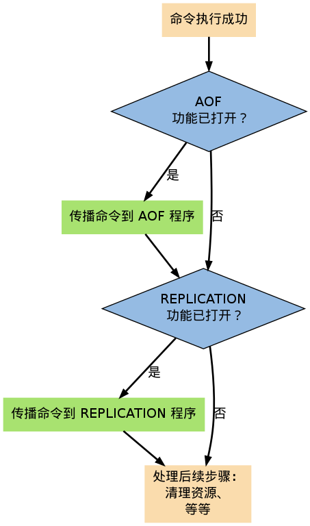
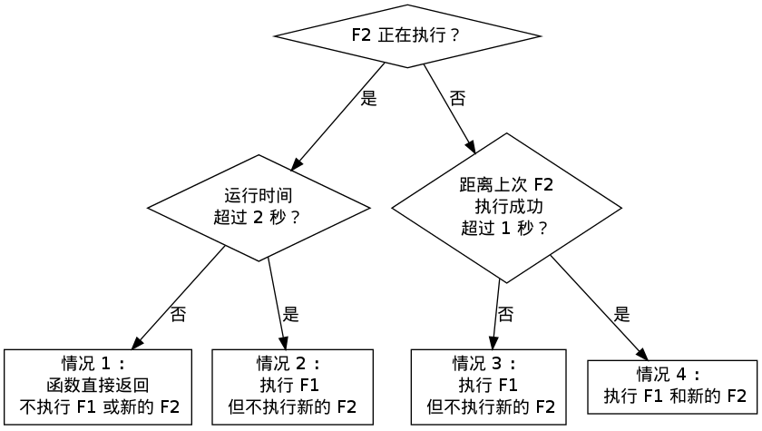
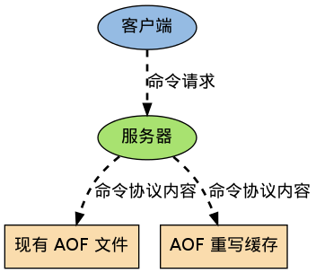

AOF
===============================

Redis 分别提供了 RDB 和 AOF 两种持久化机制：

- RDB 将数据库的快照以二进制的方式保存到磁盘中。

- AOF 则以协议文本的方式， 将所有修改数据库的命令记录到 AOF 文件， 以此达到记录数据库状态的目的。 

本章将介绍 AOF 功能的运作机制，
了解命令是如何被保存到 AOF 文件里的，
观察不同的 AOF 保存模式对数据的安全性、以及 Redis 性能的影响。

之后会介绍从 AOF 文件中恢复数据库状态的方法，以及该方法背后的实现机制。

最后还会介绍对 AOF 进行重写以调整文件体积的方法，
以及这种方法是如何在不改变数据库状态的前提下进行的。

因为本章涉及 AOF 运行的相关机制， 如果还没了解过 AOF 功能的话， 请先阅读 `Redis 持久化手册中关于 AOF 的部分 <http://redis.io/topics/persistence>`_ 。

AOF 命令同步
---------------

Redis 通过将对数据库进行修改的命令记录到 AOF 来实现数据库状态的记录，
为了方便起见，
我们称呼这种记录过程为同步。

举个例子，
如果执行以下命令：

::

    redis 127.0.0.1:6379> RPUSH list 1 2 3 4
    (integer) 4

    redis 127.0.0.1:6379> LRANGE list 0 -1
    1) "1"
    2) "2"
    3) "3"
    4) "4"

    redis 127.0.0.1:6379> KEYS *
    1) "list"

    redis 127.0.0.1:6379> RPOP list
    "4"

    redis 127.0.0.1:6379> LPOP list
    "1"

    redis 127.0.0.1:6379> LPUSH list 1
    (integer) 3

    redis 127.0.0.1:6379> LRANGE list 0 -1
    1) "1"
    2) "2"
    3) "3"

那么其中四条对数据库有修改的写入命令就会被同步到 AOF 文件中：

::

    RPUSH list 1 2 3 4

    RPOP list

    LPOP list

    LPUSH list 1

为了处理的方便，
AOF 文件会以通讯协议的格式来保存这些命令，
所以以上命令在 AOF 文件实际保存如下：

::

    *2
    $6
    SELECT
    $1
    0
    *6
    $5
    RPUSH
    $4
    list
    $1
    1
    $1
    2
    $1
    3
    $1
    4
    *2
    $4
    RPOP
    $4
    list
    *2
    $4
    LPOP
    $4
    list
    *3
    $5
    LPUSH
    $4
    list
    $1
    1

除了 ``SELECT`` 命令是 AOF 程序自己加上去的之外，
其他命令都是之前我们在终端里执行的命令。

同步命令到 AOF 文件的整个过程可以分为三个阶段：

1) **命令传播**\ ：Redis 将执行完的命令、命令的参数、命令的参数个数等信息发送到 AOF 程序中。

2) **缓存追加**\ ：AOF 程序将接收到的命令从命令函数和字符串对象转换回原来的 Redis 通讯协议，然后追加到服务器的 AOF 缓存中。

3) **文件写入和保存**\ ：AOF 缓存中的内容会被追加到 AOF 文件末尾，如果设定的 AOF 保存条件被满足的话， ``fsync/fdatasync`` 会被调用，将写入的内容真正保存到磁盘中。

以下几个小节将详细地介绍这三个步骤。

命令传播
---------

当一个 Redis 客户端需要执行命令时，
它通过网络连接，
将协议文本发送给 Redis 服务器。

比如说，
要执行命令 ``SET KEY VALUE`` ，
客户端将向服务器发送文本 ``"*3\r\n$3\r\nSET\r\n$3\r\nKEY\r\n$5\r\nVALUE\r\n"`` 。

服务器在接到客户端的请求之后，
它会根据协议文本的内容，
选择适当的命令函数，
并将各个参数从字符串文本转换为 Redis 字符串对象（\ ``StringObject``\ ）。

比如说，针对上面的 ``SET`` 命令例子，
Redis 将客户端的命令指针指向实现 ``SET`` 命令的 ``setCommand`` 函数，
并创建三个 Redis 字符串对象，
分别保存 ``SET`` 、 ``KEY`` 和 ``VALUE`` 三个参数（命令也算作参数）。

每当命令函数成功执行之后，
命令参数都会被传播到 AOF 程序，
以及 REPLICATION 程序（本节不讨论这个，列在这里只是为了完整性的考虑）。

这个执行并传播命令的过程可以用以下伪代码表示：

.. code-block:: python

    if (execRedisCommand(cmd, argv, argc) == EXEC_SUCCESS):

        if aof_is_turn_on():
            # 传播命令到 AOF 程序
            propagate_aof(cmd, argv, argc)

        if replication_is_turn_on():
            # 传播命令到 REPLICATION 程序
            propagate_replication(cmd, argv, argc)

以下是该过程的流程图：

缓存追加
----------

当命令被传播到 AOF 程序之后，
程序会根据命令以及命令的参数，
将命令从字符串对象转换回原来的协议文本。

比如说，
如果 AOF 程序接受到的三个参数分别保存着 ``SET`` 、 ``KEY`` 和 ``VALUE`` 三个字符串，
那么它将生成协议文本 ``"*3\r\n$3\r\nSET\r\n$3\r\nKEY\r\n$5\r\nVALUE\r\n"`` 。

协议文本生成之后，
它会被追加到 ``redis.h/redisServer`` 结构的 ``aof_buf`` 末尾。

其中， ``redisServer`` 结构维持着 Redis 服务器的状态，
而 ``aof_buf`` 域则保存着所有等待写入到 AOF 文件的协议文本：

::

    struct redisServer {
        
        // 其他域...

        sds aof_buf;

        // 其他域...
    };

至此，
追加命令到缓存的步骤执行完毕。

综合起来，整个缓存追加过程可以表示为以下三步：

1. 接受命令、命令的参数、以及参数的个数、所使用的数据库等信息

2. 将命令还原成 Redis 通讯协议

3. 将协议文本追加到 ``aof_buf`` 末尾

文件写入和保存
----------------------------

每当服务器中断器被执行、
或者事件处理器被执行时，
``aof.c/flushAppendOnlyFile`` 函数都会被调用，
它执行以下两个工作：

F1 ：根据条件，将 ``aof_buf`` 中的缓存写入到 AOF 文件。

F2 ：根据条件，调用 ``fsync`` 或 ``fdatasync`` 函数，将 AOF 文件保存到磁盘中。

两个步骤都需要根据一定的条件来执行，
而这些条件由 AOF 所使用的保存模式来决定，
以下小节就来介绍 AOF 所使用的三种保存模式，
以及在这些模式下，
步骤 F1 和 F2 的调用条件。 

AOF 保存模式
-------------------

目前 Redis 支持三种 AOF 保存模式，它们分别是：

1. 不保存（\ ``AOF_FSYNC_NO``\ ）

2. 每一秒钟保存一次（\ ``AOF_FSYNC_EVERYSEC``\ ）

3. 每执行一个命令保存一次（\ ``AOF_FSYNC_ALWAYS``\ ）

不保存
^^^^^^^^^^^

这这种模式下，
每次调用 ``flushAppendOnlyFile`` 函数，
F1 都会被执行，
但 F2 会被略过。

在这种模式下， F2 只会在以下任意一种情况中被执行：

- Redis 被关闭

- AOF 功能被关闭

- 系统的写缓存被刷新（可能是缓存已经被写满，或者定期保存操作被执行）

这三种情况下的 F2 操作都会引起 Redis 主进程阻塞。

每一秒钟保存一次
^^^^^^^^^^^^^^^^^^^

在这种模式中，保存操作原则上每隔一秒钟就会被调用一次，并且这种调用是由子线程执行的，因此它不会阻塞 Redis 主进程。

注意，在上一句的说明里面使用了词语“原则上”，
在实际运行中，
程序在这种模式下对 ``fsync`` 或 ``fdatasync`` 的调用并不是每秒一次，
它和调用 ``flushAppendOnlyFile`` 函数时 Redis 所处的状态有关。

每当 ``flushAppendOnlyFile`` 函数被调用时，
可能会出现以下四种情况：

- 子线程正在执行 F2 ，并且：

    1. 这个 F2 的执行时间未超过 2 秒，那么程序直接返回，并不执行 F1 或新的 F2 。
    
    2. 这个 F2 已经执行超过 2 秒，那么程序执行 F1 ，但不执行新的 F2 。注意，因为这时 F1 的写入必须等待子线程先完成（旧的） F2 ，因此这里 F1 会比平时阻塞更长时间。

- 子线程没有在执行 F2 ，并且：

    3. 上次成功执行 F2 距今不超过 1 秒，那么程序执行 F1 ，但不执行 F2 。

    4. 上次成功执行 F2 距今已经超过 1 秒，那么程序执行 F1 和 F2 。

可以用流程图表示这四种情况：

根据以上说明可以知道，
在“每一秒钟保存一次”模式下，
如果在情况 1 中发生故障停机，
那么用户最多损失小于 2 秒内所产生的所有数据。

如果在情况 2 中发生故障停机，
那么用户损失的数据是可以超过 2 秒的。

Redis 官网上所说的，
AOF 在“每一秒钟保存一次”时发生故障，
只丢失 1 秒钟数据的说法，
实际上并不准确。

每执行一个命令保存一次
^^^^^^^^^^^^^^^^^^^^^^^^^

在这种模式下，每次执行完一个命令之后， F1 和 F2 都会被执行。

另外，因为 F2 是由 Redis 主进程执行的，所以在 F2 执行期间，主进程会被阻塞，不能接受命令请求。

AOF 保存模式对性能和安全性的影响
--------------------------------------

在上一个小节，
我们简短地描述了三种 AOF 保存模式的工作方式，
现在，
是时候研究一下这三个模式在安全性和性能方面的区别了。

对于三种 AOF 保存模式，
它们对服务器主进程的阻塞情况如下：

1. 不保存（\ ``AOF_FSYNC_NO``\ ）：写入和保存都由主进程执行，两个操作都会阻塞主进程。

2. 每一秒钟保存一次（\ ``AOF_FSYNC_EVERYSEC``\ ）：写入操作由主进程执行，阻塞主进程。保存操作由子线程执行，不直接阻塞主进程，但保存操作完成的快慢会影响写入操作的阻塞时长。

3. 每执行一个命令保存一次（\ ``AOF_FSYNC_ALWAYS``\ ）：和模式 1 一样。

因为阻塞操作会让 Redis 主进程无法持续处理请求，
所以一般说来，
阻塞操作执行得越少、完成得越快，
Redis 的性能就越好。

模式 1 的保存操作只会在AOF 关闭或 Redis 关闭时执行，
或者由操作系统触发，
在一般情况下，
这种模式只需要为写入阻塞，
因此它的写入性能要比后面两种模式要高，
当然，
这种性能的提高是以降低安全性为代价的：
在这种模式下，
如果运行的中途发生停机，
那么丢失数据的数量由操作系统决定。

模式 2 在性能方面要优于模式 3 ，
并且在通常情况下，
这种模式最多丢失不多于 2 秒的数据，
所以它的安全性要高于模式 1 ，
这是一种兼顾性能和安全性的保存方案。

模式 3 的安全性是最高的，
但性能也是最差的，
因为服务器必须阻塞直到命令信息被写入并保存到磁盘之后，
才能继续处理请求。

综合起来，当遭遇突然停机时，三种模式的 AOF 文件的内容如下：

1. 不保存（\ ``AOF_FSYNC_NO``\ ）：最后一次操作系统触发 ``fsync`` 或 ``fdatasync`` 调用时所保存的内容，触发的条件和时间由操作系统决定。

2. 每一秒钟保存一次（\ ``AOF_FSYNC_EVERYSEC``\ ）：后台线程最后一次执行 ``fsync`` 或  ``fdatasync`` 所保存的内容，一般情况下最多丢失不超过 2 秒的数据。

3. 每执行一个命令保存一次（\ ``AOF_FSYNC_ALWAYS``\ ）：AOF 文件最多只丢失一个命令的数据。

AOF 文件的读取和数据还原
----------------------------

AOF 文件保存了 Redis 的数据库状态，
而文件里面包含的都是符合 Redis 通讯协议格式的命令文本。

这也就是说，
只要根据 AOF 文件里的协议，
重新执行一遍里面指示的所有命令，
就可以还原 Redis 的数据库状态了。

Redis 读取 AOF 文件并还原数据库的详细步骤如下：

1. 创建一个不带网络连接的伪客户端（fake client）

2. 读取 AOF 所保存的文本，并根据内容还原出命令、命令的参数以及命令的个数

3. 根据命令、命令的参数和命令的个数，使用伪客户端执行该命令

4. 执行 2 和 3 ，直到 AOF 文件中的所有命令执行完毕

完成第 4 步之后，
AOF 文件所保存的数据库就会被完整地还原出来。

注意，
因为 Redis 的命令只能在客户端的上下文中被执行，
而 AOF 还原时所使用的命令来自于 AOF 文件，
而不是网络，
所以程序使用了一个没有网络连接的伪客户端来执行命令。
伪客户端执行命令的效果，
和带网络连接的客户端执行命令的效果，
完全一样。

整个读取和还原过程可以用以下伪代码表示：

.. code-block:: python

    def READ_AND_LOAD_AOF():

        # 打开并读取 AOF 文件
        file = open(aof_file_name)
        while file.is_not_reach_eof():

            # 读入一条协议文本格式的 Redis 命令
            cmd_in_text = file.read_next_command_in_protocol_format()

            # 根据文本命令，查找命令函数，并创建参数和参数个数等对象
            cmd, argv, argc = text_to_command(cmd_in_text)

            # 执行命令
            execRedisCommand(cmd, argv, argc)

        # 关闭文件
        file.close()

作为例子，
以下是一个简短的 AOF 文件的内容：

::

    *2
    $6
    SELECT
    $1
    0
    *3
    $3
    SET
    $3
    key
    $5
    value
    *8
    $5
    RPUSH
    $4
    list
    $1
    1
    $1
    2
    $1
    3
    $1
    4
    $1
    5
    $1
    6

当程序读入这个 AOF 文件时，
它首先执行 ``SELECT 0`` 命令 ——
这个 ``SELECT`` 命令是由 AOF 写入程序自动生成的，
它确保程序可以将数据还原到正确的数据库上。

然后执行后面的 ``SET key value`` 和 ``RPUSH 1 2 3 4`` 命令，
还原 ``key`` 和 ``list`` 两个键的数据。

.. note:: 
    为了避免对数据的完整性产生影响，
    在服务器载入数据的过程中，
    只有和数据库无关的 pubsub 功能可以正常使用，
    其他命令一律返回错误。

AOF 重写
-------------

AOF 文件通过同步 Redis 服务器所执行的命令，
从而实现了数据库状态的记录，
但是，
这种同步方式会造成一个问题：
随着运行时间的流逝，
AOF 文件会变得越来越大。

举个例子，
如果服务器执行了以下命令：

::

    RPUSH list 1 2 3 4      // [1, 2, 3, 4]

    RPOP list               // [1, 2, 3]

    LPOP list               // [2, 3]

    LPUSH list 1            // [1, 2, 3]

那么光是记录 ``list`` 键的状态，
AOF 文件就需要保存四条命令。

另一方面，
有些被频繁操作的键，
对它们所调用的命令可能有成百上千、甚至上万条，
如果这样被频繁操作的键有很多的话，
AOF 文件的体积就会急速膨胀，
对 Redis 、甚至整个系统的造成影响。

为了解决以上的问题，
Redis 需要对 AOF 文件进行重写（rewrite）：
创建一个新的 AOF 文件来代替原有的 AOF 文件，
新 AOF 文件和原有 AOF 文件保存的数据库状态完全一样，
但新 AOF 文件的体积小于等于原有 AOF 文件的体积。

以下就来介绍 AOF 重写的实现方式。

AOF 重写的实现
-------------------

所谓的“重写”其实是一个有歧义的词语，
实际上，
AOF 重写并不需要对原有的 AOF 文件进行任何写入和读取，
它针对的是数据库中键的当前值。

考虑这样一个情况，
如果服务器对键 ``list`` 执行了以下四条命令：

::

    RPUSH list 1 2 3 4      // [1, 2, 3, 4]

    RPOP list               // [1, 2, 3]

    LPOP list               // [2, 3]

    LPUSH list 1            // [1, 2, 3]

那么当前列表键 ``list`` 在数据库中的值就为 ``1`` 、 ``2`` 、 ``3`` 。

如果我们要保存这个列表的当前状态，
并且尽量减少所使用的命令数，
那么最简单的方式不是去 AOF 文件上分析前面执行的四条命令，
而是直接读取 ``list`` 键在数据库的当前值，
然后用一条 ``RPUSH 1 2 3`` 命令来代替前面的四条命令。

再考虑这样一个例子，
如果服务器对集合键 ``animal`` 执行了以下命令：

::

    SADD animal cat                 // {cat}

    SADD animal dog panda tiger     // {cat, dog, panda, tiger}

    SREM animal cat                 // {dog, panda, tiger}

    SADD animal cat lion            // {cat, lion, dog, panda, tiger}

那么使用一条 ``SADD animal cat lion dog panda tiger`` 命令，
就可以还原 ``animal`` 集合的状态，
这比之前的四条命令调用要大大减少。

除了列表和集合之外，
字符串、有序集、哈希表等键也可以用类似的方法来保存状态，
并且保存这些状态所使用的命令数量，
比起之间建立这些键的状态所使用命令的数量要大大减少。

根据键的类型，
使用适当的插入命令来重构键的当前值，
这就是 AOF 重写的实现原理。
整个重写过程可以用伪代码表示如下：

.. code-block:: python

  def AOF_REWRITE(tmp_tile_name):

    f = create(tmp_tile_name)

    # 遍历所有数据库
    for db in redisServer.db:

      # 如果数据库为空，那么跳过这个数据库
      if db.is_empty(): continue

      # 写入 SELECT 命令，用于切换数据库
      f.write_command("SELECT " + db.number)

      # 遍历所有键
      for key in db:
              
        # 如果键带有过期时间，并且已经过期，那么跳过这个键
        if key.have_expire_time() and key.is_expired(): continue

        if key.type == String:

          # 用 SET key value 命令来保存字符串键

          value = get_value_from_string(key)

          f.write_command("SET " + key + value)

        elif key.type == List:

          # 用 RPUSH key item1 item2 ... itemN 命令来保存列表键

          item1, item2, ..., itemN = get_item_from_list(key)
                  
          f.write_command("RPUSH " + key + item1 + item2 + ... + itemN)

        elif key.type == Set:

          # 用 SADD key member1 member2 ... memberN 命令来保存集合键
                  
          member1, member2, ..., memberN = get_member_from_set(key)

          f.write_command("SADD " + key + member1 + member2 + ... + memberN)

        elif key.type == Hash:

          # 用 HMSET key field1 value1 field2 value2 ... fieldN valueN 命令来保存哈希键

          field1, value1, field2, value2, ..., fieldN, valueN = get_field_and_value_from_hash(key)

          f.write_command("HMSET " + key + field1 + value1 + field2 + value2 + ... + fieldN + valueN)

        elif key.type == SortedSet:

          # 用 ZADD key score1 member1 score2 member2 ... scoreN memberN 命令来保存有序集键

          score1, member1, score2, member2, ..., scoreN, memberN = \ 
          get_score_and_member_from_sorted_set(key)

          f.write_command("ZADD " + key + score1 + member1 + score2 + member2 + ... + scoreN + memberN)
              
        else:

          raise_type_error()
             
        # 如果键带有过期时间，那么用 EXPIREAT key time 命令来保存键的过期时间
        if key.have_expire_time():
          f.write_command("EXPIREAT " + key + key.expire_time_in_unix_timestamp())

      # 关闭文件
      f.close()

AOF 后台重写
---------------

上一节展示的 AOF 重写程序可以很好地完成创建一个新 AOF 文件的任务，
但是在执行这个程序的时候，
调用者线程会被阻塞。

很明显，
作为一种辅佐性的优化手段，
Redis 不希望 AOF 重写造成服务器无法处理请求，
所以 Redis 决定将 AOF 重写程序放到（后台）子进程里执行，
这样处理的最大好处是：

1. 子进程进行 AOF 重写期间，主进程可以继续处理命令请求。

2. 子进程带有主进程的数据副本，使用子进程而不是线程，可以在避免锁的情况下，保证数据的安全性。

不过，
使用子进程也有一个问题需要解决：
因为子进程在进行 AOF 重写期间，
主进程还需要继续处理命令，
而新的命令可能对现有的数据进行修改，
这会让当前数据库的数据和重写后的 AOF 文件中的数据不一致。

为了解决这个问题，
Redis 增加了一个 AOF 重写缓存，
这个缓存在 fork 出子进程之后开始启用，
Redis 主进程在接到新的写命令之后，
除了会将这个写命令的协议内容追加到现有的 AOF 文件之外，
还会追加到这个缓存中：

换言之，
当子进程在执行 AOF 重写时，
主进程需要执行以下三个工作：

1. 处理命令请求。

2. 将写命令追加到现有的 AOF 文件中。

3. 将写命令追加到 AOF 重写缓存中。

这样一来可以保证：

1. 现有的 AOF 功能会继续执行，即使在 AOF 重写期间发生停机，也不会有任何数据丢失。

2. 所有对数据库进行修改的命令都会被记录到 AOF 重写缓存中。

当子进程完成 AOF 重写之后，
它会向父进程发送一个完成信号，
父进程在接到完成信号之后，
会调用一个信号处理函数，
并完成以下工作：

1. 将 AOF 重写缓存中的内容全部写入到新 AOF 文件中。

2. 对新的 AOF 文件进行改名，覆盖原有的 AOF 文件。

当步骤 1 执行完毕之后，
现有 AOF 文件、新 AOF 文件和数据库三者的状态就完全一致了。

当步骤 2 执行完毕之后，
程序就用体积更小的新 AOF 文件替换了原有的大体积的 AOF 文件。

这个信号处理函数执行完毕之后，
主进程就可以继续像往常一样接受命令请求了。
在整个 AOF 后台重写过程中，
只有最后的写入缓存和改名操作会造成主进程阻塞，
在其他时候，
AOF 后台重写都不会对主进程造成阻塞，
这将 AOF 重写对性能造成的影响降到了最低。

以上就是 AOF 后台重写，
也即是 ``BGREWRITEAOF`` 命令的工作原理。

..  后台重写的原因：
    - 不能阻塞主进程
    - 两个线程同时修改的话，数据不一致
    - 通过 fork ，可以很方便地获得当前数据的 snapshot
    - 但是， fork 也会让主进程接收到的数据无法同步到子线程
    - 所以，主进程必须在子进程进行 AOF 重写起见，用一个缓存，将 AOF 重写期间的所有命令缓存进去
    - 子进程重写完毕之后，向主进程发送信号
    - 主进程打开新的 AOF 文件，将命令缓存追加进去，然后将新的 AOF 文件改名，覆盖原有的旧 AOF 文件。
    - 至此，AOF 重写完成

AOF 后台重写的触发条件
------------------------

AOF 重写可以由用户通过调用 ``BGREWRITEAOF`` 手动触发。

另外，
服务器在 AOF 功能开启的情况下，
会维持一个记录当前 AOF 文件大小的变量 ``aof_current_size`` ，
一个记录最后一次 AOF 重写时 AOF 文件大小的变量 ``aof_rewirte_base_size`` ，
以及一个增长百分比变量 ``aof_rewirte_perc`` ，
每次当服务器中断器运行时，
它都会检查以下条件是否全部满足，
如果是的话，
就会触发自动的 AOF 重写：

1. 没有 ``BGSAVE`` 命令在进行。

2. 没有 ``BGREWRITEAOF`` 在进行。

3. 当前 AOF 文件大小和最后一次 AOF 重写时的大小之间的比率大于等于指定的增长百分比。

默认情况下，
增长百分比为 ``100%`` ，
也即是说，
如果当前 AOF 文件大小比最后一次 AOF 重写时的大小要大一倍的话，
那么触发自动 AOF 重写。

小结
-------

- AOF 文件通过保存所有修改数据库的命令来记录数据库的状态。

- AOF 文件中的所有命令都以 Redis 通讯协议的格式保存。

- 不同的 AOF 保存模式对数据的安全性、以及 Redis 的性能有很大的影响。

- AOF 重写的目的是用更小的体积来保存数据库状态，整个重写过程基本上不影响 Redis 主进程处理命令请求。

- AOF 重写是一个有歧义的名字，实际的重写工作是针对数据库的当前值来进行的，程序既不读写、也不使用原有的 AOF 文件。

- AOF 可以手动触发，也可以被服务器中断器自动触发。
