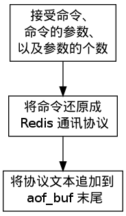

Append Only File 模式 —— aof
===============================

预备知识： http://redis.io/topics/persistence 页面中关于 AOF 的部分。

AOF 命令同步
---------------

AOF 命令同步可以分为三个阶段，分别是：

1) **命令传播**\ ：Redis 将执行完的命令、命令的参数、命令的参数个数等信息发送到 AOF 程序中。

2) **缓存追加**\ ：AOF 程序将接收到的命令从命令函数和字符串对象转换回原来的 Redis 通讯协议，然后追加到服务器的 AOF 缓存中。

3) **文件写入和保存**\ ：AOF 缓存中的内容会被追加到 AOF 文件末尾，如果设定的 AOF 保存条件被满足的话， ``fsync/fdatasync`` 会被调用，将写入的内容真正保存到磁盘中。

以下几个小节将详细地介绍这三个步骤。

命令传播
---------

当一个 Redis 客户端需要执行命令时，
它通过网络连接，
将协议文本发送给 Redis 服务器。

比如说，
要执行命令 ``SET KEY VALUE`` ，
客户端将向服务器发送文本 ``"*3\r\n$3\r\nSET\r\n$3\r\nKEY\r\n$5\r\nVALUE\r\n"`` 。

服务器在接到客户端的请求之后，
它会根据协议文本的内容，
选择适当的命令函数，
并将各个参数从字符串文本转换为 Redis 字符串对象（\ ``StringObject``\ ）。

比如说，针对上面的 ``SET`` 命令例子，
Redis 将客户端的命令指针指向实现 ``SET`` 命令的 ``setCommand`` 函数，
并创建三个 Redis 字符串对象，
分别保存 ``SET`` 、 ``KEY`` 和 ``VALUE`` 三个参数（命令也算作参数）。

每当命令函数成功执行之后，
命令参数都会被传播到 AOF 程序，
以及 REPLICATION 程序（本节不讨论这个，列在这里只是为了完整性的考虑）。

这个执行并传播命令的过程可以用以下伪代码表示：

.. code-block:: python

    if (execRedisCommand(cmd, argv, argc) == EXEC_SUCCESS):

        if aof_is_turn_on():
            # 传播命令到 AOF 程序
            propagate_aof(cmd, argv, argc)

        if replication_is_turn_on():
            # 传播命令到 REPLICATION 程序
            propagate_replication(cmd, argv, argc)

以下是该过程的流程图：

.. image:: image/propagate.png

缓存追加
----------

当命令被传播到 AOF 程序之后，
程序会根据命令以及命令的参数，
将命令从字符串对象转换回原来的协议文本。

比如说，
如果 AOF 程序接受到的三个参数分别保存着 ``SET`` 、 ``KEY`` 和 ``VALUE`` 三个字符串，
那么它将生成协议文本 ``"*3\r\n$3\r\nSET\r\n$3\r\nKEY\r\n$5\r\nVALUE\r\n"`` 。

协议文本生成之后，
它会被追加到 ``redis.h/redisServer`` 结构的 ``aof_buf`` 末尾。

其中， ``redisServer`` 结构维持着 Redis 服务器的状态，
而 ``aof_buf`` 域则保存着所有等待写入到 AOF 文件的协议文本：

::

    struct redisServer {
        
        // 其他域...

        sds aof_buf;

        // 其他域...
    };

至此，
追加命令到缓存的步骤执行完毕，
整个流程可以表示为如下图：

文件写入和保存
----------------------------

每当服务器中断器被执行、
或者事件处理器被执行时，
``aof.c/flushAppendOnlyFile`` 函数都会被调用，
它执行以下两个工作：

F1 ：根据条件，将 ``aof_buf`` 中的缓存写入到 AOF 文件。

F2 ：根据条件，调用 ``fsync`` 或 ``fdatasync`` 函数，将 AOF 文件保存到磁盘中。

两个步骤都需要根据一定的条件来执行，
而这些条件由 AOF 所使用的保存模式来决定，
以下小节就来介绍 AOF 所使用的三种保存模式，
以及在这些模式下，
步骤 F1 和 F2 的调用条件。 

AOF 保存模式
-------------------

目前 Redis 支持三种 AOF 保存模式，它们分别是：

1. 不保存（\ ``AOF_FSYNC_NO``\ ）

2. 每一秒钟保存一次（\ ``AOF_FSYNC_EVERYSEC``\ ）

3. 每执行一个命令保存一次（\ ``AOF_FSYNC_ALWAYS``\ ）

不保存
^^^^^^^^^^^

这这种模式下，
每次调用 ``flushAppendOnlyFile`` 函数，
F1 都会被执行，
但 F2 会被略过。

在这种模式下， F2 只会在以下任意一种情况中被执行：

- Redis 被关闭

- AOF 功能被关闭

- 系统的写缓存被刷新（可能是缓存已经被写满，或者定期保存操作被执行）

这三种情况下的 F2 操作都会引起 Redis 主进程阻塞。

每一秒钟保存一次
^^^^^^^^^^^^^^^^^^^

在这种模式中，保存操作原则上每隔一秒钟就会被调用一次，并且这种调用是由子线程执行的，因此它不会阻塞 Redis 主进程。

注意，在上一句的说明里面使用了词语“原则上”，
在实际运行中，
程序在这种模式下对 ``fsync`` 或 ``fdatasync`` 的调用并不是每秒一次，
它和调用 ``flushAppendOnlyFile`` 函数时 Redis 所处的状态有关。

每当 ``flushAppendOnlyFile`` 函数被调用时，
可能会出现以下四种情况：

- 子线程正在执行 F2 ，并且：

    1. 这个 F2 的执行时间未超过 2 秒，那么程序直接返回，并不执行 F1 或新的 F2 。
    
    2. 这个 F2 已经执行超过 2 秒，那么程序执行 F1 ，但不执行新的 F2 。注意，因为这时 F1 的写入必须等待子线程先完成（旧的） F2 ，因此这里 F1 会比平时阻塞更长时间。

- 子线程没有在执行 F2 ，并且：

    3. 上次成功执行 F2 距今不超过 1 秒，那么程序执行 F1 ，但不执行 F2 。

    4. 上次成功执行 F2 距今已经超过 1 秒，那么程序执行 F1 和 F2 。

可以用流程图表示这四种情况：

.. image:: image/flush.png

根据以上说明可以知道，
在“每一秒钟保存一次”模式下，
如果在情况 1 中发生故障停机，
那么用户最多损失小于 2 秒内所产生的所有数据。

如果在情况 2 中发生故障停机，
那么用户损失的数据是可以超过 2 秒的。

Redis 官网上所说的，
AOF 在“每一秒钟保存一次”时发生故障，
只丢失 1 秒钟数据的说法，
实际上并不准确。

每执行一个命令保存一次
^^^^^^^^^^^^^^^^^^^^^^^^^

在这种模式下，每次执行完一个命令之后， F1 和 F2 都会被执行。

另外，因为 F2 是由 Redis 主进程执行的，所以在 F2 执行期间，主进程会被阻塞，不能接受命令请求。

AOF 保存模式对性能和安全性的影响
--------------------------------------

在上一个小节，
我们简短地描述了三种 AOF 保存模式的工作方式，
现在，
是时候研究一下这三个模式在安全性和性能方面的区别了。

对于三种 AOF 保存模式，
它们对服务器主进程的阻塞情况如下：

1. 不保存（\ ``AOF_FSYNC_NO``\ ）：写入和保存都由主进程执行，两个操作都会阻塞主进程。

2. 每一秒钟保存一次（\ ``AOF_FSYNC_EVERYSEC``\ ）：写入操作由主进程执行，阻塞主进程。保存操作由子线程执行，不直接阻塞主进程，但保存操作完成的快慢会影响写入操作的阻塞时长。

3. 每执行一个命令保存一次（\ ``AOF_FSYNC_ALWAYS``\ ）：和模式 1 一样。

因为阻塞操作会让 Redis 主进程无法持续处理请求，
所以一般说来，
阻塞操作执行得越少、完成得越快，
Redis 的性能就越好。

模式 1 的保存操作只会在AOF 关闭或 Redis 关闭时执行，
或者由操作系统触发，
在一般情况下，
这种模式只需要为写入阻塞，
因此它的写入性能要比后面两种模式要高，
当然，
这种性能的提高是以降低安全性为代价的：
在这种模式下，
如果运行的中途发生停机，
那么丢失数据的数量由操作系统决定。

模式 2 在性能方面要优于模式 3 ，
并且在通常情况下，
这种模式最多丢失不多于 2 秒的数据，
所以它的安全性要高于模式 1 ，
这是一种兼顾性能和安全性的保存方案。

模式 3 的安全性是最高的，
但性能也是最差的，
因为服务器必须阻塞直到命令信息被写入并保存到磁盘之后，
才能继续处理请求。

综合起来，当遭遇突然停机时，三种模式的 AOF 文件的内容如下：

1. 不保存（\ ``AOF_FSYNC_NO``\ ）：最后一次操作系统触发 ``fsync`` 或 ``fdatasync`` 调用时所保存的内容，触发的条件和时间由操作系统决定。

2. 每一秒钟保存一次（\ ``AOF_FSYNC_EVERYSEC``\ ）：后台线程最后一次执行 ``fsync`` 或  ``fdatasync`` 所保存的内容，一般情况下最多丢失不超过 2 秒的数据。

3. 每执行一个命令保存一次（\ ``AOF_FSYNC_ALWAYS``\ ）：AOF 文件最多只丢失一个命令的数据。

AOF 写入是如何进行的？
-----------------------

三个阶段： 1）命令执行 2）缓存追加 3）文件写入

命令进入
^^^^^^^^^^

服务器像平常一样执行客户端送来的命令，
命令在执行之后都会检查服务器是否处于 AOF 模式，
如果是的话，
它们就会将命令和命令的参数传播到 AOF 文件，
这会引起以下两步的执行。

缓存追加
^^^^^^^^^^^

两个 buf 。

每当有命令进入时，
将输入的命令从对象形式（\ ``redisObject``\ ）转换回字符串形式（Redis 协议），
然后将字符串追加到 ``server.aof_buf`` 的末尾，
下次执行 ``flushAppendOnlyFile`` 时，
就会将缓存写入到文件。

如果当时还在进行 AOF 文件重写，
那么将字符串形式的命令也添加到 AOF 文件重写缓存中，
这样无论是当前正在使用的 AOF 文件（老 AOF 文件）
还是正在重写的 AOF （新 AOF 文件），
它们的数据都是相同的、同步的。

文件写入 
^^^^^^^^^^

``flushAppendOnlyFile`` 函数：

1. 将 AOF 缓存用 write 写入 aof 文件

2. 如果 AOF 模式是 ``AOF_FSYNC_ALWAYS`` （总是执行 ``fsync`` ），那么调用 fsync （会阻塞 Redis 主进程）；如果 AOF 模式为 ``AOF_FSYNC_EVERYSEC`` （每秒 ``fsync`` 一次），并且后台任务队列中没有 ``fsync`` 在等待，那么将 ``fsync`` 命令放到后台执行（不阻塞主进程）。

.. tip:: 
    每秒执行一次 ``fsync`` 可以在尽可能保证安全性的前提下，最大化性能。
    总是执行 ``fsync`` 模式会造成 Redis 主进程阻塞，降低性能。

AOF 读取是如何进行的？
--------------------------

AOF 文件里的内容全都是 Redis 协议，
读入程序创建一个 Redis 伪终端，
然后将 AOF 文件里的协议传给伪终端，
服务器执行伪终端传给它的命令（就像平时执行用户的命令一样），
从而重建 AOF 文件所保存的数据库。

在读入 AOF 文件期间，
服务器还会间隔性地处理外部客户端的请求，
因此 AOF 文件的命令和外部客户端的命令可能互相覆盖。
所以在服务器读取 AOF 文件时，
最好不要连接客户端，
以免影响 AOF 文件的还原效果。

AOF 重写是如何进行的？
-----------------------------

遍历所有数据库，
遍历所有键-值对，
将这些键-值对的当前状态通过 Redis 协议的形式写入到一个指定名字的临时文件里。

例子，一个列表 key 里有三个元素 ``1`` 、 ``3`` , ``9`` ，
它们以 ``RPUSH key 1`` 、 ``RPUSH key 3`` 和 ``RPUSH key 9`` 三个命令执行而成，
那么将协议内容 ``RPUSH key 1 3 9`` 写入到 AOF 文件，
这样重写后的 AOF 文件在不修改 ``key`` 的值的前提下，
节约了三倍的空间。

.. warning::

    TODO 整合协议内容，更详细地描述重建过程。

写入过程会阻塞主进程。

.. note::

    这个过程只会被 ``BGREWRITEAOF`` 调用，
    Redis 不会直接调用这个阻塞进程。

AOF 后台重写是如何进行的？
-----------------------------

主进程 fork 出一个子进程，
子进程创建一个临时文件，并执行上一节描述的 AOF 重写动作，
而主进程则继续接受请求，
并将请求追加到一个字符串缓存里。

子进程完成之后给主进程发送一个信号，
告知重写已完成。

Redis 在每次执行 serverCorn 的时候都会检查一次是否有信号到达（非阻塞 ``wait3`` ），
如果服务器状态表示正处于后台重写状态，
并且接到子进程的重写已完成信号，
那么主进程将 AOF 重写进行以来的所有新命令缓存追加到重写后的 AOF 文件里，
这就完成了所有新旧数据的同步，
然后，
主进程将临时文件改名，
代替旧的 AOF 文件，
至此，
AOF 后台重写执行完毕。

整个重写过程由子进程进行，
除了将缓存写入到新 AOF 文件的那段时间之外（为了保证安全性，这段时间的阻塞是必须的），
主进程都不会被阻塞。

AOF 保存和 RDB 保存的好处和坏处对比
--------------------------------------

TODO
