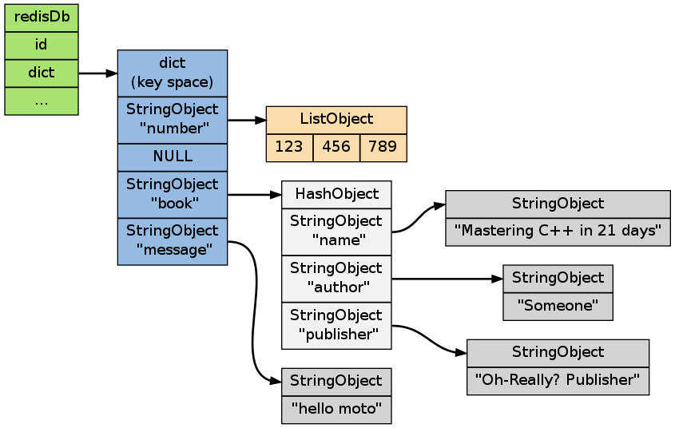
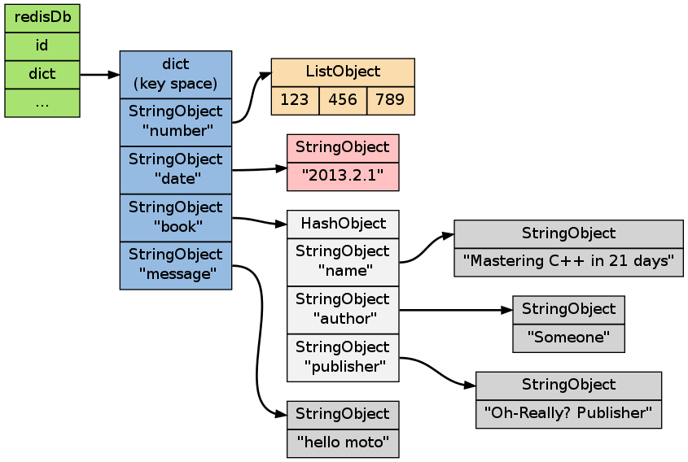
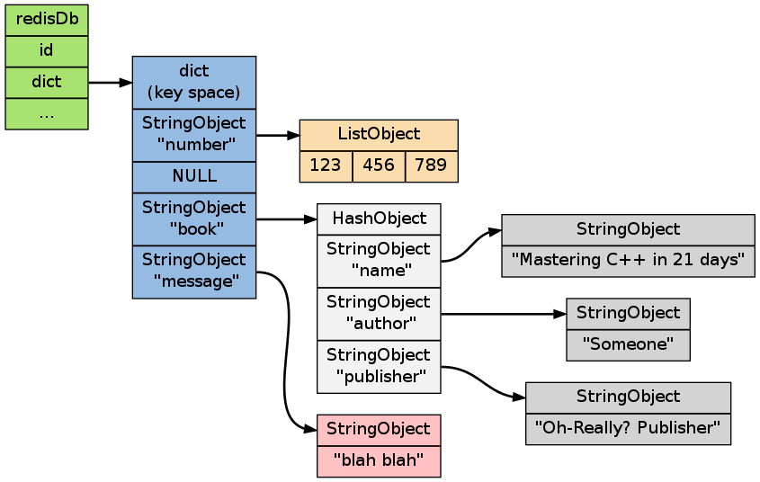
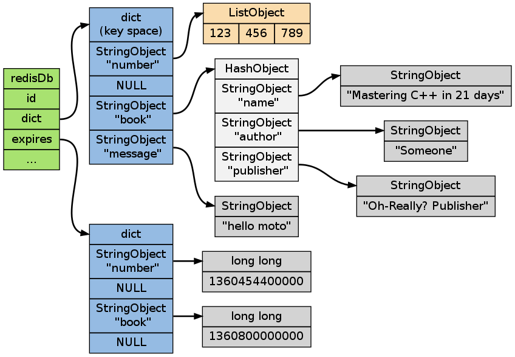
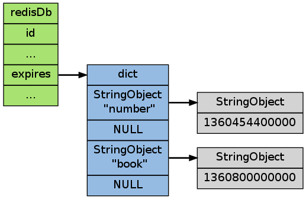
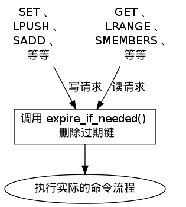
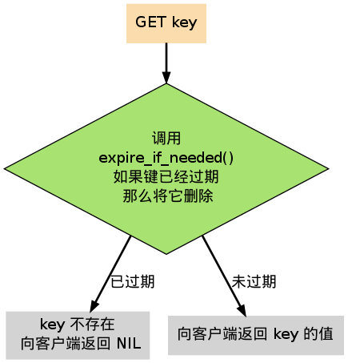

.. _db_chapter:

数据库
=================

本章将对 Redis 数据库的构造和实现进行讨论。

除了说明数据库是如何储存数据对象之外，本章还会讨论键的过期信息是如何保存，而 Redis 又是如何删除过期键的。

数据库的结构
-----------------

Redis 中的每个数据库，都由一个 ``redis.h/redisDb`` 结构表示：

::

    typedef struct redisDb {

        // 保存着数据库以整数表示的号码
        int id;

        // 保存着数据库中的所有键值对数据
        // 这个属性也被称为键空间（key space）
        dict *dict;

        // 保存着键的过期信息
        dict *expires;

        // 实现列表阻塞原语，如 BLPOP 
        // 在列表类型一章有详细的讨论
        dict *blocking_keys;
        dict *ready_keys;

        // 用于实现 WATCH 命令
        // 在事务章节有详细的讨论
        dict *watched_keys;

    } redisDb;

下文将详细讨论  ``id`` 、 ``dict`` 和 ``expires`` 三个属性，
以及针对这三个属性所执行的数据库操作。

数据库的切换
-----------------

``redisDb`` 结构的 ``id`` 域保存着数据库的号码。

这个号码很容易让人将它和切换数据库的 :ref:`SELECT` 命令联系在一起，
但是，
实际上，
``id`` 属性并不是用来实现 :ref:`SELECT` 命令，
而是给 Redis 内部程序使用的。

当 Redis 服务器初始化时，
它会创建出 ``redis.h/REDIS_DEFAULT_DBNUM`` 个数据库，
并将所有数据库保存到 ``redis.h/redisServer.db`` 数组中，
每个数据库的 ``id`` 为从 ``0`` 到 ``REDIS_DEFAULT_DBNUM - 1`` 的值。

当执行 ``SELECT number`` 命令时，程序直接使用 ``redisServer.db[number]`` 来切换数据库。

但是，
一些内部程序，
比如 AOF 程序、复制程序和 RDB 程序，
需要知道当前数据库的号码，
如果没有 ``id`` 域的话，
程序就只能在当前使用的数据库的指针，
和 ``redisServer.db`` 数组中所有数据库的指针进行对比，
以此来弄清楚自己正在使用的是那个数据库。

以下伪代码描述了这个对比过程：

.. code-block:: python

    def PSEUDO_GET_CURRENT_DB_NUMBER(current_db_pointer):
        i = 0
        for db_pointer in redisServer.db:
            if db_pointer == current_db_pointer:
                break
            i += 1
        return i

有了 ``id`` 域的话，
程序就可以通过读取 ``id`` 域来了解自己正在使用的是哪个数据库，
这样就不用对比指针那么麻烦了。

数据库键空间
----------------

因为 Redis 是一个键值对数据库（key-value pairs database），
所以它的数据库本身也是一个字典（俗称 key space）：

- 字典的键是一个\ :ref:`string_chapter`\ 对象。

- 字典的值则可以是包括\ :ref:`string_chapter`\ 、\ :ref:`list_chapter`\ 、\ :ref:`hash_chapter`\ 、\ :ref:`set_chapter`\ 或\ :ref:`sorted_set_chapter`\ 在内的任意一种 Redis 类型对象。

在 ``redisDb`` 结构的 ``dict`` 属性中，保存着数据库的所有键值对数据。

下图展示了一个包含 ``number`` 、 ``book`` 、 ``message`` 三个键的数据库 ——
其中 ``number`` 键是一个列表，列表中包含三个整数值；
``book`` 键是一个哈希表，表中包含三个键值对；
而 ``message`` 键则指向另一个字符串：

键空间的操作
------------------

因为数据库本身是一个字典，
所以对数据库的操作基本上都是对字典的操作，
加上以下一些维护操作：

- 更新键的命中率和不命中率，这个值可以用 :ref:`INFO` 命令查看；

- 更新键的 LRU 时间，这个值可以用 :ref:`OBJECT` 命令来查看；

- 删除过期键（稍后会详细说明）；

- 如果键被修改了的话，那么将键设为脏（用于事务监视），并将服务器设为脏（等待 RDB 保存）；

- 将对键的修改发送到 AOF 文件和附属节点，保持数据库状态的一致；

作为例子，以下几个小节会展示键的添加、删除、更新、取值等几个主要操作。

添加新键
^^^^^^^^^^^^^

添加一个新键对到数据库，
实际上就是将一个新的键值对添加到键空间字典中，
其中键为字符串对象，
而值则是任意一种 Redis 类型值对象。

举个例子，如果数据库的目前状态如下图所示（和前面展示的数据库状态图一样）：

那么在客户端执行 ``SET date 2013.2.1`` 命令之后，数据库更新为下图状态：

删除键
^^^^^^^^^

删除数据库中的一个键，
实际上就是删除字典空间中对应的键对象和值对象。

举个例子，如果数据库的目前状态如下图所示（和前面展示的数据库状态图一样）：

那么在客户端执行 ``DEL message`` 命令之后，数据库更新为下图状态：

.. image:: image/db-after-delete.png

更新键
^^^^^^^^^^

当对一个已存在于数据库的键执行更新操作时，
数据库释放键原来的值对象，
然后将指针指向新的值对象。

举个例子，如果数据库的目前状态如下图所示（和前面展示的数据库状态图一样）：

那么在客户端执行 ``SET message "blah blah"`` 命令之后，数据库更新为下图状态：

取值
^^^^^^^

在数据库中取值实际上就是在字典空间中取值，
再加上一些额外的类型检查：

- 键不存在，返回空回复；

- 键存在，且类型正确，按照通讯协议返回值对象；

- 键存在，但类型不正确，返回类型错误。

举个例子，如果数据库的目前状态如下图所示（和前面展示的数据库状态图一样）：

当客户端执行 ``GET message`` 时，服务器返回 ``"hello moto"`` 。

当客户端执行 ``GET not-exists-key`` 时，服务器返回空回复。

当服务器执行 ``GET book`` 时，服务器返回类型错误。

其他操作
^^^^^^^^^^^

除了上面展示的键值操作之外，还有很多针对数据库本身的命令，也是通过对键空间进行处理来完成的：

- :ref:`FLUSHDB` 命令：删除键空间中的所有键值对。

- :ref:`RANDOMKEY` 命令：从键空间中随机返回一个键。

- :ref:`DBSIZE` 命令：返回键空间中键值对的数量。

- :ref:`EXISTS` 命令：检查给定键是否存在于键空间中。

- :ref:`RENAME` 命令：在键空间中，对给定键进行改名。

等等。

键的过期时间
----------------

在前面的内容中，
我们讨论了很多涉及数据库本身、以及对数据库中的键值对进行处理的操作，
但是，
关于数据库如何保存键的过期时间，
以及如何处理过期键这一问题，
我们还没有讨论到。

通过 :ref:`EXPIRE` 、 :ref:`PEXPIRE` 、 :ref:`EXPIREAT` 和 :ref:`PEXPIREAT` 四个命令，
客户端可以给某个存在的键设置过期时间，
当键的过期时间到达时，
键就不再可用：

::

    redis> SETEX key 5 value
    OK

    redis> GET key
    "value"

    redis> GET key   // 5 秒过后
    (nil)

命令 :ref:`TTL` 和 :ref:`PTTL` 则用于返回给定键距离过期还有多长时间：

::

    redis> SETEX key 10086 value
    OK

    redis> TTL key
    (integer) 10082

    redis> PTTL key
    (integer) 10068998

在接下来的内容中，
我们将探讨和键的过期时间相关的问题：
比如键的过期时间是如何保存的，
而过期键又是如何被删除的，
等等。

过期时间的保存
-----------------------

在数据库中，
所有键的过期时间都被保存在 ``redisDb`` 结构的 ``expires`` 字典里：

::

    typedef struct redisDb {

        // ...

        dict *expires;

        // ...

    } redisDb;

``expires`` 字典的键是一个指向 ``dict`` 字典（键空间）里某个键的指针，
而字典的值则是键所指向的数据库键的到期时间，
这个值以 ``long long`` 类型表示。

下图展示了一个含有三个键的数据库，其中 ``number`` 和 ``book`` 两个键带有过期时间：

.. note:: 
    为了展示的方便，
    图中重复出现了两次 ``number`` 键和 ``book`` 键。
    在实际中，
    键空间字典的键和过期时间字典的键都指向同一个字符串对象，
    所以不会浪费任何空间。

设置生存时间
----------------

Redis 有四个命令可以设置键的生存时间（可以存活多久）和过期时间（什么时候到期）：

- :ref:`EXPIRE` 以秒为单位设置键的生存时间；

- :ref:`PEXPIRE` 以毫秒为单位设置键的生存时间；

- :ref:`EXPIREAT` 以秒为单位，设置键的过期 UNIX 时间戳；

- :ref:`PEXPIREAT` 以毫秒为单位，设置键的过期 UNIX 时间戳。

虽然有那么多种不同单位和不同形式的设置方式，
但是 ``expires`` 字典的值只保存“以毫秒为单位的过期 UNIX 时间戳”，
这就是说，
通过进行转换，
所有命令的效果最后都和 :ref:`PEXPIREAT` 命令的效果一样。

举个例子，从 :ref:`EXPIRE` 命令到 :ref:`PEXPIREAT` 命令的转换可以用伪代码表示如下：

.. code-block:: python

    def EXPIRE(key, sec):

        # 将 TTL 从秒转换为毫秒
        ms = sec_to_ms(sec)

        # 获取以毫秒计算的当前 UNIX 时间戳
        ts_in_ms = get_current_unix_timestamp_in_ms()

        # 毫秒 TTL 加上毫秒时间戳，就是 key 到期的时间戳
        PEXPIREAT(ms + ts_in_ms, key)

其他函数的转换方式也是类似的。

作为例子，
下图展示了一个 ``expires`` 字典示例，
字典中 ``number`` 键的过期时间是 2013 年 2 月 10 日（农历新年），
而 ``book`` 键的过期时间则是 2013 年 2 月 14 日（情人节）：

这两个键的过期时间可能是用以上四个命令的任意一个设置的，
但它们都以统一的格式被保存在 ``expires`` 字典中。

过期键的判定
----------------

通过 ``expires`` 字典，
可以用以下步骤检查某个键是否过期：

1. 检查键是否存在于 ``expires`` 字典：如果存在，那么取出键的过期时间；

2. 检查当前 UNIX 时间戳是否大于键的过期时间：如果是的话，那么键已经过期；否则，键未过期。

可以用伪代码来描述这一过程：

.. code-block:: python

    def is_expired(key):

        # 取出键的过期时间
        key_expire_time = expires.get(key)

        # 如果过期时间不为空，并且当前时间戳大于过期时间，那么键已经过期
        if expire_time is not None and current_timestamp() > key_expire_time:
            return True

        # 否则，键未过期或没有设置过期时间
        return False

过期键的清除
------------------------

我们知道了过期时间保存在 ``expires`` 字典里，
又知道了该如何判定一个键是否过期，
现在剩下的问题是，
如果一个键是过期的，
那它什么时候会被删除？

这个问题有三种可能的答案：

1. 定时删除：在设置键的过期时间时，创建一个定时事件，当过期时间到达时，由事件处理器自动执行键的删除操作。

2. 惰性删除：放任键过期不管，但是在每次从 ``dict`` 字典中取出键值时，要检查键是否过期，如果过期的话，就删除它，并返回空；如果没过期，就返回键值。

3. 定期删除：每隔一段时间，对 ``expires`` 字典进行检查，删除里面的过期键。

定时删除
^^^^^^^^^^^

定时删除策略对内存是最友好的：
因为它保证过期键会在第一时间被删除，
过期键所消耗的内存会立即被释放。

这种策略的缺点是，
它对 CPU 时间是最不友好的：
因为删除操作可能会占用大量的 CPU 时间 —— 
在内存不紧张、但是 CPU 时间非常紧张的时候
（比如说，进行交集计算或排序的时候），
将 CPU 时间花在删除那些和当前任务无关的过期键上，
这种做法毫无疑问会是低效的。

除此之外，
目前 Redis 事件处理器对时间事件的实现方式 —— 无序链表，
查找一个时间复杂度为 :math:`O(N)`  —— 并不适合用来处理大量时间事件。

惰性删除
^^^^^^^^^^

惰性删除对 CPU 时间来说是最友好的：
它只会在取出键时进行检查，
这可以保证删除操作只会在非做不可的情况下进行 —— 
并且删除的目标仅限于当前处理的键，
这个策略不会在删除其他无关的过期键上花费任何 CPU 时间。

惰性删除的缺点是，
它对内存是最不友好的：
如果一个键已经过期，
而这个键又仍然保留在数据库中，
那么 ``dict`` 字典和 ``expires`` 字典都需要继续保存这个键的信息，
只要这个过期键不被删除，
它占用的内存就不会被释放。

在使用惰性删除策略时，
如果数据库中有非常多的过期键，
但这些过期键又正好没有被访问的话，
那么它们就永远也不会被删除（除非用户手动执行），
这对于性能非常依赖于内存大小的 Redis 来说，
肯定不是一个好消息。

举个例子，
对于一些按时间点来更新的数据，
比如日志（log），
在某个时间点之后，
对它们的访问就会大大减少，
如果大量的这些过期数据积压在数据库里面，
用户以为它们已经过期了（已经被删除了），
但实际上这些键却没有真正的被删除（内存也没有被释放），
那结果肯定是非常糟糕。

定期删除
^^^^^^^^^^^^

从上面对定时删除和惰性删除的讨论来看，
这两种删除方式在单一使用时都有明显的缺陷：
定时删除占用太多 CPU 时间，
惰性删除浪费太多内存。

定期删除是这两种策略的一种折中：

- 它每隔一段时间执行一次删除操作，并通过限制删除操作执行的时长和频率，籍此来减少删除操作对 CPU 时间的影响。

- 另一方面，通过定期删除过期键，它有效地减少了因惰性删除而带来的内存浪费。

Redis 使用的策略
^^^^^^^^^^^^^^^^^^^^

Redis 使用的过期键删除策略是惰性删除加上定期删除，
这两个策略相互配合，可以很好地在合理利用 CPU 时间和节约内存空间之间取得平衡。

因为前面已经说了这两个策略的概念了，下面两节就来探讨这两个策略在 Redis 中的具体实现。

过期键的惰性删除策略
-----------------------

实现过期键惰性删除策略的核心是 ``db.c/expireIfNeeded`` 函数 ——
所有命令在读取或写入数据库之前，程序都会调用 ``expireIfNeeded`` 对输入键进行检查，
并将过期键删除：

比如说， ``GET`` 命令的执行流程可以用下图来表示：

``expireIfNeeded`` 的作用是，
如果输入键已经过期的话，
那么将键、键的值、键保存在 ``expires`` 字典中的过期时间都删除掉。

用伪代码描述的 ``expireIfNeeded`` 定义如下：

.. code-block:: python

    def expireIfNeeded(key):

        # 对过期键执行以下操作 。。。
        if key.is_expired():
          
            # 从键空间中删除键值对
            db.dict.remove(key)

            # 删除键的过期时间
            db.expires.remove(key)

            # 将删除命令传播到 AOF 文件和附属节点
            propagateDelKeyToAofAndReplication(key)

过期键的定期删除策略
-----------------------

对过期键的定期删除由 ``redis.c/activeExpireCycle`` 函执行：
每当 Redis 的例行处理程序 ``serverCron`` 执行时，
``activeExpireCycle`` 都会被调用 —— 
这个函数在规定的时间限制内，
尽可能地遍历各个数据库的 ``expires`` 字典，
随机地检查一部分键的过期时间，
并删除其中的过期键。

整个过程可以用伪代码描述如下：

.. code-block:: python

    def activeExpireCycle():

        # 遍历数据库（不一定能全部都遍历完，看时间是否足够）
        for db in server.db:

            # MAX_KEY_PER_DB 是一个 DB 最大能处理的 key 个数
            # 它保证时间不会全部用在个别的 DB 上（避免饥饿）
            i = 0
            while (i < MAX_KEY_PER_DB):

                # 数据库为空，跳出 while ，处理下个 DB
                if db.is_empty(): break

                # 随机取出一个带 TTL 的键
                key_with_ttl = db.expires.get_random_key()
        
                # 检查键是否过期，如果是的话，将它删除
                if is_expired(key_with_ttl):
                    db.deleteExpiredKey(key_with_ttl)
        
                # 当执行时间到达上限，函数就返回，不再继续
                # 这确保删除操作不会占用太多的 CPU 时间
                if reach_time_limit(): return

                i += 1

过期键对 AOF 、RDB 和复制的影响
--------------------------------------------------

前面的内容讨论了过期键对 CPU 时间和内存的影响，现在，是时候说说过期键在 RDB 文件、 AOF 文件、 AOF 重写以及复制中的影响了：

过期键会被保存在更新后的 RDB 文件、 AOF 文件或者重写后的 AOF 文件里面吗？

附属节点会会如何处理过期键？处理的方式和主节点一样吗？

以上这些问题就是本节要解答的。

更新后的 RDB 文件
^^^^^^^^^^^^^^^^^^^^^

在创建新的 RDB 文件时，程序会对键进行检查，过期的键不会被写入到更新后的 RDB 文件中。

因此，过期键对更新后的 RDB 文件没有影响。

AOF 文件
^^^^^^^^^^^

在键已经过期，但是还没有被惰性删除或者定期删除之前，这个键不会产生任何影响，AOF 文件也不会因为这个键而被修改。

当过期键被惰性删除、或者定期删除之后，程序会向 AOF 文件追加一条 ``DEL`` 命令，来显式地记录该键已被删除。

举个例子，
如果客户端使用 ``GET message`` 试图访问 ``message`` 键的值，
但 ``message`` 已经过期了，
那么服务器执行以下三个动作：

1. 从数据库中删除 ``message`` ；
2. 追加一条 ``DEL message`` 命令到 AOF 文件；
3. 向客户端返回 ``NIL`` 。

AOF 重写
^^^^^^^^^^^

和 RDB 文件类似，
当进行 AOF 重写时，
程序会对键进行检查，
过期的键不会被保存到重写后的 AOF 文件。

因此，过期键对重写后的 AOF 文件没有影响。

复制
^^^^^^^^^^^

当服务器带有附属节点时，
过期键的删除由主节点统一控制：

- 如果服务器是主节点，那么它在删除一个过期键之后，会显式地向所有附属节点发送一个 ``DEL`` 命令。

- 如果服务器是附属节点，那么当它碰到一个过期键的时候，它会向程序返回键已过期的回复，但并不真正的删除过期键。因为程序只根据键是否已经过期、而不是键是否已经被删除来决定执行流程，所以这种处理并不影响命令的正确执行结果。当接到从主节点发来的 ``DEL`` 命令之后，附属节点才会真正的将过期键删除掉。

附属节点不自主对键进行删除是为了和主节点的数据保持绝对一致，
因为这个原因，
当一个过期键还存在于主节点时，这个键在所有附属节点的副本也不会被删除。

这种处理机制对那些使用大量附属节点，并且带有大量过期键的应用来说，可能会造成一部分内存不能立即被释放，但是，因为过期键通常很快会被主节点发现并删除，所以这实际上也算不上什么大问题。

.. _db_expand_and_shrink:

数据库空间的收缩和扩展
------------------------

在《\ :ref:`dict_chapter`\ 》一章里有提到过，
当字典的可用节点数（桶大小）和已用节点数的比例超过 1:1 、并且 rehash 功能被打开时，
字典会自动扩展自己的大小。

数据库的 ``dict`` 字典和 ``expires`` 字典也遵循这一扩展规则，
并且扩展过程也是通过字典的渐进式扩展来进行。
不过，
字典模块本身并没有定义应该在何时对字典进行收缩操作 —— 
它将收缩操作执行的时机交给调用者程序决定。

对于数据库来说，
收缩的规则由 ``redis.c/htNeedResize`` 函数定义：
当字典的节点填充百分比小于 ``redis.h/REDIS_HT_MINFILL`` 时，
字典的大小会被缩小为大于等于已使用节点数。

节点填充百分比可以用公式 ``fill_percent = used_node_number * 100 / dict_size`` 来计算，
其中，
``used_node_number`` 为字典目前已有的节点数量，
而 ``dict_size`` 则为字典的可用节点数量。

``REDIS_HT_MINFILL`` 常量在当前版本中的值为 ``10`` ，
也即是说，
当字典的节点填充百分比低于 10% 时，
字典就会被缩小，
新字典的可用节点数大于等于 ``used_node_number`` 。

最后，检查字典是否需要缩小的工作由 ``redis.c/tryResizeHashTables`` 函数完成，
每次 ``serverCron`` 函数运行的时候，
它都会被调用。

这个函数的完整定义如下：

::

    /*
     * 如果字典的节点填充百分比低于 REDIS_HT_MINFILL 
     * 那么将字典的大小缩小，让 USED/BUCKETS 的比率 <= 1
     */
    void tryResizeHashTables(void) {
        int j;

        for (j = 0; j < server.dbnum; j++) {

            // 缩小 key space
            if (htNeedsResize(server.db[j].dict))
                dictResize(server.db[j].dict);

            // 缩小 expire space
            if (htNeedsResize(server.db[j].expires))
                dictResize(server.db[j].expires);
        }
    }

小结
------

- 数据库主要由 ``dict`` 和 ``expires`` 两个字典构成，其中 ``dict`` 保存键值对，而 ``expires`` 则保存键的过期时间。

- 数据库的键总是一个字符串对象，而值可以是任意一种 Redis 数据类型，包括字符串、哈希、集合、列表和有序集。

- ``expires`` 的某个键和 ``dict`` 的某个键共同指向同一个字符串对象，而 ``expires`` 键的值则是该键以毫秒计算的 UNIX 过期时间戳。

- Redis 使用惰性删除和定期删除两种策略来删除过期的键。

- 更新后的 RDB 文件和重写后的 AOF 文件都不会保留已经过期的键。

- 当一个过期键被删除之后，程序会追加一条新的 ``DEL`` 命令到现有 AOF 文件末尾。

- 当主节点删除一个过期键之后，它会显式地发送一条 ``DEL`` 命令到所有附属节点。

- 附属节点即使发现过期键，也不会自作主张地删除它，而是等待主节点发来 ``DEL`` 命令，这样可以保证主节点和附属节点的数据总是一致的。

- 数据库的 ``dict`` 字典和 ``expires`` 字典的扩展策略和普通字典一样。它们的收缩策略是：当节点的填充百分比不足 10% 时，将可用节点数量减少至大于等于当前已用节点数量。
